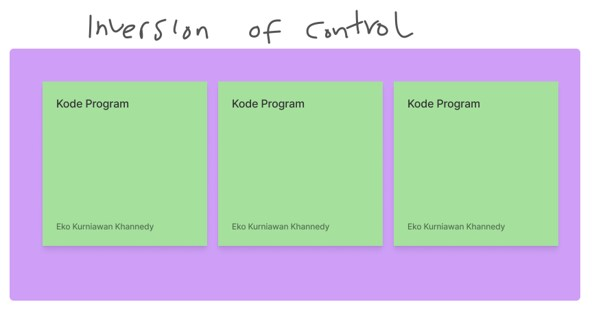
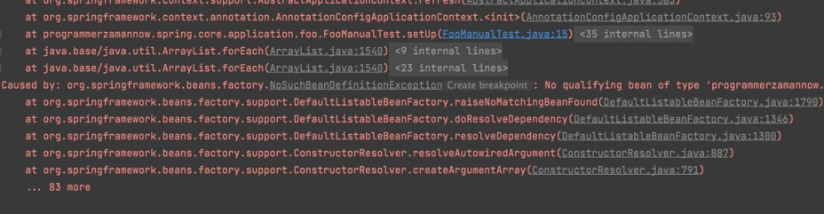
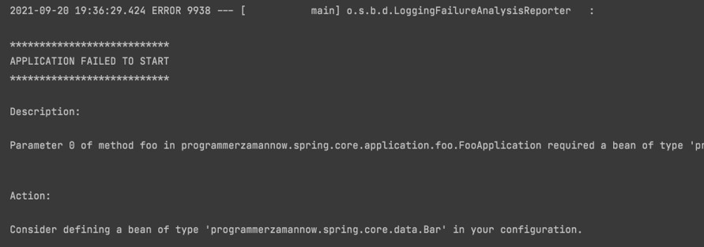
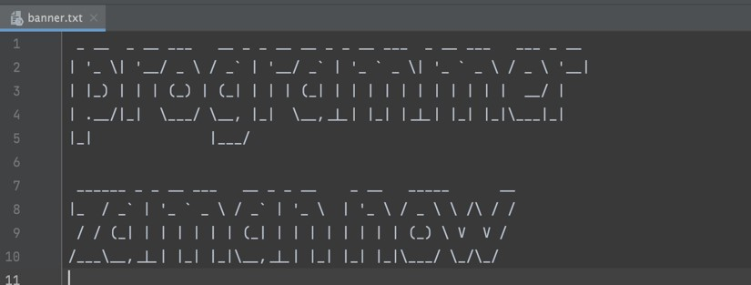
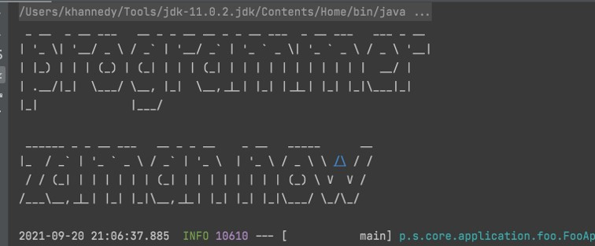

# Spring Dasar

## Sebelum Belajar

- Sudah mengikuti Kelas Java

## Agenda

- Pengenalan Spring
- Inversion of Control
- Application Context
- Dependency Injection
- Bean
- Life Cycle
- Event Listener
- Dan lain-lain

## #1 Pengenalan Spring Framework

- Spring Framework adalah Framework paling populer di Java
- Saking populernya, Spring Framework sampai mengalahkan popularitas Java Enterprise sendiri
- Spring Framework dibuat sekitar 2003 oleh Rob Johnson, yang dibuat sebagai alternative Java Enterprise
- Spring Framework semakin populer karena sangan ringan dan mudah digunakan dibandingkan Java Enterprise
- <https://spring.io/>

### Pengenalan Spring Boot

- Spring Boot merupakan framework untuk mempermudah pembuatan aplikasi Spring Framework
- Dahulu untuk menggunakan Spring Framework, untuk pemula tidaklah mudah, karena terlalu banyak yang harus dilakukan sebelum bisa membuat aplikasi
- Spring Boot menjadikan kompleksitas tersebut ditangani secara otomatis oleh Spring Boot, sehingga kita bisa membuat aplikasi Spring Framework secara cepat tanpa harus melakukan pengaturan apaun
- Spring Boot sekarang sudah menjadi satu framework wajib ketika kita ingin membuat aplikasi Spring Framework

### Kenapa Menggunakan Spring?

- Tidak bisa dipungkiri, saat ini Spring adalah satu-satunya framework paling populer di Java
- Belum ada yang bisa menandingi popularitasnya di Java
- Saking populernya, bahkan banyak perusahaan pindah ke JVM karena ingin menggunakan Spring-nya, bukan Java
- Dengan banyaknya bahasa yang bisa berjalan di atas JVM, seperti Kotlin, Groovy dan Scala, maka secara programmer punya banyak pilihan bahasa pemrograman ketika menggunakan Spring
- Spring juga sudah banyak sekali diadopsi di banyak perusahaan, baik itu skala besar atau kecil

### Ekosistem Pendukung

- Spring memiliki exosistem pendukung yang sangat besar
- Spring sendiri tidaklah digunakan untuk menggantikan framework yang sudah ada, melainkan menjahit framework-framework yang sudah ada, menjadi framework yang saling terintegrasi
- Spring bisa digunakan terintegrasi dengan baik dengan Bean Validation, Java Presistence API, Servlet, dan lain-lain
- Selain itu juga Spring bisa diintegrasikan dengan teknologi yang tidak standar bawaan Java, seperti MongoDB, Consul, Vault, Cassandra, dan lain-lain

## #2 Membuat Project

- <htps://start.spring.io/>

## #3 Inversion of Control

- Inversion of Control (IoC) merupakan prinsip dalam pembuatan perangkat lunak, dimana kita melakukan pemindahan kontrol untuk objek atau program ke sebuah container di framework
- Tidak seperti biasanya ketika kita membuat aplikasi, dimana kita selalu melakukan secara manual, dalam IoC, kita menyerahkan banyak pekerjaan ke container IoC
- Container IoC memiliki kontrol untuk melakukan eksekusi program kita, memanajemen objct pada program kita dan melakukan abstraction terhadap program kita
- Saat menggunakan framework IoC, kita biasanya akan mengikuti cara kerja framework tersebut

### Spring Inversion of Control

- Spring bisa dibilang adalah framework IoC, dimana kita akan menyerahkan banyak sekali pekerjaan dalam program kita ke Spring
- Kode program kita akan mengikuti cara kerja Spring

### Diagram Inversion of Control



## #4 Application Context

- ApplicationContext adalah sebuah interface representasi container IoC di Spring
- ApplicationContext adalah inti dari Spring Framework
- ApplicationContext banyak sekali class implementasinya, secara garis besar dibagi menjadi 2 jenis implementasi, XML dan Annotation
- Pada versi Spring 3, XML masih menjadi pilihan utama, namun sekarang sudah banyak orang beralih dari XML ke Annotation, bahkan Spring Boot pun merekomendasikan menggunakan Annotation untuk membuat aplikasi Spring
- <https://docs.spring.io/spring-framework/docs/current/javadoc-api/org/springframework/context/ApplicationContext.html>

### Configuration

- Untuk membuat ApplicationContext menggunakan Annotation, pertama kita bisa perlu membuat Configuration class
- Configuration Class adalah sebuah class yang terdapat annotation `@Configuration` pada class tersebut

### Kode: HelloWorldConfiguration

```java
// HelloWorldConfiguration.java
package programmerzamannow.spring.core;

import org.springframework.context.annotaion.Configuration;

@Configuration
public class HelloWorldConfiguration {

}
```

### Membuat Application Context

- Selanjutnya, setelah membuat Class Configuration, kita bisa menggunakan class AnnotationConfigApplicationContext untuk membuat Application Context
- <https://docs.spring.io/spring-framework/docs/current/javadoc-api/org/springframework/context/annotation/AnnotationConfigApplicationContext.html>

### Kode: Membuat Application Context

```java
ApplicationContext context = new ApplicationConfigApplicationContext(HelloWorldConfiguration.class);

Assertions.assertNotNull(context);
```

## #5 Singleton

- Singleton adalah salah satu Design Patterns untuk pembuatan object, dimana sebuah object hanya dibuat satu kali saja
- Dan ketika kita membutuhkan object tersebut, kita hanya akan menggunakan object yang sama
- <https://refactoring.guru/design-patterns/singleton>

### Membuat Singleton di Java

- Ada banyak cara membuat singleton object di Java
- Cara yang paling sering digunakan adalah membuat class yang berisikan static method untuk membuat object dirinya sendiri
- Selanjutnya contructor nya dibuat private, agar tidak bisa diakses dari luar
- Sehingga user terpaksa menggunakan method static tersebut ketika ingin membuat object nya

### Kode: Singleton Class

```java
public class Database {
		private static Database database;

		public static Database getInstance() {
				if (database == null) {
						database = new Database();
				}
				return database;
		}

		private Database() {
				// can not instantiate database class
		}
}

Database database1 = Database.getInstance();
Database database2 = Database.getInstance();
```

## #6 Bean

- Saat sebuah object kita masukan kedalam Spring Container IoC, maka kita sebut object tersebut adalah Bean
- Secara default, bean merupakan singleton, artinya jika kita mengakses bean yang sama, maka dia akan mengembalikan object yang sama. Kita juga bisa mengubahnya jika tidak ingin singleton, nantinya akan kita bahas di materi tersendiri

### Membuat Bean

- Untuk membuat bean, kita bisa membuat sebuah method di dalam class Configuration
- Selanjutnya nama method tersebut akan menjadi nama bean nya, dan return object nya menjadi object bean nya
- Method tersebut perlu kita tambahkan annotation @Bean, untuk menandakan bahwa itu adalah bean
- Secara otomatis Spring akan mengeksekusi method tersebu, dan return value nya akan dijadikan object bean secara otomatis, dan disimpan di container IoC

### Kode: Membuat Bean

```java
@Configuration
public class BeanConfiguration {

	@Bean
	public Foo foo() {
		Foo foo = new Foo();
		return foo;
	}
}
```

### Mengakses Bean

- Setelah kita membuat bean, secara otomatis semua object akan di-manage oleh `ApplicationContext`
- Untuk mengakses bean, kita bisa menggunakan method getBean milik Application Context

### Kode: Mengakses Bean

```java
Foo foo1 = applicationContext.getBean(Foo.class);
Foo foo2 = applicationContext.getBean(Foo.class);

Assertions.assertSame(foo1, foo2);
```

## #7 Duplicate Bean

- Di Spring, kita bisa mendaftarkan beberapa bean dengan tipe yang sama
- Namun perlu diperhatikan, jika kita membuat bean dengan tipe data yang sama, maka kita harus menggunakan nama bean yang berbeda
- Salain itu, saat kita mengakses bean nya, kita wajib menyebutkan nama bean nya, karena jika tidak, Spring akan bingung harus mengakses bean yang mana

### Kode: Duplicate Bean

```java
@Bean
public Foo foo1() {
	Foo foo = new Foo();
	return foo;
}

@Bean
public Foo foo2() {
	Foo foo = new Foo();
	return foo;
}
```

### Kode: Mengakses Duplicate Bean

```java
Foo foo1 = applicationContext.getBean("foo1", Foo.class);
Foo foo2 = applicationContext.getBean("foo2", Foo.class);

Assertions.assertNotSame(foo1, foo2);
```

## #8 Primary Bean

- Jika terjadi duplicate bean, selain kita sebutkan nama bean nya ketika ingin mengakses bean nya, kita juga bisa pilih salah satu bean menjadi primary
- Dengan memilih salah satunya menjadi primary, secara otomatis jika kita mengakses bean tanpa menyebutkan nama bean nya, secara otomatis primary nya yang akan terpilih
- Untuk memilih primary bean, kita bisa tambahkan annotation @Primary

### Kode: Primary Bean

```java
@Primary
@Bean
public Foo foo1() {
	Foo foo new Foo();
	return foo;
}

@Bean
public Foo foo2() {
	Foo foo new Foo();
	return foo;
}
```

### Kode: Mengakses Primary Bean

```java
Foo foo = applicationContext.getBean(Foo.class);
Foo foo1 = applicationContext.getBean("foo1", Foo.class);
Foo foo2 = applicationContext.getBean("foo2", Foo.class);

Assertions.assertSame(foo, foo1);
Assertions.assertNotSame(foo1, foo2);
```

## #9 Mengubah Nama Bean

- Secara default, nama bean diambil dari nama method
- Namun kadang-kadang kita tidak ingin menggunakan nama method untuk nama bean
- Saat project kita sudah besar, kadang bisa jadi nama method sama, walaupun isi bean nya berbeda, dan di Spring, nama bean itu untuk, tidak boleh sama
- Jika kita ingin mengubah nama bean, kita bisa menggunakan method value() milik annotation @Bean

### Kode: Mengubah Nama Bean

```java
@Primary
@Bean(value="fooFirst")
public Foo foo1() {
	Foo foo new Foo();
	return foo;
}

@Bean(value="fooSecond")
public Foo foo2() {
	Foo foo new Foo();
	return foo;
}
```

### Kode: Mengakses Bean

```java
Foo foo = applicationContext.getBean(Foo.class);
Foo foo1 = applicationContext.getBean("fooFirst", Foo.class);
Foo foo2 = applicationContext.getBean("fooSecond", Foo.class);

Assertions.assertSame(foo, foo1);
Assertions.assertNotSame(foo1, foo2);
```

## #10 Dependency Injection

- Saat kita membuat object, sudah pasti kita sering membuat object yang terhubung dengan object lain
- Dependency Injection (DI) adalah teknik dimana kita bisa mengotomatisasi proses pembuatan object yang tergantung dengan object lain, atau kita sebut dependencies
- Dependencies akan secara otomatis di-inject (dimasukan) kedalam object yang membutuhkannya
- Spring Framework sejak awal dibilang sebuah framework IoC yang memang cara kerjanya menggunakan Dependency Injection

### Tanpa Depencency Injection

- Sebenarnya tanpa Dependency Injection pun, kita tetap bisa membuat aplikasi
- Namun ketika relasi antar dependencies sangat kompleks, agak ribet untuk kita melakukanya jika harus manual
- Oleh karena itu, penggunaan Dependency Injection framework seperti Spring sangat membantu sekali

### Kode: Class FooBar

```java
@AllArgsConstructor
@Data
public class FooBar {

	private Foo foo;

	private Bar bar;
}
```

### Kode: Tanpa Dependency Injection

```java
var foo = new Foo();
var bar = new Bar();

var fooBar = new FooBar(foo, bar);

Assertions.assertSame(foo, fooBar.getFoo());
Assertions.assertSame(bar, fooBar.getBar());
```

### Spring Dependency Injection

- Spring sejak awal dikenal dengan framework untuk Dependency Injection
- Ketika kita membuat method untuk bean di Spring, kita bisa menambahkan parameter
- Secara otomatis Spring akan mencarikan bean lain yang sesuai dengan tipe parameter tersebut
- Jika ternyata tidak ada bean yang cocok, maka secara otomatis akan terjadi error
- Dan jika ternyata terdapat bean lebih dari satu, secara otomatis akan terjadi error, kecuali terdapat primary bean

### Kode: Bean Dependency Injection

```java
@Bean
public Bar bar() {
	return new Bar();
}

@Bean
public FooBar fooBar(Foo foo, Bar bar) {
	return new FooBar(foo, bar);
}
```

### Kode: Mengakses Dependency Injection

```java
Foo foo = applicationContext.getBean(Foo.class);
Bar bar = applicationContext.getBean(Bar.class);
FooBar fooBar = applicationContext.getBean(FooBar.class);

Assertions.assertSame(foo, fooBar.getFoo());
Assertions.assertSame(bar, fooBar.getBar());
```

## #11 Memilih Dependency

- Kadang secara menggunakan DI, kita ingin memilih object mana yang ingin kita gunakan
- Saat terdapat duplicate bean dengan tipe data yang sama, secara otomatis Spring akan memilih bean yang primary
- Namun kita juga bisa memilih secara manual jika memang kita inginkan
- Kita bisa menggunakan annotation @Qualifier(value="namaBean") pada parameter di method nya

### Kode: Memilih Dependency

```java
@Bean
public FooBar fooBar(@Qualifier("fooSecond") Foo foo, Bar bar) {
	return new FooBar(foo, bar);
}
```

### Kode: Mangakses Bean

```java
Foo foo = applicationContext.getBean("fooSecond", Foo.class);
Bar bar = applicationContext.getBean("barSecond", Bar.class);
DooBar fooBar = applicationContext.getBean(FooBar.class);

Assertions.assertSame(fooBar.getBar(), bar);
Assertions.assertSame(fooBar.getFoo(), foo);
```

## #12 Circular Dependencies

- Hati-hati dengan circular dependencies
- Circular dependencies adalah kasus dimana sebuah lingkara dependency terjadi, misal bean A membutuhkan bean B, bean B membutuhkan bean C, dan ternyata bean C menmbutuhkan A
- Jika terjadi cyclic seperti ini, secara otomatis Spring bisa mendeteksinya, dan akan menganggap bahwa itu adalah error

### Kode: Contoh Circular Configuration

```java
@Bean
public CyclicA cyclicA(CyclicB cyclicB) {
	return new CyclicA(cyclicB);
}

@Bean
public CyclicB cyclicB(CyclicC cyclicC) {
	return new CyclicB(cyclicC);
}

@Bean
public CyclicC cyclicC(CyclicA cyclicA) {
	return new CyclicC(cyclicA);
}
```

### Kode: Error Circular Dependencies

```java
try {
	ApplicationContext applicationContext = new AnnotationConfigApplicationContext(CyclicConfiguration.class);

	Assertions.fail("It must be fail because cyclic");
} catch (BeansException exception) {
	exception.printStackTrace();
}
```

## #13 Depends On

- Saat sebuah bean membutuhkan bean lain, secara otomatis bean tersebut akan dibuat setalah bean yang dibutuhkan dibuat
- Namun bagaimana jika bean tersebut tidak membutuhkan bean lain, namun kita ingin sebuah bean dibuat setelah bean lain dibuat?
- Jika ada kasus seperti itu, kita bisa menggunakan annotation `@DependsOn(value={"namaBean"})`
- Secara otomatis, Spring akan menprioritaskan pembuatan bean yang terdapat di DependsOn terlebih dahulu

### Kode: Depends On

```java
@Bean
@DependsOn(value = {"bar"})
public Foo foo() {
	log.info("Create new Foo");
	return new Foo();
}

@Bean
public Bar bar() {
	log.info("Create new Bar");
	return new Bar();
}
```

## #14 Lazy Bean

- Secara default, bean di Spring akan dibuat ketika aplikasi Spring pertama kali berjalan
- Oleh karena itu, kadang ketika aplikasi Spring pertama berjalan akan sedikit lambar, hal ini dikarenakan semua bean akan dibuat di awal
- Namun jika kita mau, kita juga bisa membuat sebuat bean menjadi lazy (malas), dimana bean tidak akan dibuat, sampai memang diakses atau dibutuhkan
- Untuk membuat sebuah bean menjadi lazy, kita bisa tambahkan annotation `@Lazy` pada bean tersebut

### Kode: Lazy Bean

```java
@Lazy
@Bean
@DependsOn(value= {"bar"})
public Foo foo() {
	log.info("Create new Foo");
	return new Foo();
}
```

## #15 Scope

- Scope merupakan strategy cara sebuah object dibuat
- Secara default strategy object di Spring adalah singleton, artinya hanya dibuat sekali, dan ketika kita akses, akan mengembalikan object yang sama
- Namun kita juga bisa mengubah scope bean yang kita mau di Spring
- Untuk mengubah scope sebuah bean, kita bisa tambahan annotation @Scope(value="namaScope")

### Bean Scope

| Scope         | Keterangan                                            |
| ------------- | ----------------------------------------------------- |
| `singleton`   | (Default) Hanya dibuat sekali dalam Spring IoC        |
| `prototype`   | Selalu dibuat object baru setiap kali bean diakses    |
| `request`     | Dibuat baru per HTTP Request (hanya untuk Web App)    |
| `session`     | Dibuat baru per HTTP Session (hanya untuk Web App)    |
| `application` | Dibuat baru per ServletContext (hanya untuk Web App)  |
| `websocket`   | Dibuat baru per WebSocket (hanya untuk WebSocket App) |

### Kode: Scope Prototype

```java
@Bean
@Scope("prototype")
public Foo foo() {
	log.info("Create new Foo");
	return new Foo();
}
```

### Kode: Mengakses Bean Prototype

```java
Foo foo1 = applicationContext.getBean(Foo.class);
Foo foo2 = applicationContext.getBean(Foo.class);
Foo foo3 = applicationContext.getBean(Foo.class);

Assertions.assertNotSame(foo1, foo2);
Assertions.assertNotSame(foo2, foo3);
Assertions.assertNotSame(foo3, foo1);
```

## #16 Membuat Scope

- Jika scope disediakan oleh Spring tidak bisa memenuhi kebutuhan kita, kita juga bisa membuat scope sendiri
- Caranya dengan membuat class yang implement interface Scope
- <https://docs.spring.io/spring-framework/docs/current/javadoc-api/org/springframework/beans/factory/config/Scope.html>
- Selanjutnya untuk meregistrasikan, kita bisa membuat bean `CustomScopeConfigurer`
- <https://docs.spring.io/spring-framework/docs/current/javadoc-api/org/springframework/beans/factory/config/CustomScopeConfigurer.html>

### Kode: Doubleton Scope

```java
public class DoubletonScope implements Scope {

	@Override
	public Object get(String name, ObjectFactory<?> objectsFactory) {
		counter ++;
		if (objects.size() == 2) {
			return objects.get((int) (counter%2);
		} else {
			Object object = objectFactory.getObject();
			objects.add(object);
			return object;
		}
	}

	@Override
	public Object remove(String name) {
		if (objects.size() != 0) {
			return objects.remove(0);
		}
 		return null
	}
}
```

### Kode: Register Doubleton Scope

```java
@Bean
public CustomScopeConfigurer customScopeConfigurer() {
	CustomScopeConfigurer configurer = new CustomScopeConfigurer();
	configurer.addScope("doubleton", new DoubletonScope());
	return configurer;
}

@Bean
@Scope("doubleton")
public Bar bar() {
	log.info("Create new Bar");
	return new Bar();
}
```

### Kode: Mengakses Doubleton Bean

```java
Foo bar1 = applicationContext.getBean(Bar.class);
Foo bar2 = applicationContext.getBean(Bar.class);
Foo bar3 = applicationContext.getBean(Bar.class);
Foo bar3 = applicationContext.getBean(Bar.class);

Assertions.assertSame(bar1, bar3);
Assertions.assertSame(bar2, bar4);

Assertions.assertNotSame(bar1, bar2);
Assertions.assertNotSame(bar3, bar4);
```

## #17 Life Cycle

- Spring Container memiliki alur hidup, dan jika kita ingin berinteraksi dengan alur hidup nya Spring
- Saat pertama kali Spring berjalan dan sudah selesai membuat bean, Spring akan memberitahu bean tersebut bahwa sudah siap, artinya semua dependencies sudah dimasukan
- Dan ketika aplikasi Spring akan mati, Spring juga akan memberitahu semua bean bahwa bean tersebut akan dihancurkan

### Life Cycle Callback

- Secara default, bean tidak tahu alur hidup Spring ketika selesai membuat bean ketika akan menghancurkan bean
- Jika kita tertarik untuk berinteraksi ketika alur hidup Spring terjadi, maka kita bisa implements interface initializingBean dan DiposableBean
- `InitializingBean` diguanakan jika kita ingin bereaksi ketika Spring selesai membuat bean
- <https://docs.spring.io/spring-framework/docs/current/javadoc-api/org/springframework/beans/factory/config/InitializingBean.html>
- `DiposableBean` digunakan jika kita ingin berinteraksi ketika Spring akan menghancurkan bean
- <https://docs.spring.io/spring-framework/docs/current/javadoc-api/org/springframework/beans/factory/config/DiposableBean.html>

### Kode: Connection Class

```java
@Slf4j
public class Connection implements InitializingBean, DiposableBean {

	@Override
	public void afterPropertiesSet() throws Exception {
		log.info("Connection ready to be used");
	}

	@Override
	public void destroy() throws Exception {
		log.info("connection closed");
	}
}
```

### Kode: LifeCycle Configuration

```java
@Configuration
public class LifeCycleConfiguration {

	@Bean
	public Connection connection() {
		return new Connection();
	}
}
```

### Kode: Mengakses Connection

```java
ConfigurableApplicationContext applicationContext = new AnnotationConfigApplicationContext(LifeCycleConfiguration.class);

Connection connection = applicationContext.getBean(Connection.class);

applicationContext.close();
// or
applicationContext.registerShutdownHook();
```

## #18 Life Cycle Annotation

- Selain menggunakan interface initializingBean dan DisposableBean, kita juga bisa menggunakan annotation untuk mendaftarkan callback method untuk lifecycle
- Pada annotation `@Bean`, terdapat method `initMethod()` dan `destroyMethod()`
- `initMethod()` digunakan untuk meregistrasikan method yang akan dipanggil ketika bean selesai dibuat
- `destroyMethod()` digunakan untuk meregistrasikan method yang akan dipanggil ketika bean akan dihancurkan
- Methodnya harus tanpa parameter, dan return value nya tidak akan dipedulikan, jadi sebainkya gunakan void saja

### Kode: Server Class

```java
@Slf4j
public class Server {
	public void start() {
		log.info("Start server");
	}

	public void stop() {
		log.info("Stop server");
	}
}
```

### Kode: Server Configuration

```java
@Bean(initMethod="start", destroyMethod="stop")
public Server server() {
		return new Server();
}
```

### Kode: Mengakses Server

```java
ConfigurableApplicationContext applicationContext = new AnnotationConfigApplicationContext(LifeCycleConfiguration.class);

applicationContext.registerShutdownHook();

Server server = applicationContext.getBean(Server.class);
```

### `@PostContruct` dan `@PreDestroy`

- Selain menggunakan annotation `@Bean`, untuk menandai sebuah method adalah init method dan destroy method, kita juga bisa menggunakan annotation pada method nya secara langsung
- Ini bisa digunakan untuk menghindari kita lupa menyebutkan init dan destroy method ketika membuat @Bean
- `@PostConstruct` merupakan method yang ditandai harus dipanggil ketika bean selesai dibuat
- `@PreDestroy` merupakan method yang ditandai harus dipanggil ketika bean akan dihacurkan
- Jika sudah menggunakan annotation ini, maka tidak perlu lagi menyebutkan nya di @Bean

### Kode: Server Class

```java
@Slf4j
public class Server {

	@PostConstruct
	public void start() {
		log.info("Start server");
	}

	@PreDestroy
	public void stop() {
		log.info("Stop server");
	}
}
```

## #19 Import

- Saat nanti kita membuat aplikasi, tidak mungkin kita hanya memuat satu Configuration Class
- Biasanya kita akan membuat banyak sekali, tergantung seberapa kompleks aplikasi kita
- Spring mendukung import Configuration Class lain jika dibutuhkan
- Kita bisa menggunakan annotation `@Import`, lalu sebutkan Configuration Class mana yang ingin kita import
- Ketika kita melakukan import, kita bisa import lebih dari satu class
- <https://docs.spring.io/spring-framework/docs/current/javadoc-api/org/springframework/context/annotation/import.html>

### Kode: Foo dan Bar Configuration

```java
@Configuration
public class FooConfiguration {

	@Bean
	public Foo foo() {
		return new Foo();
	}
}

@Configuration
public class BarConfiguration {

	@Bean
	pubilc Bar bar() {
		return new Bar();
	}
}
```

### Kode: Import Configuration

```java
@Configuration
@Import(value = {
	FooConfiguration.class,
	BarConfiguration.class
})
public class MainConfiguration {

}
```

### Kode: Mengakses Bean

```java
ConfigurableApplicationContext applicationContext = new AnnotationConfigApplicationContext(MainConfiguration.class);

applicationContext.registerShutdownHook();

Foo foo = applicationContext.getBean(Foo.class);
Bar bar = applicationContext.getBean(Bar.class);
```

## #20 Component Scan

- Import adalah hal yang sangat menarik, karena kita bisa memecah Configration Class menjadi banyak Class
- Namun semakin lama, pasti aplikasi kita akan semakin besar, dan secara otomatis Configuration Class akan menjadi banyak
- Melakukan import satu persatu sudah tidak menyenangkan lagi jika terlalu banyak
- Spring memiliki fitur component scan, dimana kita bisa secara otomatis mengimport configuration di sebuah package dan sub package nya secara otomatis
- Untuk melakukan itu, bisa gunakan annotation `@ComponentScan`
- <https://docs.spring.io/spring-framework/docs/current/javadoc-api/org/springframework/context/annotation/ComponentScan.html>

### Kode: Component Scan

```java
@Configuration
@ComponentScan(basePackages = {
	"programmerzamannow.spring.core.configuration"
})
public class ScanConfiguration {

}
```

## #21 Component

- Sebelumnya kita sudah belajar membuat bean menggunakan method di configuration dengan annotation `@Bean`
- Spring juga menyediakan cara otomatis tanpa harus kita membuat method `@Bean`
- Kita bisa menandai sebuah class dengan annotation @Component, secara otomatis Spring akan membuat bean untuk class tersebut
- @Component hanya mendukung pembuatan satu bean, jadi jika kita ingin membuat beberapa bean dengan tipe yang sama, kita tetap harus menggunakan `@Bean` method

### Component Bean Name

- Saat kita menggunakan @Component, nama bean akan secara otomatis dibuat otomatis oleh Spring
- Jika kita menggunakan @ComponentScan, secara otomatis bean name secara otomatis akan menggunakan nama class namun menjadi `camelCase`, misal `CategoryService` menjadi `categoryService`, `ProductWeb` menjadi `productWeb`
- Jika kita menggunakan `@import`, secara otomatis bean name akan menjadi `NamaClass.class.getName()`
- Namun jika ingin membuat nama berbeda, kita juga bisa gunakan `@Component(value="namaBean")`

### Annotation

- Semua annotation yang sudah kita bahas di `@Bean` juga didukung di `@Component`
- Seperti misalnya `@Scope`, `@PostConstruct`, `@PreDestroy`, `@Lazy`, `@Primary` dan lain-lain

### Kode: Component

```java
@Component
public class ProductService {

}
```

### Kode: Component Configuration

```java
@Configuration
@ComponentScan(basePackages = {
	"programmerzamannow.spring.core.service"
})
public class ComponentConfiguration {

}
```

### Kode: Mengakses Component

```java
ProductService productService = applicationContext.getBean(ProductService.class);

Assertions.assertNotNull(productService);
```

## #22 Constructor-based Dependency Injection

### Dependency Injection

- Sebelumnya untuk melakukan Dependency Injection di `@Bean`, kita bisa menambah parameter di method nya
- Secara otomatis Spring akan memilih bean mana yang cocok untuk parameter tersebut
- Bagaimana jika menggunakan `@Component?`
- Untuk @Component kita bisa melakukan beberapa cara untuk Dependency Injection nya

### Constructor-based Dependency Injection

- Pertama yang bisa kita lakukan untuk Dependency Injection di @Component adalah menggunakan constructor paramenter
- Kita bisa menambahkan constructor yang memiliki parameter jika membutuhkan bean lain
- Secara otomatis Spring akan mencarikan bean tersebut, dan ketika membuat bean @Component Spring akan menggunakan bean yang dibutuhkan di constructor
- Constructor-based Dependency Injection hanya mendukung satu constructor, jadi pastikan kita hanya membuat satu constructor

### Kode: Constructor-based DI

```java
@Component
public class ProductService {

	@Getter
	private ProductRepository productRepository;

	public ProductService(ProductRepository productRepository) {
		this.productRepository = productRepository;
	}
}
```

### Kode: Mengakses Bean

```java
ProductService productService = applicationContext.getBean(ProductService.class);
Assertions.assertNotNull(productService.getProductService());

ProductRepository productRepository = applicationContext.getBean(ProductRepository.class);
Assertions.assertSame(productRepository, productService.getProductRepository());
```

### Multiple Constructor

- Seperti di awal disebutkan bahwa Spring hanya mendukung satu constuctor untuk Dependency Injection nya
- Namun bagaimana jika terdapat multiple constructor?
- Jika pada kasus seperti ini, kita harus menandai constructor mana yang akan digunakan oleh Spring
- Caranya kita bisa menggunakan annotation `@Autowired`

### Kode: Mengakses Multiple Constructor

```java
@Component
public class ProductService {

	@Getter
	private ProductRepository productRepository;

	@Autowired
	public ProductService(ProductRepository productRepository) {
		this.productRepository = productRepository;
	}

	public ProductService(ProductRepository productRepository, String name) {
		this.productRepository = productRepository;
	}
}
```

## #23 Setter-based Dependency Injection

- Selain menggunakan constructor parameter, kita juga bisa menggunakan setter method jika ingin melakukan dependency injection
- Namun khusus untuk setter method, kita perlu menambah annotation `@Autowired` pada setter method nya
- Secara otomatis Spring akan mencari bean yang dibutuhkan di setter method yang memiliki annotation `@Autowired`
- Setter-based DI juga bisa digabungkan dengan Constructor-based DI

### Kode: Setter-based DI

```java
@Component
public class CategoryService {

	@Getter
	private CategoryRepository categoryRepository;

	@Autowired
	public vood setCategoryRepository(CategoryRepository categoryRepository) {
		this.categoryRepository = categoryRepository;
	}
}
```

### Kode: Mengakses Bean

```java
CategoryService categoryService = applicationContext.getBean(CategoryService.class);
Assertions.assertNotNull(categoryService.getCategoryService());

CategoryRepository categoryRepository = applicationContext.getBean(CategoryRepository.class);
Assertions.assertSame(categoryRepository, categoryService.getCategoryRepository());
```

## #24 Field-based Dependency Injection

- Selain constructor dan setter, kita juga bisa melakukan dependency injection langsung menggunakan field
- Caranya sama dengan setter, kita bisa tambahkan `@Autowired` pada fieldnya
- Secara otomatis Spring akan mencari bean dengan tipe data tersebut
- Field-based DI bisa digabung sekaligus dengan Setter-based DI dan Constructor-based DI
- Khusus Field-based DI, Spring sendiri sudah tidak merekomendasikan penggunaan cara melakukan DI dengan Field

### Kode: Field-based DI

```java
@Component
public class CustomerService {

	@Getter
	@Autowired
	private CustomerRepository customerRepository;
}
```

### Kode: Mengakses Bean

```java
CustomerService customerService = applicationContext.getBean(CustomerService.class);
Assertions.assertNotNull(customerService.getCustomerService());

CustomerRepository customerRepository = applicationContext.getBean(CustomerRepository.class);
Assertions.assertSame(customerRepository, customerService.getCustomerRepository());
```

## #25 Qualifier

- Seperti yang sudah dijelaskan di awal, jika terdapat bean dengan tipe data yang sama lebih dari satu, maka secara otomatis Spring akan bingung memilih bean yang mana yang akan digunakan
- Kita perlu memilih salah satu menjadi primary, yang secara otomatis akan dipilih oleh Spring
- Namun jika kita ingin memilih bean secara manual, kita juga bisa menggunakan @Qualifier
- Kita bisa tambahkan `@Qualifier` di constructor parameter, di setter method atau di field

### Kode: Duplicate Bean

```java
@Primary
@Bean
public CustomerRepository normalCustomerRepository() {
	return new CustomerRepository();
}

@Bean
public CustomerRepository premiumCustomerRepository() {
	return new CustomerRepository();
}
```

### Kode: Menggunakan Qualifier

```java
@Component
public class CustomerService {

	@Getter
	@Autowired
	@Qualifer("normalCustomerRepository")
	private CustomerRepository normalCustomerRepository;

	@Getter
	@Autowired
	@Qualifier("premiumCustomerRepository")
	private CustomerRepository premiumCustomerRepository;
}
```

### Kode: Mengakses Bean

```java
CustomerService customerService = applicationContext.getBean(CustomerService.class);

Assertions.assertNotNull(customerService.getNormalCutomerRepository());
Assertions.assertNotNull(customerService.getPremierCustomerRepository());

Assertions.assertNotSame(customerService.getNormalCutomerRepository(), customerService.getPremierCustomerRepository());
```

## #26 Optional Dependency

- Secara default, semua dependency itu wajib
- Artinya jika Spring tidak bisa menemukan bean yang dibutuhkan pada saat DI, maka secara otomatis akan terjadi error
- Namun jika kita memang ingin membuat sebuah dependency menjadi Optional, artinya tidak wajib
- Kita bisa wrap dependency tersebut dengan menggunakan `java.util.Optional<T>`
- Secara otomatis jika ternyata bean yang dibutuhkan tidak ada, maka tidak akan terjadi error
- Kita bisa gunakan `Optional<T>` pada `@Bean` (method parameter) ataupun `@Component` (constructor parameter, setter method parameter, field)

### Kode: Optional Configuration

```java
@Configuration
public class OptionalConfiguration {

	@Bean
	public Foo foo() {
		return new Foo();
	}

	@Bean
	public FooBar foobar(Optional<Foo> foo, Optional<Bar> bar) {
		return new FooBar(foo.orElse(null), bar.orElse(null));
	}
}
```

### Kode: Mengakses Bean

```java
Foo foo = applicationContext.getBean(Foo.class);
Foobar fooBar = applicationContext.getBean(FooBar.class);

Assertions.assertSame(fooBar.getFoo(), foo);
Assertions.assertNull(fooBar.getBar());
```

### Object Provider

- Selain menggunakan `java.util.Optional<T>`, kita juga bisa menggunakan `ObjectProvider<T>`
- Yang membedakan pada `ObjectProvider<T>` adalah, jika ternyata bean nya lebih dari satu, `ObjectProvider<T>` bisa digunakan untuk mengambil semua bean tersebut
- <https://docs.spring.io/spring-framework/docs/current/javadoc-api/org/springframework/beans/factory/ObjectProvider.html>

### Kode: Object Provider

```java
@Component
public class MultiFoo {

	@Getter
	private List<Foo> foos;

	public MultiFoo(ObjectProvider<Foo> objectProvider) {
		foos = objectProvider.stream().collect(Collectors.toList());
	}
}
```

### Kode: Optinal Configuration

```java
@Configuration
@Import(value = MultiFoo.class)
public class OptionalConfiguration {

	@Bean
	@Primary
	public Foo foo() {
		return new Foo();
	}
}
```

### Kode: Mengakses Bean

```java
Multiple multiFoo = applicationContext.getBean(MultiFoo.class);
Assertions.assertEquals(2, multiFoo.getFoos().size());
```

## #27 Factory Bean

- Kadang ada kasus dimana sebuah class misal bukanlah milik kita, misal class third party library
- Sehingga agak sulit jika kita harus menambahkan annotation pada class tersebut
- Pada kasus seperti ini, cara terbaik untuk membuat bean nya adalah dengan menggunakan `@Bean` method
- Atau di Spring, kita juga bisa menggunakan `@Component`, namun kita perlu wrap dalam class Factory Bean
- <https://docs.spring.io/spring-framework/docs/current/javadoc-api/org/springframework/beans/factory/FactoryBean.html>

### Kode: Payment Gateway Client

```java
@Data
public class PaymentGatewayClient {

	private String endpoint;

	private String publicKey;

	private String privateKey;
}
```

### Kode: Factory Bean

```java
@Component(value = "paymentGatewayClient")
public class PaymentGatewayClientBean implements FactoryBean<PaymentGatewayClient> {

	@Override
	public PaymentGatewayClient getObject() throws Exception {
		PaymentGatewayClient clinet = new PaymentGatewayClient();
		clinet.setEndpont("https://payment/");
		clinet.setPrivateKey("PRIVATE");
		clinet.setpublicKey("PUBLIC");
		return clinet;
	}
}
```

### Kode: Configuration

```java
@Configuration
@Import(value = {
	PaymentGatewayClientBean.class
})
public class FactoryConfiguration {

}
```

### Kode: Mengakses Bean

```java
PaymentGatewatClient client = applicationContext.getBean(PaymentGatewayClient.class);
Assertions.assertEquals("https://payment/", clinet.getEndpoint());
Assertions.assertEquals("PRIVATE", clinet.getPrivateKey());
Assertions.assertEquals("PUBLIC", clinet.getPublicKey());
```

## #28 Inheritance

- Saat kita mengakses bean, kita bisa langsung menyebutkan tipe class bean tersebut, atau bisa juga dengan parent class / parent interface bean
- Misal jika kita memiliki sebuah interface bernama `MerchantService`, lalu kita memiliki bean dengan object implementasi class nya `MerchantServiceImpl`, maka untuk mengakses bean nya, kita tidak hanya bisa menggunakan tipe `MerchantServiceImpl`, namun juga bisa dengan `MerchantService`
- Namun perlu berhati-hati, jika misal `MerchantService` memiliki banyak bean turunan, pastikan tidak terjadi error duplicate

### Kode: MerchantService

```java
public interface MerchantService {

}

@Component
public class MerchantServiceImpl implements MerchantService {

}
```

### Kode: Configuration

```java
@Configuration
@Import(MerchantServiceImpl.class)
public class InheritanceConfiguration {

}
```

### Kode: Mengakses Bean

```java
MerchantService merchantService = applicationContext.getBean(MerchantService.class);
MerchantServiceImpl merchantServiceImpl = applicationContext.getBean(MerchantServiceImpl.class);

Assertions.assertSame(merchantService, merchantServiceImpl);
```

## #29 Bean Factory

- ApplicationContext adalah interface turunan dari BeanFactory
- BeanFactory merupakan kontrak untuk management bean di Spring
- Method-method yang sebelumnya kita gunakan untuk mengambil bean, sebenarnya merupakan method kontrak dari interface BeanFactory
- <https://docs.spring.io/spring-framework/docs/current/javadoc-api/org/springframework/beans/factory/BeanFactory.html>

### Listable Bean Factory

- Bean Factory hanya bisa digunakan untuk mengakses single bean, artinya jika terdapat bean dengan tipe yang sama, kita harus sebutkan satu per satu nama bean nya
- Listable Bean Factory adalah turunan dari Bean Factory yang bisa kita gunakan untuk mengakses beberapa bean sekaligus
- Dalam beberapa kasus, ini sangat berguna, seperti misal kita ingin mengambil semua bean dengan tipe tertentu
- Application Context juga merupakan turunan dari interface Listable Bean Factory
- <https://docs.spring.io/spring-framework/docs/current/javadoc-api/org/springframework/beans/factory/ListableBeanFactory.html>

### Kode: Menggunakan Listable Bean Factory

```java
ObjectProvider<Foo> fooObjectProvider = applicationContext.getBeanProvider(Foo.class);

Map<String, Foo> beans = applicationContext.getBeansOfType(Foo.class);
```

## #30 Bean Post Processor

- Bean Post Processor merupakan sebuah interface yang bisa kita gunakan untuk memodifikasi proses pembuatan bean di Application Context
- Bean Post Processor mirip seperti middleware, yang diakses sebelum bean di initialized dan setelah bean di initialized
- Karena sangat flexible, bahkan Bean Post Processor bisa memodifikasi hasil object bean
- <https://docs.spring.io/spring-framework/docs/current/javadoc-api/org/springframework/beans/factory/config/BeanPostProcessor.html>

### Bean Id Generator

- Misal sekarang kita akan coba membuat id unique untuk bean
- Dimana kita akan membuat sebuah interface bernama `IdAware`, lalu memiliki method `setId(String)`
- Kita akan membuat Bean Post Processor, dimana jika bean nya implements `IdAware`, kita akan s`etId(String)` nya menggunakan `UUID`

### Kode: IdAware interface

```java
public interface idAware {

	void setId(String id);
}
```

### Kode: Bean Post Processor

```java
@Component
public class IdGeneratorBeanPostProcessor implements BeanPostProcessor {

	@Override
	public Object postProcesBeforeInitialization(Object bean, String beanName) throws BeansException {
		if (bean instanceof IdAware) {
			IdAware idAware = (IdAware) bean;
			IdAware.setId(UUID.randomUUID().toString());
		}

		return bean;
	}
}
```

### Kode: Component

```java
@Component
public class Car implements IdAware {

	@Getter
	private String id;

	@Override
	public void setId(String id) {
		this.id = id;
	}
}
```

### Kode: Mengakses Bean

```java
@Test
void testIdAware() {
	Car car= applicationContext.getBean(Car.class);
	Assertions.assertNotNull(car.getId());
}

@Configuration
@Import({Car.class, IdGeneratorBeanPostProcessor.class})
public static class TestConfiguration {

}
```

## #31 Ordered

- Saat kita membuat Bean Post Processor, kita bisa membuat lebih dari satu
- Kadang ada kasus saat membuat beberapa Bean Post Processor, kita ingin membuat yang berurutan
- Sayangnya secara default, Spring tidak menjamin urutan eksekusi nya
- Agar kita bisa menentukan urutannya, kita bisa menggunakan interface Ordered
- <https://docs.spring.io/spring-framework/docs/current/javadoc-api/org/springframework/core/Ordered.html>

### Kode: Id Aware

```java
public interface idAware {

	void idAware(String id);

	String getId();
}
```

### Kode: Id Ganerator

```java
@Component
public class IdGeneratorBeanPostProcessor implements BeanPostProcessor, Ordered {

	@Override
	public int getOrder() {
		return 1;
	}

	@Override
	public Object postProcesBeforeInitialization(Object bean, String beanName) throws BeansException {
		// ...
	}
}
```

### Kode: Prefix id Generator

```java
@Component
public class PrefixIdGeneratorBeanPostProcessor implements BeanPostProcessor, Ordered {

	@Override
	public int getOrder() { return 2; }

	@Override
	public Object postProcesBeforeInitialization(Object bean, String beanName) throws BeansException {
		if (bean instanceof IdAware) {
			IdAware idAware = (IdAware) bean;
			IdAware.setId("PZN-" + idAware.getId());
		}

		return bean;
	}
}
```

### Kode: Mengakses Bean

```java
@Test
void testIdAware() {
	Car car = applicationContext.getBean(Car.class);
	Assertions.assertNotNull(car.getId());
	System.out.println(car.getId());
}

@Configuration
@Import({Car.class, IdGeneratorBeanPostProcessor.class, PrefixIdGeneratorBeanPostProcessor.class})
public static class TestConfiguration {

}
```

## #32 Aware

- Spring memiliki sebuah interface berama `Aware`
- Aware adalah super interface yang digunakan untuk semua Aware interface
- Aware ini diperuntukkan untuk penanda agar Spring melakukan injection object yang kita butuhkan
- Mirip seperti yang sudah kita lakukan ketika membuat IdAware menggunakan IdGenerator Bean Post Processor
- Namun untuk ini, kita tidak perlu lagi membuat Bean Post Processor secara manual
- <https://docs.spring.io/spring-framework/docs/current/javadoc-api/org/springframework/beans/factory/Aware.html>

### Daftar Aware

| Aware                            | Keterangan                            |
| -------------------------------- | ------------------------------------- |
| `ApplicationContextAware`        | Untuk mendapatkan application context |
| `BeanFactoryAware`               | Untuk mendapatkan bean factory        |
| `BeanNameAware`                  | Untuk mendapatkan nama bean           |
| `ApplicationEventPublisherAware` | Untuk mendapatkan event publisher     |
| `EnvironmentAware`               | Untuk mendapatkan environment         |
| dan lain-lain                    |                                       |

### Kode: Aware

```java
@Component
public class AuthService implements ApplicationContextAware, BeanNameAware {

	@Getter
	private String beanName;

	@Getter
	private ApplicationContext applicationContext;
}
```

### Kode: Mengakses Bean

```java
@Test
void testAware() {
	AuthService authService = applicationContext.getBean(AuthService.class);
	Assertions.assertEquals(AuthService.class.getName(), auth.getBeanName());
	Assertions.assertSame(applicationContext, authService.getApplicationContext());
}

@Configuration
@Import(AuthService.class)
public static class TestConfiguration {

}
```

## #33 Bean Factory Post Processor

- Secara default, mungkin kita tidak akan pernah sama sekali membuat Application Context secara manual
- Namun kadang ada keadaan kita ingin memodifikasi secara internal Application Context
- Spring merekomendasikan kita untuk membuat Bean Factory Post Processor
- <https://docs.spring.io/spring-framework/docs/current/javadoc-api/org/springframework/beans/factory/config/BeanFactoryPostProcessor.html>
- <https://docs.spring.io/spring-framework/docs/current/javadoc-api/org/springframework/beans/factory/support/BeanDefinitionRegistryPostProcessor.html>

### Kode: Bean Factory Post Processor

```java
@Component
public class FooBeanFactoryPostProcesssor implements BeanDefinitionRegistryPostProcessor {

	@Override
	public void beanProcessBeanDefinitionRegistry(BeanDefinitionRegistry registry) throws BeansException {
		GenericBeanDefinition definition = new GenericBeanDefinition();
		definition.setBeanClass(Foo.class);
		definition.setScope("singleton");

		registry.registerBeanDefinition("foo", definition);
	}
}
```

### Kode: Mengakses Bean

```java
@Test
void TestAware() {
	Foo foo = applicationContext.getBean("foo", Foo.class);
	Assertions.assertNotNull(foo);
}

@Configuration
@Import(FooBeanFactoryPostProcesssor.class)
public static class TestConfiguration {

}
```

## #34 Event Listener

- Spring memiliki fitur Event Listener yang bisa kita gunakan untuk komunikasi antar class menggunakan Event
- Event di Spring merupakan object turunan dari `ApplicationEvent`, sedangkan Listener di Spring merupakan turunan dari `ApplicationListener`
- <https://docs.spring.io/spring-framework/docs/current/javadoc-api/org/springframework/context/ApplicationEvent.html>
- <https://docs.spring.io/spring-framework/docs/current/javadoc-api/org/springframework/context/ApplicationListener.html>

### Application Event Publisher

- Ketika kita ingin mengirimkan event ke listener, kita bisa menggunakan object `ApplicationEventPublisher`, dimana `ApplicationEventPublisher` juga merupakan super interface dari ApplicationContext
- Atau kita bisa menggunakan `ApplicationEventPublisher`Aware untuk mendapatkan object `ApplicationEventPublisher`
- <https://docs.spring.io/spring-framework/docs/current/javadoc-api/org/springframework/context/ApplicationEventPublisher.html>

### Kode: Event

```java
public class LoginSuccessEvent extends ApplicationEvent {

	@Getter
	private final User user;

	public LoginSuccessEvent(User user) {
		super(user);
		this.user = user;
	}
}
```

### Kode: Listener

```java
@Slf4j
@Component
public class LoginSuccessListener implements ApplicationListener<LoginSuccessEvent> {

	@Override
	public class onApplicationEvent(LoginSuccessEvent event) {
		log.info("Success login for user {}", event.getUser());
	}
}
```

### Kode: Mengirim Event

```java
@Component
public class UserService implements ApplicationEventPublisherAware {

	private ApplicationEventPublisher applicationEventPublisher;

	@Override
	public void setApplicationEventPubilisher(ApplicationEventPublisher applicationEventPublisher) {
		this.applicationEventPublisher = applicationEventPublisher;
	}

	public boolean login(String username, String password) {
		if (isLoginSuccess(username, password)) {
			applicationEventPublisher.publishEvent(new LoginSuccessEvent(new User(username)));
			return true;
		}
	}
}
```

### Kode: Mengakses Bean

```java
@Test
void TestListener() {
	UserService userService = applicationContext.getBean(UserService.class);
	userService.login("eko", "rahasia");
	userService.login("kurniawan", "rahasia");
	userService.login("khannedy", "rahasia");
}

@BarConfiguration
@Import({LoginSuccessListener.class, UserService.class})
public static class TestConfiguration {

}
```

## #35 Event Listener Annotation

- Selain menggunakan interface `ApplicationListener`, kita juga bisa menggunakan `Annotation` untuk membuat Listener
- Ini lebih flexible dibanding menggunakan interface `ApplicationListener`
- Kita bisa menggunakan annotation `@EventListener`
- <https://docs.spring.io/spring-framework/docs/current/javadoc-api/org/springframework/context/event/EventListener.html>

### Kode: Event Listener Annotation

```java
@Slf4j
@Component
public class UserListener {

	@EventListener(classes = LoginSuccessEvent.class)
	public void onLoginSuccessEvent(LoginSuccessEvent event) {
		log.info("Success login for user {}", event.getUser());
	}
}
```

### Cara Kerja Event Listener Annotation?

- Annotation `@EventListener` bekerja dengan menggunakan Bean Post Processor bernama `EventListenerMethodProcessor`
- `EventListenerMethodProcessor` mendeteksi jika ada bean yang memiliki method dengan annotation `@EventListener`, maka secara otomatis akan membuat listener baru, lalu meregistrasikannya ke `ApplicationContext.addApplicationListener(listener)`
- <https://docs.spring.io/spring-framework/docs/current/javadoc-api/org/springframework/context/event/EventListenerMethodProcessor.html>

## #36 Spring boot Application

- Sebelumnya kita selalu membuat Application Context secara manual, dan kita belum menggunakan fitur otomatis Spring Boot
- Hal ini sengaja saya jelaskan agar kita tidak kaget bagaimana semua itu bisa berjalan secara otomatis di Spring Boot
- Pada saat membuat aplikasi Spring Boot, kita akan mengganti `@Configuration` utama menjadi `@SpringBootApplication`
- Isi dari `@SpringBootApplication` itu sendiri sebenarnya gabungan dari `@Configuration` dan banyak hal lain, seperti contohnya `@ComponentScan`
- <https://docs.spring.io/spring-boot/docs/current/api/org/springframework/boot/autoconfigure/SpringBootApplication.html>

### Kode: Foo Application

```java
@SpringBootApplication
public class FooApplication {

	@Bean
	public Foo foo() {
		return new Foo();
	}
}
```

### Spring Application

- Selain `@SpringBootApplication`, untuk membuat Application Context nya, kita tidak perlu membuat manual, kita bisa gunakan class `SpringApplication`
- Secara otomatis `SpringApplication` akan membuat `ApplicationContext` dan melakukan hal-hal yang dibutuhkan secara otomatis
- <https://docs.spring.io/spring-boot/docs/current/api/org/springframework/boot/SpringApplication.html>

### Kode: Spring Application

```java
@SpringBootApplication
public class FooApplication {

	public static void main(String[] args) {
		ApplicationContext context = SpringApplication.run(FooApplication.class, args);
		Foo foo = context.getBean(Foo.class);
	}

	@Bean
	public Foo foo() {

	}
}
```

### Spring Boot Test

- Untuk membuat unit test di Spring Boot, kita bisa menggunakan annotation `@SpringBootTest(classes={YourConfiguration.class})`
- Selanjutnya kita tidak perlu mengambil bean secara manual lagi menggunakan `ApplicationContext`, kita bisa menggunakan DI secara langsung di unit test nya menggunakan `@Autowired`
- <https://docs.spring.io/spring-boot/docs/current/api/org/springframework/boot/test/context/SpringBootTest.html>

### Kode: Test Foo Application

```java
@SpringBootTest(classes = FooApplication.class)
class FooApplicationTest {

	@Autowired
	Foo foo;

	@Test
	void testFoo() {
		Assertions.assertNotNull(foo);
	}
}
```

## #37 Startup Failure

- Salah satu yang menarik di Spring Boot adalah, Spring Boot memiliki fitur `FailureAnalyzer`
- `FailureAnalyzer` digunakan untuk melakukan analisa ketika terjadi error startup yang menyebabkan aplikasi tidak mau berjalan
- Spring sudah menyediakan banyak sekali class implementasi `FailureAnalyzer` yang bisa mempermudah kita menganalisa kesalaha ketika terjadi startup failure
- <https://docs.spring.io/spring-boot/docs/current/api/org/springframework/boot/diagnostics/FailureAnalyzer.html>

### Kode: Error Configration

```java
@SpringBootApplication
public class FooApplication {

	@Bean
	public Foo foo(Bar bar) {
		return new Foo();
	}
}
```

### Kode: Tanpa Spring Boot



### Kode: Dengan Spring Boot



## #38 Banner

- Spring Boot memiliki fitur banner, dimana saat aplikasi Spring Boot berjalan, kita bisa menampilkan tulisan banner di console
- Secara default fitur banner ini akan menyala dan akan mencari tulisan banner di classpath dengan nama `banner.txt`
- Jika tidak ada file tersebut, maka secara otomatis akan menampilkan tulisan banner Spring Boot
- Salah satu contoh tempat untuk membuat banner adalah <http://www.bagill.com/ascii-sig.php>

### Kode: Default Banner


### Kode: banner.txt



### Kode: Hasil Banner



## #39 Customizing Spring Application

- Kadang ada kalanya kita ingin melakukan pengaturan di Spring Application sebelum Application Context nya dibuat
- <https://docs.spring.io/spring-boot/docs/current/api/org/springframework/boot/SpringApplication.html>
- Kita bisa menggunakan langsung SpringApplication, atau bisa juga menggunakan `SpringApplicationBuilder`
- <https://docs.spring.io/spring-boot/docs/current/api/org/springframework/boot/builder/SpringApplicationBuilder.html>

### Kode: Customizing Spring Application

```java
SpringApplication application = new SpringApplication(FooApplication.class);
application.setBannerMode(Banner.Mode.OFF);

ApplicationContext context = application.run(args);

Foo foo = context.getBean(Foo.class);
```

## #40 Spring Application Event

- Sebelumnya kita sudah belajar tentang Event Listener
- Di Spring Boot, terdapat banyak sekali Event yang dikirim ketika aplikasi Spring Boot berjalan
- Jika kita ingin, kita bisa membuat Listener untuk menerima event tersebut
- <https://docs.spring.io/spring-boot/docs/current/api/org/springframework/boot/context/event/SpringApplicationEvent.html>

### Daftar Event

| Event                                | Keterangan                                              |
| ------------------------------------ | ------------------------------------------------------- |
| `ApplicationStartingEvent`           | Dikirim ketika start aplikasi                           |
| `ApplicationContextInitializedEvent` | Dikirim ketika ApplicationContext sudah di initialisasi |
| `ApplicationStartedEvent`            | Dikirim ketika aplikasi sudah berjalan                  |
| `ApplicationFailedEvent`             | Dikirim ketika aplikasi gagal berjalan                  |
| dan lain-lain                        |                                                         |

### Menambah Listener

- Beberapa Event di Spring Boot Application Event di trigger bahkan sebelum Spring membuat Application Context
- Oleh karena itu, jika kita buat menggunakan bean, bisa saja beberapa listener tidak akan dipanggil, karena bean nya belum dibuat
- Agar lebih aman, kita bisa menambahkan listener ketika membuat SpringApplication

### Kode: Contoh Listener

```java
@Slf4j
public class AppStartingListener implements ApplicationListener<ApplicationStartingEvent> {

	@Override
	public void onApplicationEvent(ApplicationStartingEvent event) {
		log.info("Application starting");
	}
}
```

### Kode: Menambahkan Listener

```java
SpringApplication application = new SpringApplication(EventApplication.class);
application.setListeners(List.of(
	new AppStartingListener()
));

applicationContext = application.run();
```

## #41 Command Line Runner

- Saat kita membuat aplikasi, kadang kita butuh argument yang diberikan pada main method
- Spring Application bisa mengirim data argument tersebut secara otomatis ke bean yang kita buat
- Kita hanya butuh membuat bean dari `CommandLineRunner`
- CommandLineRunner secara otomatis akan di jalankan ketika Spring Application berjalan
- <https://docs.spring.io/spring-boot/docs/current/api/org/springframework/boot/CommandLineRunner.html>

### Kode: Contoh Command Line Runner

```java
@SpringBootApplication
public class CommandApplication {

	@Slf4j
	@Component
	public static class LogCommandLineRunner implements CommandLineRunner {

		@Override
		public void run(String... args) throws Exception {
			log.info("Run with args : {}", Arrays.toString(args));
		}
	}
}
```

## #42 Application Runner

- Selain CommandLineRunner, Spring Boot menyediakan fitur `ApplicationRunner`
- Penggunaan ApplicationRunner sama seperti CommandLineRunnnner, hanya saja argument nya sudah di wrap dalam object `ApplicationArguments`
- Yang menarik dari ApplicationArguments adalah, memiliki fitur parsing untuk command line argument
- <https://docs.spring.io/spring-boot/docs/current/api/org/springframework/boot/ApplicationArguments.html>
- <https://docs.spring.io/spring-boot/docs/current/api/org/springframework/boot/ApplicationRunner.html>

### Kode: Application Runner

```java
@SpringBootApplication
public class RunnerApplication {

	@Slf4j
	@Component
	public static class SimpleRunner implements ApplicationRunner {

		@Override
		public void run(ApplicationArguments args) throws Exception {
			List<String> profiles = args.getOptionValues("profiles");
			log.info("Profiles {}", profiles);
		}
	}
}
```

## #43 Spring Boot Plugin

- Saat kita membuat project Spring Boot, secara otomatis terdapat spring-boot-plugin di project maven kita
- Plugin ini bisa digunakan untuk mempermudah saat kita menjalankan aplikasi Spring kita
- Kita bisa gunakan perintah :
- `mvn spring-boot:run`
- Untuk menjalankan aplikasi Spring Boot kita, kita harus memastikan bahwa hanya ada satu main class

### Distribution File

- Spring Boot plugin juga sudah menyediakan cara membuat distribution file aplikasi kita
- Plugin ini akan mendeteksi main class di project kita, lalu membundle aplikasi kita beserta dependency yang dibutuhkan dalam satu file jar
- Pastikan hanya terdapat satu main class, karena jika lebih dari satu, maka spring boot plugin akan melakukan komplen
- Kita cukup gunakan perintah :
- `mvn package`
- Secara otomatis akan terbuat single jar application

## #44 Materi Selanjutnya

- Spring Config Properties
- Spring Logging
- Spring Validation
- Spring Aspect Oriented Programming
- Spring Async
- Spring Data JPA
- Spring Web MVC
- Dan lain-lain
