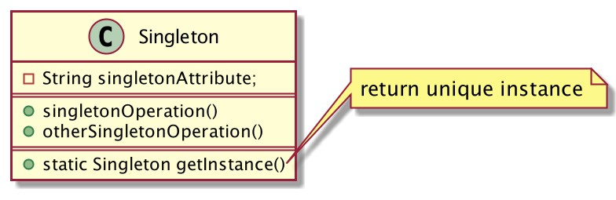
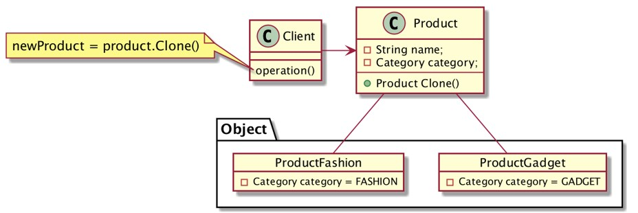
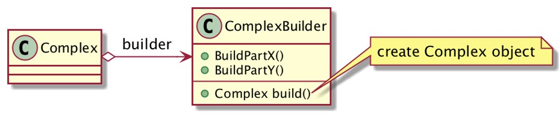
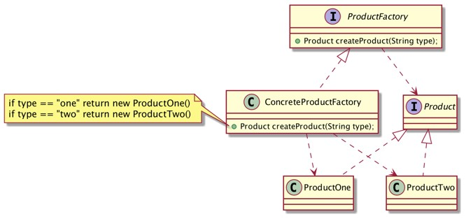
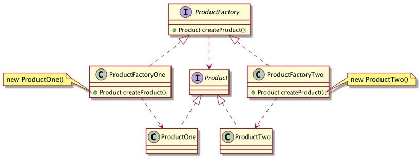
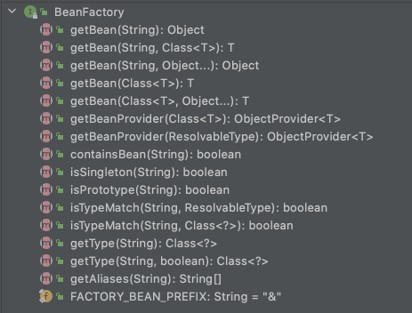
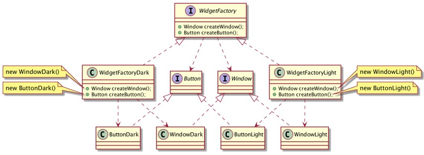

# Spring Design Patterns Creational

## Sebelum Belajar

- Java
- Spring Boot

## Agenda

- Pengenalan Design Pattern
- Pengenalan Creational Design Pattern
- Singleton
- Prototype
- Abstract Factory
- Builder
- Factory Method

## #1 Pengenalan Design Patterns

### Pendahuluan

- Membuat aplikasi berbasis object oriented bukanlah hal yang mudah
- Dan membuat aplikasi berbasis object oriented yang mudah dikembangkan, itu lebih sulit lagi
- Bahkan tak jarang, kadang desain object oriented awal ketika membuat aplikasi, perlu diubah ketika ukuran aplikasi kita semakin kompleks dan besar
- Pengembang aplikasi, biasanya akan mengambil pengalaman dari pengembangan aplikasi sebelumnya, entah dari pengalaman sendiri, atau pengalaman orang lain
- Tujuan course ini adalah belajar membuat desain aplikasi object oriented sebagai Design Patterns

### Apa itu Design Patterns?

- Design patterns adalah solusi umum yang biasa digunakan ketika menghadapi masalah saat melakukan desain aplikasi
- Design patterns bukanlah solusi yang bisa di transform langsung menjadi kode program
- Design patterns adalah template atau panduan untuk menyelesaikan masalah, dan bisa diimplementasikan berbeda-beda, namun dengan tujuan yang sama

### Kegunaan Design Patterns

- Design patterns bisa mempercepat proses development dengan menyediakan solusi yang sudah terbukti.
- Menggunakan Design Patterns bisa menolong kita dari kesalahan dimasa depan jika mengimplementasikan solusi sendiri yang belum terbukti baik.
- Design Patterns menyediakan solusi umum, sehingga bisa digunakan di berbagai kasus
- Design Patterns juga sudah umum diadopsi oleh para pengembang perangkat lunak, sehingga menggunakan Design Patterns akan memudahkan perangkat lunak kita mudah dikembangkan

### Jenis-Jenis Design Patterns

Secara garis besar, Design Patterns dibagi menjadi tiga jenis

- `Creational Design Patterns`, yaitu Design Patterns yang berhubungan dengan mekanisme pembuatan object
- `Structural Design Patterns`, yaitu Design Patterns yang berhubungan dengan interaksi antar object dan class ketika membentuk struktur yang lebih besar.
- dan `Behavioral Design Patterns`, yaitu Design Patterns yang berhubungan dengan penugasan, tanggung jawab, dan hubungan antar object

Pada course ini, kita akan fokus membahas `Creational Design Patterns`

### Buku Design Patterns

- Design Pattern : Elements of Reusable Object-Oriented Software
- Para penulisnya dikenal dengan panggilan GOF (Gang of Four)

## #2 Pengenalan Creational Design Patterns

- Creational Design Patterns adalah Design Patterns untuk membuat object.
- Creational Design Patterns membuat system menjadi lebih independen ketika membuat dan melakukan komposisi object
- Creational Design Patterns kadang menggunakan perawisan untuk membuat object
- Penggunaan Design Patterns tidak diharuskan hanya satu Pattern saja, kita bisa menggabungkan beberapa Design Patterns sekaligus jika memang dibutuhkan

### Jenis-Jenis Creational Design Patterns

Terdapat banyak Design Pattern yang berjenis Creational, yaitu :

- Singleton,
- Prototype,
- Builder,
- Factory Method,
- dan Abstract Factory

## #3 Membuat Project

- <https://start.spring.io/>

Dependencies :

- Lombok

## #4 Singleton Pattern

- GOF : Ensure a class only has one instance, and provide a global point of access to it.
- Memastikan bahwa sebuah class hanya memiliki satu instance object, dan menyediakan cara mengaksesnya secara global (artinya bisa diakses dari mana saja)

### Motivasi

- Pada beberapa kasus, memastikan sebuah class hanya memiliki satu instant object sangat penting
- Pertanyaannya, bagaimana memastikan sebuah class hanya memiliki satu instance object?
- Solusinya adalah membiarkan class itu sendiri yang bertanggung jawab untuk membuat instance object nya. Class tersebut bisa memastikan tidak ada instance lain yang dibuat, dan akan menyediakan cara mengakses singleton object tersebut
- Ketika terdapat perubahan pada instance object, client yang menggunakan singleton object tersebut tidak perlu melakukan perubahan

### Struktur



### Keuntungan

- Class singleton bisa mengatur bagaimana dan kapan client bisa mengakses object singleton tersebut
- Singleton lebih aman dibandingkan global variable. Ini mencegah client secara tidak sengaja mengubah global variable
- Class singleton bisa mengubah implementasi dari instance object nya, tanpa harus melakukan perubahan di client yang mengaksesnya

## #5 Singleton Pattern di Spring Boot

- Implementasi singleton pattern di Spring sangatlah mudah, kita bahkan tidak perlu membuat class khusus singleton
- Secara default object bean yang terdapat di Spring sudah singleton, jadi secara tidak sadar sebenarnya kita sudah mengimplementasikan singleton pattern

### Kapan Menggunakan Singleton Pattern

- Saat menggunakan Spring, sebisa mungkin selalu menggunakan singleton pattern, kecuali memang ada kebutuhan khusus sehingga kita tidak ingin menggunakan singleton
- Secara default, Spring selalu membuat object secara singleton, dan secara default object akan dibuat secara eager (langsung di awal ketika aplikasi dijalankan), namun jika kita ingin membuat object singleton ketika object akan diakses, kita bisa mengubahnya menjadi lazy (artinya hanya dibuat ketika pertama kali diakses)
- Namun jika objectnya berat, seperti koneksi ke database, membuat http client, dan lain-lain, sangat disarankan membuat object singleton yang eager

### Contoh Kasus

- Kita akan membuat sebuah counter sebagai statistic berapa banyak request yang sudah ditangani oleh aplikasi kita
- Kita akan membuat class Counter, dimana class counter ini akan menyimpan data jumlah counter, dan memiliki method untuk menaikkan data counter nya
- Kita akan membuat instance class Counter sebagai singleton object, karena data counter harus selalu sama, sehingga tidak memerlukan lebih dari satu instance object

### Kode: Class Counter

```java
public class Counter {

	private Long value = 0L;

	public Long getValue() { return value; }

	public void increment() {
		value++;
	}
}
```

### Kode: Membuat Singleton

```java
@Bean
public Counter counter() {
	return new Counter();
}
```

### Kode: Test Singleton

```java
Counter counter1 = applicationContext.getBean(Counter.class);
Counter counter2 = applicationContext.getBean(Counter.class);
Counter counter3 = applicationContext.getBean(Counter.class);

counter1.increment();
counter2.increment();
counter3.increment();

System.out.println(counter1.getValue());
System.out.println(counter2.getValue());
System.out.println(counter3.getValue());
```

### Yang Perlu Diperhatikan

- Singleton object secara otomatis akan di sharing ke semua client
- Oleh karena itu pastikan singleton object itu immutable (tidak bisa diubah)
- Jika singleton object nya sifatnya mutable (bisa diubah), pastikan tidak terjadi race condition ketika diubah secara bersamaan oleh beberapa client secara sekaligus

### Kode: Race Condition

```java
private void incrementCounterAsync(Counter counter, int total) {
	new Thread(() -> {
		for (int i = 0; i < total; i++) {
			counter.increment();
		}
	}).start();
}
```

### Kode: Test Race Condition

```java
Counter counter1 = applicationContext.getBean(Counter.class);
Counter counter2 = applicationContext.getBean(Counter.class);

incrementCounterAsync(counter1, 1000000);
incrementCounterAsync(counter1, 1000000);

Thread.sleep(5000L);

System.out.println(counter1.getValue());
System.out.println(counter2.getValue());
```

## #6 Prototype Pattern

- GOF : Specify the kinds of objects to create using a prototypical instance, and create new objects by copying this prototype.
- Tentukan jenis objek yang akan dibuat menggunakan contoh prototipe, dan buat objek baru dengan menyalin objek prototipe-nya.

### Motivasi

- Pada beberapa kasus, kita sering sekali menemui pembuatan object dengan beberapa data yang sama
- Jika kita membuat object tersebut secara manual satu persatu, maka akan rentang terhadap kesalahan, terutama ketika object dengan jenis tertentu harus berubah datanya
- Prototype pattern merupakan pattern dimana kita akan membuat object prototype, lalu saat kita membuat object baru, kita tidak perlu membuat object dari awal lagi, kita cukup menyalin data dari object prototype
- Hal inin membuat pembuatan object lebih mudah, dan jika data prototype ingin diubah, kita bisa dengan mudah mengubah prototype, dan secara otomatis semua object baru dari prototype tersebut akan berubah datanya

### Struktur



### Keuntungan

- Menambah dan menghapus prototype object sangat mudah, karena bukan sub-class, sehingga menambah dan menghapus prototype object tidak sesulit jika menggunakan class inheritance
- Membuat jenis object baru sangat mudah, hanya dengan menambah atau mengubah attribute object prototype, tidak perlu ada penambahan class baru
- Menurunkan jumlah subclass, pada pattern Factory Method, kadang menghasilkan class hirarki yang banyak, prototype bisa mencegah terjadinya class hirarki yang terlalu banyak
- Prototype object bahkan bisa dibuat pada saat runtime (aplikasi berjalan), karena tidak membutuhkan deklarasi class baru

## #7 Prototype Pattern di Spring Boot

- Kita sudah tahu secara default bean di Spring adalah singleton, artinya ketika kita akses bean nya, sebenarnya dia adalah object yang sama
- Di Spring, kita bisa ubah scope bean dari singleton menjadi prototype. Saat kita ubah menjadi prototype, secara otomatis object akan selalu dibuat baru sesuai dengan deklarasi yang ada di bean
- Dengan demikian, implementasi prototype di Spring sangat mudah

### Kapan Menggunakan Prototype Pattern

- Saat kita memiliki sebuah class yang jenis objectnya banyak kesamaan, maka sangat cocok menggunakan prototype pattern
- Dengan prototype pattern, kita bisa membuat object dari prototype bean yang sudah kita deklarasikan
- Hati-hati ketika membuat bean dari prototype, karena secara otomatis object akan selalu dibuat baru oleh Spring

### Contoh Kasus

- Misal kita akan membuat aplikasi kepegawaian, dimana terdapat data Employee
- Setiap Employee memiliki title / jabatan masing-masing, dan salary-nya selalu sama antar title
- Pada kasus ini, kita bisa menggunakan prototype pattern untuk membuat object Employee, dimana kita bisa buat beberapa prototype sesuai dengan title nya

### Kode: Class Employee

```java
public class Employee {

	private String id;

	private String name;

	private Position position;

	private Long salary;
}
```

### Kode: Membuat Prototype

```java
@Bean
@Scope("prototype")
public Employee employeeManager() {
	Employee employee = new Employee();
	employee.setPosition(Position.MANAGER);
	employee.setSalary(20_000_000L);
	return employee;
}

@Bean
@Scope("prototype")
public Employee employeeStaff() {
	Employee employee = new Employee();
	employee.setPosition(Position.STAFF);
	employee.setSalary(10_000_000L);
	return employee;
}
```

### Kode: Membuat Object dari Prototype

```java
Employee eko = applicationContext.getBean("employeeManager", Employee.class);
eko.setName("Eko");

Employee budi = applicationContext.getBean("employeeStaff", Employee.class);
budi.setName("Budi");

Employee joko = applicationContext.getBean("employeeStaff", Employee.class);
joko.setName("Joko");
```

## #8 Builder pattern

- GOF : Separate the construction of a complex object from its representation so that the same construction process can create different representations.
- Memisahkan pembuatan objek yang kompleks dari representasi sehingga proses pembuatan yang sama dapat membuat representasi yang berbeda.

### Motivasi

- Pada kenyataannya, kita sering sekali menemui class yang sangat kompleks dan butuh banyak hal yang perlu disiapkan sebelum membuat object dari class tersebut
- Ada baiknya pada kasus ini, kita implementasikan builder pattern
- Dalam builder pattern, kita akan membuat builder class, yang digunakan sebagai class untuk melakukan konstruksi pembuatan class yang telah ditentukan

### Struktur



### Keuntungan

- Memisahkan kompleksitas konstruksi object dari class nya
- Menghilangkan kompleksitas class dari client, sehingga client hanya perlu menggunakan builder ketika membuat instance object
- Pembuatan object dengan builder dilakukan bertahap step by step, ini membuat client lebih mudah ketika pembuatan object dibandingkan langsung menggunakan constructor atau function/method

## #9 Builder Pattern di Spring Boot

- Builder pattern adalah salah satu pattern yang sangat berguna untuk membuat complex object, namun sayangnya implementasi builder pattern secara manual tidaklah menyenangkan
- Seandainya kita perlu membuat complex object dengan puluhan attribute, maka kita juga perlu membuat builder class yang berisi puluhan method untuk mempersiapkan attribute tersebut
- Oleh karena itu, banyak sekali library yang memang sengaja dibuatkan untuk implementasi ini, salah satunya adalah library Lombok, yang biasa digunakan di Spring Boot
- Dengan menggunakan library Lombok, kita bisa membuat builder class hanya dengan annotation `@Builder` pada class complex nya

### Kapan Menggunakan Builder Pattern

- Saat kita membuat class yang complex dan banyak attribute, sangat disarankan menggunakan builder pattern
- Builder pattern bisa digabungkan dengan pattern lainnya, misal pembuatan singleton object bisa menggunakan builder pattern, atau pembuatan prototype object juga bisa menggunakan builder pattern
- Bahkan saya sendiri selalu menggunakan builder pattern, jika membuat class Model/Data/Entity untuk mempermudah proses pembuatan objectnya, tanpa harus memikirkan jumlah parameter di constructor

### Contoh Kasus

- Misal kita membuat aplikasi toko online, dimana memerlukan data Product
- Data product merupakan data yang kompleks, karena banyak sekali attribute yang terdapat di Product
- Membuat object Product menggunakan konstruktor atau menggunakan function satu per satu sangatlah melelahkan, oleh karena itu, lebih baik kita menggunakan builder pattern

### Kode: Class Product

```java
@Builder
public class Product {

	private String id;

	private String name;

	private Long price;

	private String sku;
}
```

### Hasil Product Builder

```java
public static Product.ProductBuilder builder() {
	return new Product.ProductBuilder();
}

public static class ProductBuilder {
	private String id;
	private String name;
	private Long price;
	private String sku;
}
```

### Kode: Membuat Object dengan Builder

```java
Product iphone = Product.builder()
	.id("XXX")
	.name("IPhone XXX")
	.category(Category.GADGET)
	.price(25_000_000L)
	.build();
```

### Kode: Prototype Menggunakan Builder

```java
@Bean
@Scope("prototype")
public Product productGadget() {
	return Product.builder()
		.category(Category.GADGET)
		.build();
}
```

## #10 Factory Method Pattern

- GOF : Define an interface for creating an object, but let subclasses decide which class to instantiate. Factory Method lets a class defer instantiation to subclasses.
- Membuat interface untuk membuat objek, tetapi biarkan subclass memutuskan kelas mana yang akan dibuat. Factory Method memungkinkan instansiasi class dilakukan ke subclass nya
- Biasa juga disebut sebagai Virtual Constructor

### Motivasi

- Biasanya library atau framework yang baik, selalu menggunakan abstract class atau interface untuk menjaga relasi antar object, bahkan kadang library atau framework bertanggung jawab membuat object nya
- Factory Method merupakan pattern dimana kita bisa membuat object dari abstract class atau interface dengan cara menggunakan abstract class atau interface factory
- Dimana implementasi factory tersebut bisa menentukan class mana yang digunakan untuk membuat object tersebut
- Biasanya implementasi factory object dibuat menggunakan singleton pattern

### Struktur Factory Method



### Struktur Factory Method dengan Inheritance



### Keuntungan

- Factory Method mengeliminasi ketergantungan antara client dengan class yang spesifik, karena client hanya butuh berinteraksi dengan Product interface nya
- Membuat object dengan menggunakan factory method sangat flexible dibandingkan harus membuat object secara langsung
- Perubahan atau pergantian class konkrit pada Factory tidak perlu dirisaukan oleh client, karena client hanya berinteraksi dengan Product interface nya
- Potensi kerugian Factory Method hanya kita perlu membuat factory class untuk tiap implementasi class dari Product interface

## #11 Factory Method Pattern di Spring Boot

- Untuk implementasi Factory Method di Spring, kita tidak perlu bersusah-susah membuat Factory class nya
- Kita bisa memanfaatkan Spring Application Context sebagai Factory class nya
- Dengan begitu, kita cukup fokus membuat Bean yang digunakan sebagai Factory Method nya
- Khusus untuk Factory Method, kita perlu membuat menggunakan prototype pattern, karena jika menggunakan Singleton pattern, Bean akan secara otomatis dibuat sekali diawal

### Kapan Menggunakan Factory Method Pattern

- Ketika kita butuh membuat object dari interface, namun tidak perlu peduli dengan implementasi concrete class nya
- Ketika object dari interface, bisa berubah-ubah sesuai parameter yang kita berikan pada factory method

### Contoh Kasus

- Aplikasi kita membutuhkan data Social Media, namun kita tidak terlalu peduli dengan implementasi detail social media nya
- Factory Method bisa menentukan implementasi detail object social media sesuai dengan tipe yang kita berikan

### Kode: Interface Social Media

```java
public interface SocialMedia {

	String getName();

	String getUrl();

	SocialMediaType getType();
}
```

### Kode: Factory Method

```java
@Bean
@Scope("prototype")
public SocialMedia socialMedia(SocialMediaType type) {
	if (type == SocialMediaType.FACEBOOK) {
		return FacebookSocialMedia.builder().name("FACEBOOK")
			.url("https://www.facebook.com").type(SocialMediaType.FACEBOOK).build();
	} else if (type == SocialMediaType.TWITTER) {
		return TwitterSocialMedia.builder().name("TWITTER")
			.url("https://www.twitter.com").type(SocialMediaType.TWITTER).build();
	} else {
		return new RuntimeException("Unsuported Social Media Type");
	}
}
```

### Sprint BeanFactory

- ApplicationContext adalah interface turunan dari BeanFactory
- BeanFactory ada implementasi factory method pattern
- Oleh karena itu, jika menggunakan Spring, kita tidak perlu lagi membuat Factory class lagi, karena semua sudah otomatis dibuat oleh Spring



### Kode: Menggunakan Factory Method

```java
SocialMedia facebook = applicationContext.getBean(SocialMedia.class, SocialMediaType.FACEBOOK);
SocialMedia twitter = applicationContext.getBean(SocialMedia.class, SocialMediaType.TWITTER);

System.out.println(facebook);
System.out.println(twitter);
```

### Factory Method dengan Inheritance

- Bagaimana implementasi Factory Method dengan inheritance?
- Karena kita tidak perlu membuat Factory class lagi, pembuatan Factory Method dengan Inheritance mirip dengan Prototype Pattern
- Yang membedakan adalah, pada prototype, kita menyalin data dari object dengan class yang sama, sedangkan pada factory method, kita hanya peduli pada interface nya, sedangkan class nya yang ditentukan oleh factory method itu sendiri

### Kode: Factory Method

```java
@Bean
@Scope("prototype")
public SocialMedia socialMediaFacebook() {
	return FacebookSocialMedia.builder().name("FACEBOOK")
		.url("https://www.facebook.com").type(SocialMediaType.FACEBOOK).build();
}

@Bean
@Scope("prototype")
public SocialMedia socialMediaTwitter() {
	return TwitterSocialMedia.builder().name("TWITTER")
		.url("https://www.twitter.com").type(SocialMediaType.TWITTER).build();
}
```

### Kode: Menggunakan Factory Method

```java
SocialMedia facebook = applicationContext.getBean("socialMediaFacebook", SocialMedia.class);
SocialMedia twitter = applicationContext.getBean("socialMediaTwitter", SocialMedia.class);

System.out.println(facebook);
System.out.println(twitter);
```

## #12 Abstract Factory Pattern

- GOF : Provide an interface for creating families of related or dependent objects without specifying their concrete classes.
- Menyediakan sebuah interface untuk membuat keluarga object yang saling berkaitan tanpa perlu menentukan class konkret nya
- Kadang disebut juga dengan pattern Kit

### Motivasi

- Abstract Factory pattern sebenarnya merupakan lanjutan dari Factory Method pattern
- Pada Factory Method pattern, kita hanya fokus membuat satu buat object dari interface, pada kenyataanya, sering sekali kita bertemu dengan object-object yang saling terkait dalam satu keluarga yang sama
- Misal ketika membuat aplikasi desktop, terdapat interface Window, Dialog, Button, dan lain-lain, lalu terdapat class implementasi nya, namun dalam aplikasi desktop biasanya terdapat tema, sehingga bisa kita group semua implementasi class nya dalam tema, misal DarkWindow, DarkDialog, dan lain-lain
- Dengan kasus seperti itu, kita bisa membuat interface WidgetFactory, lalu membuat class implementasi DarkWidgetFactory, LightWidgetFactory, yang di dalam factory nya terdapat method untuk membuat Window, Dialog, dan lain-lain

### Struktur



### Keuntungan

- Jika diperhatikan Abstract Factory sebenarnya mirip dengan Factory Method dengan struktur Inheritance, yang membedakan pada Abstract Factory, tidak hanya terdapat satu method, karena memang tujuannya adalah menggabungkan pembuatan object yang satu keluarga atau grup
- Abstract Factory mengeliminasi ketergantungan antara client dengan class yang spesifik, karena client hanya butuh berinteraksi dengan Product interface nya
- Membuat object dengan menggunakan abstract factory sangat flexible dibandingkan harus membuat object secara langsung
- Perubahan atau pergantian class konkrit pada abstract factory tidak perlu dirisaukan oleh client, karena client hanya berinteraksi dengan Product interface nya

## #13 Abstract Factory Pattern di Spring Boot

- Sebelumnya pada Factory Method inheritance, kita tidak membuat Factory class nya, hal ini dikarenakan sudah ditangani dengan baik oleh BeanFactory nya Spring
- Namun, karena pada Abstract Factory, kita perlu menggabungkan factory method yang satu keluarga, maka kita perlu membuat class Abstract Factory sendiri
- Namun untuk class Abstract Factory nya, kita perlu buat secara singleton, karena harusnya semua client akan menggunakan Abstract Factory yang sama

### Kapan Menggunakan Abstract Factory Pattern

- Ketika kita butuh membuat object dari interface, namun tidak perlu peduli dengan implementasi concrete class nya
- Ketika object dari interface, bisa berubah-ubah sesuai parameter yang kita berikan pada factory method
- Ketika interface tersebut memiliki keluarga yang saling berkaitan

### Contoh Kasus

- Kita sedang membuat Payment Gateway, dimana payment gateway yang akan kita buat mendukung banyak sekali Payment Method
- Operasi pada payment gateway hampir mirip untuk semua payment method, misal `ChargeRequest`, `GetBalanceRequest` dan `CancelRequest`
- Pada kasus ini, kita bisa buat PaymentFactory sebagai Abstract Factory class, lalu kita buat implementasi untuk tiap keluarga payment method nya, misal `CreditCardPaymentFactory`, `KlikBCAPaymentFactory`, `GoPayPaymentFactory` dan lain-lain
- Dimana `PaymentFactory` berisi factory method untuk membuat object `ChargeRequest`, `GetBalanceRequest` dan `CancelRequest`

### Kode: Interface Charge Request

```java
public interface PaymentChargeRequest {

	String getId();

	void setId(String id);

	Log getAmount();

	void setAmount(Long amount);

	Log getFee();

	PaymentMethod getMethod();
}
```

### Kode: Interface Cancel Request

```java
public interface PaymentCancelRequest {

	String getId();

	void setId(String id);

	PaymentMethod getMethod();
}
```

### Kode: Class Payment Factory

```java
public interface PaymentFactory {

	PaymentChargeRequest createChargeRequest();

	PaymentCancelRequest createCancelRequest();
}
```

### Kode: Credit Card Payment Factory

```java
@Configuration
public class CreditCardPaymentFactory implements PaymentFactory {

	@Override
	public PaymentChargeRequest createChargeRequest() {
		return CreditCardPaymentChargeRequest.builder().build()
	}

	@Override
	public PaymentCancelRequest createCancelRequest() {
		return CreditCardPaymentCancelRequest.builder().build()
	}
}
```

### Kode: Menggunakan Abstract Factory

```java
@Test
void testAbstractFactory() {
	CreditCardPaymentFactory creditCardPaymentFactory = applicationContext.getBean(CreditCardPaymentFactory.class);
	BcaClickpayPaymentFactory bcaClickpayPaymentFactory = applicationContext.getBean(BcaClickpayPaymentFactory.class);

	testPayment(creditCardPaymentFactory);
	testPayment(bcaClickpayPaymentFactory);
}

void testPayment(PaymentFactory paymentFactory) {
	PaymentChargeRequest chargeRequest = paymentFactory.createChargeRequest();
	PaymentCancelRequest cancelRequest = paymentFactory.createCancelRequest();

	System.out.private (chargeRequest);
	System.out.private (cancelRequest);
}
```

## #14 Materi Selanjutnya

- Spring Boot : Structural Design Patterns
- Spring Boot : Behavioral Design Patterns
