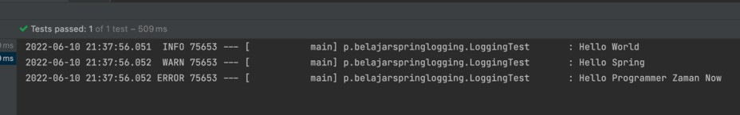
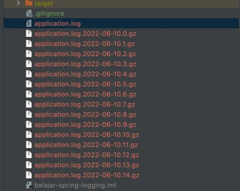

# Spring Logging

## Sebelum Balajar

- Spring Dasar
- Spring Config Properties
- Java Logging

## Agenda

- Pengenalan Spring Logging
- Logging Properties
- Rolling File
- Custom Logging Configuration
- Dan lain-lain

## #1 Pengenalan Spring Logging

### Pengenalan Logging

- Logging sudah kita bahas dengan detail pada materi Java Logging, jadi diharapkan sudah mengikuti materi Java Logging terlebih dahulu sebelum mengikuti materi Spring Logging

### Spring Logging

- Spring sendiri sebenarnya tidak memiliki fitur khusus untuk Logging
- Spring menggunakan library Logging yang sudah tersedia di Java
- Secara default Spring menggunakan library Logback untuk melakukan logging, dan materi Logback sudah kita bahas secara lengkap di kelas Java Logging
- Namun Spring Boot memiliki fitur tambahan untuk mempermudah kita, ketika akan menggunakan Logging di Spring, dan fitur-fitur ini akan kita bahas di kelas ini

## #2 Membuat Project

- <https://start.spring.io/>

## #3 Default Logging Setting

- Saat kita menggunakan Spring Boot, secara default, Spring Boot sudah memiliki setting atau pengaturan default untuk Logging
- Secara default Spring Boot melakukan logging ke Console, dan selain itu Spring Boot juga memiki Log Format

### Kode: Sample Logging

```java
@Slf4j
@SpringBootTest
public class LoggingTest {

	@Test
	void testNothing() {
		log.info("Hello World");
		log.warn("Hello Springg");
		log.error("Hello Programmer Zaman Now");
	}
}
```

### Kode: Sample Logging Output



## #4 Logging Level

- Pada materi Java Logging, kita sudah bahas tentang Logging Level
- Saat menggunakan Logback, biasanya kita bisa ubah level dari logging di file `logback.xml`, namun Spring Boot memiliki fitur dimana kita bisa menggunakan file Spring `application.properties` untuk mengubah pengaturan Logging nya

### Logging Properties

- Kita bisa menggunakan prefix `logging.level` untuk mengubah pengaturan logging level, misal:
- `logging.level.root=info`
- `logging.level.nama.package.nya=warn`

### Kode: Application Properties

```
logging.level.root=info
logging.level.programmerzamannow=warn
```

### Kode: Logging

```java
@Slf4j
@SpringBootTest
@TestPropertySource("classpath:application-first.properties")
public class LoggingTest {

	@Test
	void testNothing() {
		log.info("Hello World");
		log.warn("Hello Springg");
		log.error("Hello Programmer Zaman Now");
	}
}
```

## #5 File Output

- Secara default, Spring Boot melakukan konfigurasi logging output hanya ke Console
- Namun Spring Boot memiliki fitur untuk mengaktifkan logging output ke File, dengan cara menggunakan properties :
- `logging.file.name` untuk menentukan nama file output logging, misal application.log atau `/tmp/application.log`
- `logging.file.path` untuk menentukan nama folder output logging, dan secara otomatis akan menggunakan nama file spring.log, misal jika menggunakan `/tmp/`, maka secara otomatis file log nya adalah `/tmp/spring.log`

### Kode: Application Properties

```
logging.level.root=info
logging.level.programmerzamannow=warn

logging.file.name=application.log
```

## #6 File Rolling

- Spring Boot juga memiliki fitur untuk mempermudah ketika kita ingin melakukan rolling file logging menggunakan Logback
- Ada banyak pengaturan di application properties yang bisa kita gunakan

### File Rolling Properties

| Name                                                   | Keterangan                                                            |
| ------------------------------------------------------ | --------------------------------------------------------------------- |
| `logging.logback.rollingpolicy.file-name-pattarn`      | The filename pattern used to create log archives.                     |
| `logging.logback.rollingpolicy.clean-history-on-start` | If log archive cleanup should occur when the application starts       |
| `logging.logback.rollingpolicy.max-file-size`          | The maximum size of log file before it is archived                    |
| `logging.logback.rollingpolicy.total-size-cap`         | The maximum amount of size log archives can take before being deleted |
| `logging.logging.rollingpolicy.max-history`            | The minimum number of archive log files to keep (defaults to 7)       |

### Kode: Application Properties

```
logging.level.root=info
logging.level.programmerzamannow=warn

logging.file.name=application.log

logging.logback.rollingpolicy.max-file-size=10KB
logging.logback.rollingpolicy.max-history=10
logging.logback.rollingpolicy.total-file-cap=160
```

### Kode: Test Long Logging

```java
@Slf4j
@SpringBootTest
@TestPropertySource("classpath:/application-first.properties")
public class LoggingTest {

	@Test
	void testLongLogging() {
		for (int i = 0; i < 100_000; i++) {
			log.warn("Hello World {}", j);
		}
	}
}
```

### Hasil File Rolling



## #7 Log Group

- Pada beberapa kasus, kadang kita ingin membuat konfigurasi logging level yang sama untuk beberapa package
- Spring Boot memiliki fitur bernama Log Group, dimana kita bisa membuat nama log group untuk beberapa package
- Keuntungannya, kita bisa menggunakan nama log group tersebut ketika melakukan pengaturan logging level
- Kita bisa menggunakan application properties:
- `logging.group.nama=package1,package2,danseterusnya`

### Log Group Spring Boot

| Name  | Loggers                                                                                                                                                                                                 |
| ----- | ------------------------------------------------------------------------------------------------------------------------------------------------------------------------------------------------------- |
| `web` | `org.springframework.core.codec, org.springframework.http, org.springframework.web, org.springframework.boot.actuate.endpoint.web, org.springframework.boot.web.servlet.ServletContextInitializerBeans` |
| `sql` | `org.springframework.jdbc.core, org.hibernate.SQL, org.jooq.tools.LoggerListener`                                                                                                                       |

### Kode: Application Properties

```
logging.group.pzn=programmerzamannow

logging.level.root=info
logging.level.pzn=warn

logging.file.name=application.log

logging.logback.rollingpolicy.max-file-size=10KB
logging.logback.rollingpolicy.max-history=10
logging.logback.rollingpolicy.total-file-cap=160
```

## #8 Log Pattern

- Kita juga bisa mengubah default log pattern bawaan Spring Boot jika kita mau
- Kita bisa menggunakan application properties
- `logging.pattern.console` untuk mengubah log pattern console
- `logging.pattern.file` untuk mengubah log pattern file

### Kode: Application Properties

```java
logging.group.pzn=programmerzamannow

logging.level.root=info
logging.level.pzn=warn

logging.pattern.console=%d{yyyy-MM-dd HH:mm:ss.SSS} [%thread] %-5level %logger{36}% - [%X{requestId}%] - %msg%n

logging.file.name=application.log

logging.logback.rollingpolicy.max-file-size=10KB
logging.logback.rollingpolicy.max-history=10
logging.logback.rollingpolicy.total-file-cap=160
```

## #9 Custom Log Configuration

- Jika kita tidak ingin menggunakan fitur bawaan Spring Boot, dan lebih suka membuat konfigurasi logback sendiri, kita juga bisa menambahkan file `logback.xml` di resources
- Secara otomatis jika Spring Boot mendeteksi terdapat file `logback.xml`, maka Spring Boot akan membaca konfigurasi Logging dari file tersebut
- Untuk konfigurasi manual `logback.xml` sudah kita bahas di kelas Java Logging

## #10 Materi Selanjutnya

- Spring Validation
- Spring Aspect Oriented Programming
- Spring Async
- Spring Data JPA
- Spring Web MVC
- Dan lain-lain
