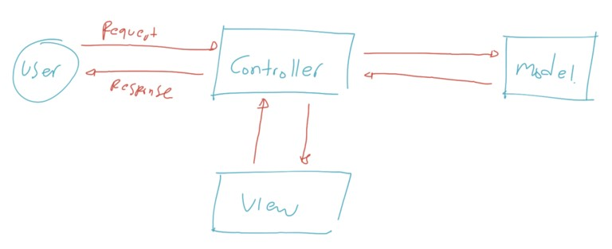
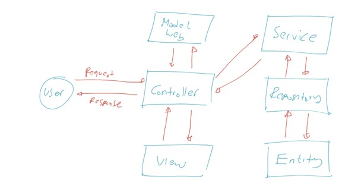
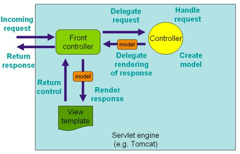
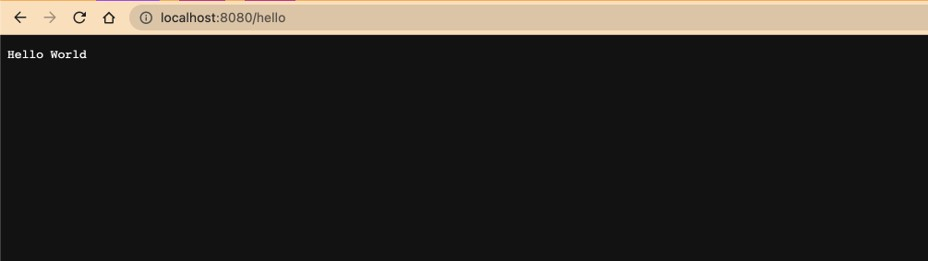
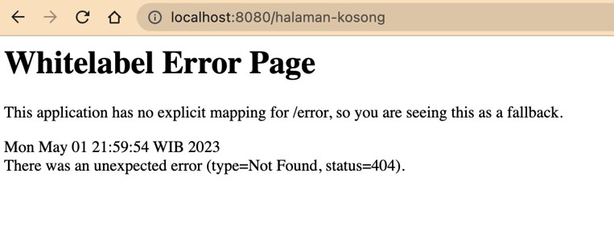

# Spring MVC

## Sebelum Belajar

- Selesai Mengikuti Kelas Java dari Programmer Zaman Now
- Selesai Mengikuti Kelas HTTP dari Programmer Zaman Now
- Selesai Mengikuti Kelas RESTful API dari Programmer Zaman Now
- Spring Dasar
- Spring AOP

## #1 Pengenalan MVC

### Sejarah MVC

- MVC singkatan dari Model View Controller, yaitu salah satu software design pattern yang banyak digunakan ketika pengembangan aplikasi berbasis user interface
- MVC pertama kali dikenalkan oleh Trygve Reenskaug pada tahun 1970 ketika berkunjung ke Xerox Palo Alto Research
- Awalnya MVC banyak digunakan di aplikasi berbasis Desktop, namun sekarang MVC banyak diadopsi di Web
- Saat ini sendiri, design pattern MVC sudah banyak berkembang, ada hierarchical `model–view–controller` (HMVC), `model–view–adapter` (MVA), `model–view–presenter` (MVP), `model–view–viewmodel` (MVVM), dan lain-lain

### Model View Controller

Seperti singkatannya, MVC dibagi menjadi tiga bagian :

- `Model`, merupakan bagian yang merepresentasikan data. Seperti yang kita ketahui, ada banyak sekali jenis data, seperti data request, data response, data table, dan lain-lain, sehingga kadang kita perlu memperkecil lagi scope dari Model itu sendiri ketika membuat aplikasi.
- `View`, merupakan bagian yang merepresentasikan tampilan, seperti halaman web, desktop, mobile, dan lain-lain.
- `Controller`, merupakan bagian yang mengurus alur kerja dari menerima input, memanipulasi data Model, sampai menampilkan View. Anggap saja Controller merupakan core logic dari aplikasi kita

### Diagram MVC



### Pada Kenyataanya

- Walaupun sekilas MVC sangat sederhana, pada kenyataannya ketika kita membuat aplikasi yang kompleks, kita biasanya tidak lagi bisa memanfaatkan MVC
- Kadang kita butuh mengimplementasikan design pattern lain, seperti misal nya Service Pattern, Repository Pattern, dan lain-lain
- Oleh karena itu, jangan terlalu terpaku pada satu pattern, jika kita bisa mengkombinasikan beberapa pattern agar kode aplikasi kita lebih rapi dan baik, maka disarankan untuk melakukan kombinasi

### Diagram Contoh Aplikasi



## #2 Pengenalan Spring Web MVC

- Spring Web MVC (Model View Controller) adalah sebuah fitur di Spring untuk mempermudah membuat web menggunakan Java Servlet
- Pada kelas Java Servlet kita sudah tahu bagaimana sulitnya membuat web di Java Servlet karena semua harus dibuat secara manual
- Spring membuat fitur Web MVC yang bisa digunakan untuk mempermudah semua proses pembuatan Web

### Dispatcher Servlet

- Semua logic Spring Web MVC, diatur oleh sebuah servlet bernama `DispatcherServlet`
- Servlet ini adalah gerbang utama masuknya request di Spring Web MVC
- Dari DispatcherServlet, nanti akan diteruskan ke Controller yang sesuai dengan URL yang diakses
- <https://docs.spring.io/spring-framework/docs/current/javadoc-api/org/springframework/web/servlet/DispatcherServlet.html>

### Cara Kerja Spring Web MVC



## #3 Membuat Project

- <https://start.spring.io/>
- Tambah Dependency :
  - Spring Web MVC
  - Mustache
  - Lombok
  - Validation
  - Configuration Properties

## #4 Controller

- Untuk membuat Controller di Spring, kita bisa menggunakan annotation Controller
- Di annotation Controller sendiri, sebenarnya terdapat annotation Component, hal ini membuat class yang kita tambahkan annotation Controller, akan secara otomatis teregistrasi sebagai Bean
- <https://docs.spring.io/spring-framework/docs/current/javadoc-api/org/springframework/stereotype/Controller.html>

### Kode: Controller

```java
// HelloController.java
package programmerzamannow.webmvc.controller;

import org.springframework.stereotype.Controller;

@Controller
public class HelloController {

}
```

## #5 Request Mapping

- Saat kita belajar menggunakan Servlet, untuk membuat Routing pada Servlet kita menggunakan annotation WebServlet
- Di Spring WebMVC, untuk menambahkan Routing, kita bisa menggunakan annotation RequestMapping pada method yang ingin kita jadikan sebagai Controller Handler nya
- <https://docs.spring.io/spring-framework/docs/current/javadoc-api/org/springframework/web/bind/annotation/RequestMapping.html>

### Kode: Request Mapping

```java
// HelloController.java
package programmerzamannow.webmvc.controller;

import jakarta.servlet.http.HttpServletResponse;
import org.springframework.stereotype.Controller;
import org.springframework.web.bind.annotation.RequestMapping;

@Controller
public class HelloController {

	@RequestMapping(path = "/hello")
	public void helloWorld(HttpServletResponse response) throws IOException {
		response.getWriter().println("Hello World");
	}
}
```

## #6 Menjalankan Web

- Spring Boot secara default menambahkan Apache Tomcat sebagai Embedded Web Server
- Hal ini menjadikan kita tidak perlu lagi untuk membuat aplikasi Spring Boot dalam bentuk War, dan tidak perlu melakukan deployment secara manual ke Apache Tomcat
- Secara default, Spring Boot menggunakan port 8080 untuk menjalankan Apache Tomcat nya
- Jika kita ingin mengubah port nya, kita bisa gunakan properties
- `server.port=NOMOR`
- Pada `application.properties`

### Tampilan Web Browser



## #7 Servlet Request dan Response

- Saat kita membuat Controller Handler dengan `RequestMapping`
- Kita bisa menambahkan parameter `HttpServletRequest` atau `HttpServletResponse` jika memang butuh object tersebut
- Tidak ada aturan posisi parameter, karena Spring WebMVC bisa mendeteksi secara otomatis tipe dan posisi parameter nya

### Kode: Servlet Request dan Response

```java
@Controller
public class HelloController {

	@RequestMapping(path = "/hello")
	public void helloWorld(HttpServletRequest request, HttpServletResponse response) throws IOException {
		String name = request.getParameter("name");
		if (Objects.isNull(name)) {
			name = "Guest";
		}
		response.getWriter().println("Hello " + name);
	}
}
```

## #8 Mock MVC

- Saat kita membuat Web menggunakan Spring WebMVC, Spring telah menyediakan fitur bernama `MockMVC`
- Fitur ini digunakan untuk mempermudah kita melakukan unit test
- Dengan menggunakan MockMVC, kita bisa mengetes semua Controller yang kita buat, tanpa harus menjalankan aplikasi Web nya, dan tidak perlu melakukan pengetesan secara manual menggunakan Browser atau HTTP Client
- <https://docs.spring.io/spring-framework/docs/current/javadoc-api/org/springframework/test/web/servlet/MockMvc.html>

### Static Imports

Ketika menggunakan MockMVC, kita butuh beberapa static utility method dari class-class berikut

- `MockMvcBuilders.*`
- `MockMvcRequestBuilders.*`
- `MockMvcResultMatchers.*`
- `MockMvcResultHandlers.*`

### Kode: Membuat Mock MVC

```java
import org.springframework.beans.factory.annotation.Autowired;
import org.springframework.boot.test.autoconfigure.web.servlet.AutoConfigureMockMvc;
import org.springframework.boot.test.context.SpringBootTest;
import org.springframework.test.web.servlet.MockMvc;

import static org.springframework.test.web.servlet.MockMvcBuilder.*;
import static org.springframework.test.web.servlet.request.MockMvcRequestBuilders.*;
import static org.springframework.test.web.servlet.request.MockMvcResultMatchers.*;
import static org.springframework.test.web.servlet.request.MockMvcResultHandlers.*;

@SpringBootTest
@AutoConfigureMockMvc
public class HelloControllerTest {

	@Autowired
	private MockMvc mockMvc;
}
```

### Kode: Unit Test Hello Route

```java
@SpringBootTest
@AutoConfigureMockMvc
public class HelloControllerTest {

	@Autowired
	private MockMvc mockMvc;

	@Test
	void helloGuest() throws Exception {
		mockMvc.perform(
			get("/hello")
		).andExpectAll(
			status().isOk(),
			content().string(Matchers.containsString("Hello Guest"))
		);
	}

	@Test
	void helloName() throws Exception {
		mockMvc.perform(
			get("/hello").queryParam("name", "Eko")
		).andExpectAll(
			status().isOk(),
			content().string(Matchers.containsString("Hello Eko"))
		);
	}
}
```

## #10 Integration Test

- Saat kita menggunakan MockMVC, Spring tidak akan menjalankan aplikasi web kita
- Spring hanya menyediakan mock request da mock response
- Test yang mensimulasikan saat aplikasi berjalan adalah menggunakan mode Integration Test
- Integration Test artinya adalah menjalankan aplikasi web secara lengkap, bersama dengan web server nya (Apache Tomcat)
- Secara otomatis kita bisa menjalankan aplikasi web ketika test berjalan, dan menghentikannya ketika test selesai

### Kode: Menjalankan Integration Test

```java
@SpringBootTest(webEnvironment = SpringBootTest.WebEnvironment.RANDOM_PORT)
public class HelloControllerIntegrationTest {

	@Autowired
	private TestRestTemplate restTemplate;
}
```

### Test Rest Template

- Berbeda ketika kita menggunakan MockMVC, saat menggunakan mode Integration Test, karena tidak menggunakan mock lagi, maka untuk mengetest aplikasi, kita harus benar-benar mengirim request ke aplikasi web
- Spring memiliki HTTP Client bernama RestTemplate, yang akan kita bahas di materi khusus
- Dan spesial untuk integration test, kita bisa menggunakan object `TestRestTemplate`

### Random Port

- Secara default, saat menjalankan Integration Test, Spring akan menjalankan aplikasi sesuai dengan port di properties `server.port`
- Namun kadang-kadang, portnya bentrok dengan port lain, oleh karena itu direkomendasikan menggunakan random port
- Random port artinya Spring akan mencoba mendeteksi port yang belum digunakan, nanti secara otomatis akan menggunakan port tersebut
- Untuk mendapatkan nilai port nya, kita bisa menggunakan inject `@Value("${local.server.port}")` atau lebih mudah menggunakan `@LocalServerPort`

### Kode: Random Port

```java
@SpringBootTest(webEnvironment = SpringBootTest.WebEnvironment.RANDOM_PORT)
public class HelloControllerIntegrationTest {

	@LocalServerPort
	private Integer port;

	@Autowired
	private TestRestTemplate restTemplate;
}
```

### Kode: Integration Test

```java
@Test
void helloGuest() {
	String response = restTemplate.getForEntity("http://localhost:" + port + "/hello", String.class).getBody();
	Assertions.assertNotNull(response);
	Assertions.assertEquals("Hello Guest", response.trim());
}

@Test
void helloEko() {
	String response = restTemplate.getForEntity("http://localhost:" + port + "/hello?name=Eko", String.class).getBody();
	Assertions.assertNotNull(response);
	Assertions.assertEquals("Hello Eko", response.trim());
}
```

## #11 Service

### Service Layer

- Di awal kita belajar tentang MVC (Model View Controller)
- Di bahasa pemrograman atau framework lain, biasanya orang menambahkan kode yang berhubungan dengan bisnis logic di Controller Layer, namun berbeda dengan programmer Java
- Untuk programmer Java, sebenarnya kebiasaan atau best practice nya akan membuat layer khusus untuk kode bisnis logic, bernama Service Layer
- Service Layer di Spring memiliki annotation khusus, yaitu `@Service`
- Saat kita menambahkan `@Service`, secara otomatis juga class tersebut akan di registrasikan sebagai bean
- <https://docs.spring.io/spring-framework/docs/current/javadoc-api/org/springframework/stereotype/Service.html>s

### Interface

- Salah satu best practice di Spring adalah, saat kita membuat Service Layer, kita akan buat dalam bentuk Interface
- Lalu kita akan buat class implementasi yang diregistrasikan sebagai Spring Bean
- Sedangkan class yang membutuhkan Service Layer tersebut, akan menggunakan Interface nya, bukan class implementasinya
- Salah satu keuntungan mengekspos Interface dibanding Class adalah, kita bisa mengubah atau mengganti isi dari class implementasi, tanpa berdampak pada class lain yang menggunakan interface nya

### Kode: Hello Service

```java
public interface HelloService {

	String hello(String name);
}

@Service
public class HelloServiceImpl implements HelloService {

	@Override
	public String hello(String name) {
		if (name == null) {
			return "Hello Guest";
		} else {
			return "Hello " + name;
		}
	}
}
```

### Kode: Hello Service Test

```java
@SpringBootTest
class HelloServiceImplTest {

	@Autowired
	private HelloService helloService;

	@Test
	void hello() {
		Assertions.assertEquals("Hello Guest", helloService.hello(null));
		Assertions.assertEquals("Hello Eko", helloService.hello("Eko"));
	}
}
```

## #12 Mock Bean

- Saat kita belajar di kelas Java Unit Test, kita sudah belajar tentang melakukan mock menggunakan Mockito
- Saat kita menggunakan Spring, kita juga melakukan hal tersebut
- Selain itu, Spring juga bisa secara otomatis meregistrasikan Mock object tersebut sebagai bean, sehingga class yang membutuhkan bean tersebut, secara otomatis bisa mendapatkan Mock object yang kita buat
- Untuk membuat Mock Bean, kita cukup gunakan annotation `@MockBean`
- <https://docs.spring.io/spring-boot/docs/current/api/org/springframework/boot/test/mock/mockito/MockBean.html>

### Kode: Hello Controller

```java
@Controller
public class HelloController {

	@Autowired
	private HelloService helloService;

	@RequestMapping(path = "/hello")
	public void helloWorld(HttpServletRequest request, HttpServletResponse response) throws IOException {
		String name = request.getParameter("name");
		String responseBody = helloService.hello(name);
		response.getWriter().println(responseBody);
	}
}
```

### Kode: Mock Bean

```java
@SpringBootTest
class HelloServiceImplTest {

	@MockBean
	private HelloService helloService;

	@BeforeEach
	void setUp() {
		Mockito.when(helloService.hello(Mockito.antString()))
			.thenReturn("Hello Guys");
	}

	@Test
	void helloGuest() throws Exception {
		mockMvc.perform(
			get("/hello").queryParam("name", "Budi")
		).andExpectAll(
			status().isOk(),
			content().string(Matchers.containsString("Hello Guys"))
		);
	}
}
```

## #13 Request Method

- Saat kita menggunakan RequestMapping, terdapat attribute method yang bisa kita gunakan untuk menentukan jenis HTTP Method yang diperbolehkan
- Secara default, jika kita tidak memilihnya, maka Controller Method tersebut bisa diakses oleh seluruh jenis HTTP Method
- Jika kita mengirim method yang tidak diperbolehkan, maka Spring akan menolak dengan response 405 Method Not Allowed

### Kode: Request Method GET

```java
@Controller
public class HelloController {

	@Autowired
	private HelloService helloService;

	@RequestMapping(path = "/hello", method = RequestMethod.GET)
	public void helloWorld(HttpServletRequest request, HttpServletResponse response) throws IOException {
		String name = request.getParameter("name");
		String responseBody = helloService.hello(name);
		response.getWriter().println(responseBody);
	}
}
```

### Kode: Unit Test Post

```java
@Test
void helloPost() throws Exception {
	mockMvc.perform(
		post("/hello").queryParam("name", "Eko")
	).andExpectAll(
		status().isMethodNotAllowed()
	);
}
```

### Shortcut Annotation

| RequestMapping Method | Shortcut Annotation |
| --------------------- | ------------------- |
| `GET`                 | `@GetMapping`       |
| `POST`                | `@PostMapping`      |
| `PUT`                 | `@PutMapping`       |
| `PATCH`               | `@PatchMapping`     |
| `DELETE`              | `@DeleteMapping`    |

### Kode: Shortcut Mapping

```java
@Controller
public class HelloController {

	@Autowired
	private HelloService helloService;

	@GetMapping(path = "/hello")
	public void helloWorld(HttpServletRequest request, HttpServletResponse response) throws IOException {
		String name = request.getParameter("name");
		String responseBody = helloService.hello(name);
		response.getWriter().println(responseBody);
	}
}
```

## #14 Request Param

- Saat kita belajar Java Servlet, kita sudah tahu untuk mendapatkan Query/Request Parameter dari ServletRequest
- Namun di Spring, kita bisa menggunakan Annotation `@RequestParam` untuk memberitahu bahwa kita membutuhkan request parameter
- Selain itu, kita bisa menambahkan apakah query parameter itu wajib atau tidak, dan juga bisa menambahkan default value nya jika tidak dikirim oleh user
- Secara otomatis data request parameter akan dikirim datanya ke parameter yang kita tentukan
- <https://docs.spring.io/spring-framework/docs/current/javadoc-api/org/springframework/web/bind/annotation/RequestParam.html>

### Kode: Request Param

```java
@Controller
public class HelloController {

	@Autowired
	private HelloService helloService;

	@GetMapping(path = "/hello")
	public void helloWorld(@RequestParam(name = "name", required = false) String name, HttpServletResponse response) throws IOException {
		String responseBody = helloService.hello(name);
		response.getWriter().println(responseBody);
	}
}
```

### Konversi Tipe Data

- Kita tahu bahwa query parameter itu datanya adalah String
- Namun jika kita membutuhkan datanya dalam bentuk tipe data lain, Spring bisa secara otomatis melakukan konversi tipe datanya menggunakan fitur Converter yang pernah kita bahas di materi Spring Config Properties

### Kode: Membuat Date Converter

```java
@Component
@Slf4j
public class StringToDateConverter implements Converter<String, Date> {

	private SimpleDateFormat dateFormat = new SimpleDateFormat("yyyy-MM-dd");

	@Override
	public Date convert(String source) {
		try {
			retrun dateFormat.parse(source);
		} catch (ParseException e) {
			log.warn("Error convert data from string {}", source, e);
			return null;
		}
	}
}
```

### Kode: Date Controller

```java
@Controller
public class DateController {

	private final SimpleDateFormat dateFormat = new SimpleDateFormat("yyyyMMdd");

	@GetMapping(path = "/date")
	public void getDate(@RequestParam(name = "date") Date datem HttpServletResponse response) throws IOException {
		response.getWriter().println("Date : " + dateFormat.format(date));
	}
}
```

### Kode: Date Controller Test

```java
@Test
void date() throws Exception {
	mockMvc.perform(
		get("/date").queryParam("date", "2020-10-10")
	).andExpectAll(
		status().isOk(),
		content().string(Matchers.containsString("Date : 20201010"))
	);
}
```

## #15 Response Body

- Secara default, kita harus menuliskan response dari Controller Method ke HttpServletResponse
- Namun hal ini kadang menyulitkan jika misal kita hanya ingin mengembalikan data berupa String
- Spring memiliki annotation `@ResponseBody`, yang bisa secara otomatis menjadikan data yang dikembalikan dari Controller Method menjadi data yang ditulis ke HttpServletResponse
- <https://docs.spring.io/spring-framework/docs/current/javadoc-api/org/springframework/web/bind/annotation/ResponseBody.html>

### Kode: Date Controller

```java
@Controller
public class DateController {

	private final SimpleDateFormat dateFormat = new SimpleDateFormat("yyyyMMdd");

	@GetMapping(path = "/date")
	@ResponseBody
	public String getDate(@RequestParam(name = "date") Date date) {
		return "Date : " + dateFormat.format(date);
	}
}
```

## #16 Request Content Type

- Saat kita membuat Controller Method, kita juga bisa membatasi jenis `Content-Type` yang dikirim oleh user
- Contoh pada kasus melakukan submit data form, kita biasanya meminta `Content-Type` yang dikirim oleh user adalah `application/x-www-form-urlencoded`
- Untuk membatasi tipe Content-Type, kita bisa tambahkan di `@RequestMapping` pada attribute `consume`

### Kode: Form Controller

```java
@Controller
public class FormController {

	@PostMapping(path = "/form/hello", consumes = MediaType.APPLICATION_FORM_URLENCODED_VALUE)
	public String hello(@RequestParam(name = "name") String name) {
		return "Hello " + name;
	}
}
```

### Kode: Form Controller Unit Test

```java
@Test
void formHello() throws Exception {
	mockMvc.perform(
		post("/form/hello")
			.contentType(MediaType.APPLICATION_FORM_URLENCODED)
			.param("name", "Eko")
	).andExpectAll(
		status().isOk()
		.content().string(Matchers.containsString("Hello Eko"))
	);
}
```

## #17 Response Content Type

- Di `@RequestMapping`, selain consume, terdapat juga attribute produce, yang bisa kita gunakan untuk memberi tahu di HTTP Response, `Content-Type` dari response body yang dikembalikan

### Kode: Response Content type

```java
@PostMapping(
	path = "/form/hello",
	consumes = MediaType.APPLICATION_FORM_URLENCODED_VALUE,
	produces = MediaType.TEXT_HTML_VALUE
)
@ResponseBody
public String hello(@RequestParam(name = "name") String name) {
	return """
					<html>
					<body>
					<h1>Hello $name</h1>
					</body>
					</html>
				""".replace("$name", name);
}
```

### Kode: Form Controller Unit Test

```java
@Test
void formHello() throws Exception {
	mockMvc.perform(
		post("/form/hello")
			.contentType(MediaType.APPLICATION_FORM_URLENCODED)
			.param("name", "Eko")
	).andExpectAll(
		status().isOk(),
		header().string(HttpHeaders.CONTENT_TYPE, Matchers.containsString(MediaType.TEXT_HTML_VALUE)),
		content().string(Matchers.containsString("Hello Eko"))
	);
}
```

## #18 Request Header

- Untuk mendapatkan Http Request Header, seperti yang sudah kita pelajari di materi Java Servlet, kita bisa mendapatkannya melalui `HttpServletRequest`
- Namun Spring WebMVC memiliki cara lebih mudah dengan menggunakan annotation `@RequestHeader`
- Caranya kita bisa tambahkan di parameter di Controller Method
- Kita juga bisa menentukan apakah wajib atau tidak, dan juga default value nya
- Selain itu, fitur Converter juga bisa digunakan untuk Request Header
- <https://docs.spring.io/spring-framework/docs/current/javadoc-api/org/springframework/web/bind/annotation/RequestHeader.html>

### Kode: Header Controller

```java
@Controller
public class HeaderController {

	@GetMapping(path = "/header/token")
	@ResponseBody
	public String header(@RequestHeader(name = "X-TOKEN") String token) {
		if (token.equals("EKO")) {
			return "OK";
		} else {
			return "KO";
		}
	}
}
```

### Kode: Header Unit Test

```java
@Test
void headerOk() throws Exception {
	mockMvc.perform(
		get("/header/token").header("X-TOKEN", "EKO")
	).andExpectAll(
		status().isOk(),
		content().string(Matchers.containsString("OK"))
	);
}
```

## #19 Path Variable

- Salah satu fitur Spring WebMVC yang berbeda dari Java Servlet adalah Path Variable
- Path Variable adalah fitur dimana kita bisa membuat patterns pada URL Path, dan mengambil nilai yang terdapat di URL Path nya
- Dengan fitur ini, kita bisa membuat URL Path yang dinamis, dan bisa mendapatkan nilai dinamis di URL Path nya secara otomatis
- Untuk menggunakan fitur ini, kita perlu tambahkan variable path nya di URL Path nya, dan juga menambahkan parameter dengan annotation `@PathVariable`
- Path Variable juga memiliki kemampuan otomatis konversi tipe data dengan Converter
- <https://docs.spring.io/spring-framework/docs/current/javadoc-api/org/springframework/web/bind/annotation/PathVariable.html>

### Kode: Order Controller

```java
@Controller
public class OrderController {

	@GetMapping(path = "/orders/{orderId}/products/{productId}")
	@ResponseBody
	public String order(
		@PathVariable("orderId") String orderId,
		@PathVariable("productId") String productId,
	) {
		return "Order : " + orderId + ", Product : " + productId;
	}
}
```

### Kode: Unit Test Order Controller

```java
@Test
void orderProduct() throws Exception {
	mockMvc.perform(
		get("/orders/1/products/2")
	).andExpectAll(
			status().isOk(),
			content().string(Matchers.containsString("Order : 1, Product : 2"))
	);
}
```

## #20 Form Request

- Seperti pernah kita bahas di materi Java Servlet, untuk mendapatkan data Form Request, kita bisa menggunakan cara yang sama dengan mendapatkan data di Query Parameter
- Begitu pula di Spring Web MVC
- Untuk mendapatkan data di Form Request, kita bisa menggunakan annotation `@RequestParam`
- Secara otomatis Spring Web MVC juga akan mengambil data dari Form Request atau Query Parameter
- Seperti yang pernah kita praktekan di materi Request Content Type

### Kode: Form Controller

```java
@Controller
public class FormController {

	private final SimpleDateFormat dateFormat = new SimpleDateFormat("yyyy-MM-dd");

	@PostMapping(path = "/form/person", consumes = MediaType.APPLICATION_FORM_URLENCODED_VALUE)
	@ResponseBody
	public String createPerson(
		@RequestParam(name = "name") String name,
		@RequestParam(name = "birthDate") Date birthDate,
		@RequestParam(name = "address") String address,
	) {
		return "Success create Person with name : " + name + ", birthDate : " + dateFormat.format(birthDate) + ", address : " + address;
	}
}
```

### Kode: Form Controller Test

```java
@Test
void createPerson() throws Exception {
	mockMvc.perform(
		post("/form/person")
			.contentType(MediaType.APPLICATION_FORM_URLENCODED)
			.param("name", "Eko")
			.param("birthDate", "1990-10-10")
			.param("address", "Indonesia")
	).andExpectAll(
		status().isOk(),
		content().string(Matchers.containsString("Success create Person with name : Eko, birthDate : 1990-10-10, address : Indonesia"))
	);
}
```

## #21 Upload File

- Upload File di Spring Web MVC bisa menggunakan cara seperti di Java Web Servlet, atau bisa menggunakan fitur di Spring Web MVC yang lebih mudah menggunakan annotation `@RequestPart`
- <https://docs.spring.io/spring-framework/docs/current/javadoc-api/org/springframework/web/bind/annotation/RequestPart.html>
- Untuk tipe data pada parameter nya, kita bisa gunakan `MultipartFile`
- https://docs.spring.io/spring-framework/docs/current/javadoc-api/org/springframework/web/multipart/MultipartFile.html

### Upload File Properties

- Spring memiliki pengaturan yang bisa kita atur untuk Upload file, misal kita ingin membatasi jumlah ukuran file misal nya, dan lain-lain
- Semua pengaturan untuk upload file bisa kita tambahkan di application properties, dengan prefix `spring.servlet.multipart`
- Kita bisa lihat daftarnya disini :
- <https://docs.spring.io/spring-boot/docs/current/reference/html/application-properties.html#appendix.application-properties.web>

### Kode: Upload Controller

```java
@Controller
public class UploadController {

	@PostMapping(path = "/upload/profile", consumes = MediaType.MULTIPART_FORM_DATA_VALUE)
	@ResponseBody
	public String upload(
		@RequestParam(name = "name") String name,
		@RequestPart(name = "profil") MultipartFile profile
	) throws IOException {
		Path path = Path.of("upload/" + profile.getOriginalFilename());
		Files.write(path, profile.geBytes());
		return "Success save profile " + name + " to " + path;
	}
}
```

### Kode: Test Upload Controller

```java
@Test
void uploadFile() throws Exception {
	mockMvc.perform(
		multipart("/upload/profile")
			.file(new MockMultipartFile("profile", "profile.png", "image/png", getClass().getResourceAsStream("/images/profile.ong")))
			.param("name", "Eko")
			.contentType(MediaType.MULTIPART_FORM_DATA)
	).andExpectAll(
		status().isOk(),
		content().string(Matchers.containsString("Success save profile Eko to upload/profile.png"))
	);
}
```

## #22 Request body

- Saat kita membuat aplikasi web berupa RESTful API, kadang kita ingin mengirim data lewat Request Body dalam bentuk format data seperti JSON, XML, dan sejenisnya
- Spring bisa digunakan untuk membaca data Request Body secara mudah, cukup menggunakan annotation `@RequestBody`
- <https://docs.spring.io/spring-framework/docs/current/javadoc-api/org/springframework/web/bind/annotation/RequestBody.html>

### Kode: Hello Request & Response

```java
public class HelloRequest {

	private String name;

	public String getName() {
		return name;
	}

	public void setName(String name) {
		this.name = name;
	}
}

public class HelloResponse {

	private String hello;

	public String getHello() {
		return hello;
	}

	public void setHello(String hello) {
		this.hello = hello;
	}
}
```

### Kode: Body Controller

```java
@PostMapping(
	path = "/body/hello",
	consumes = MediaType.APPLICATION_JSON_VALUE,
	produces = MediaType.APPLICATION_JSON_VALUE,
)
@ResponseBody
public String body(@RequestBody String requestBody) throws JsonProcessingException {
	HelloRequest request = objectMapper.readValue(requestBody, HelloRequest.class);

	HelloResponse response = new HelloResponse();
	response.setHello("Hello " + request.getName());

	return objectMapper.writeValueAsString(response);
}
```

### Kode: Unit Test Body Controller

```java
void bodyHello() throws Exception {
	HelloRequest request = new HelloRequest();
	request.setName("Eko");

	mockMvc.perform(
		post("/body/hello")
			.contentType(MediaType.APPLICATION_JSON)
			.accept(MediaType.APPLICATION_JSON)
			.content(objectMapper.writeValueAsString(request))
	).andExpectAll(
			status().isOk()
	).andExpect(result -> {
			String responseBody = result.getResponse().getContentAsString();
			HelloResponse helloResponse = objectMapper.readValue(responseBody, HelloResponse.calss);
			Assertions.assertEquals("Hello Eko", helloResponse.getHello());
	});
}
```

## #23 Response Status

- Saat kita membuat HTTP Response, kadang kita ingin mengubah Response Status Code
- Secara default, response sukses adalah 200, kadang mungkin kita ingin ubah secara manual
- Jika kita ingin ubah secara dinamis, kita bisa gunakan `HttpServletResponse`
- Atau jika kita ingin hardcode response status nya, kita bisa gunakan annotation `@ResponseStatus` di Controller Method nya
- <https://docs.spring.io/spring-framework/docs/current/javadoc-api/org/springframework/web/bind/annotation/ResponseStatus.html>

### Kode: Code Controller

```java
@Controller
public class CodeController {

	@DeleteMapping(path = "/products/{id}")
	@ResponseBody
	@ResponseStatus(HttpStatus.ACCEPTED)
	public void delete(@PathVariable("id") Integer id) {
		// delete to database
	}
}
```

### Kode: Test Code Controller

```java
@Test
void deleteProduct() throws Exception {
	mockMvc.perform(
			delete("/products/12345")
	).andExpectAll(
			status().isAccepted()
	);
}
```

## #24 Response Entity

- Sekarang kita sudah tahu beberapa cara membuat HTTP Response, dari menggunakan `HttpServletResponse` dan `@ResponseBody`
- Spring menyediakan cara yang sangat flexible untuk membuat HTTP Response menggunakan object `ResponseEntity`
- Kita bisa return di Controller Method dengan object ResponseEntity
- <https://docs.spring.io/spring-framework/docs/current/javadoc-api/org/springframework/http/ResponseEntity.html>

### Kode: Auth Controller

```java
@Controller
public class AuthController {

	@PostMapping(path = "/auth/login", consumes = MediaType.APPLICATION_FORM_URLENCODED_VALUE)
	public ResponseEntity<String> login(
		@RequestParam(name = "username") String username,
		@RequestParam(name = "password") String password
	) {
		if ("eko".equals(username) && "rahasia".equals(password)) {
			return new ResponseEntity<>("Ok", HttpStatus.OK);
		} else {
			return new ResponseEntity<>("kO", HttpStatus.UNAUTHORIZED);
		}
	}
}
```

### Kode: Unit Test Sukses

```java
@Test
void loginSuccess() throws Exception {
	mockMvc.perform(
			post("/auth/login")
				.contentType(MediaType.APPLICATION_FORM_URLENCODED)
				.param("username", "eko")
				.param("password", "rahasia")
	).andExpectAll(
			status().isOk(),
			content().string(Matchers.containsString("OK"))
	);
}
```

### Kode: Unit Test Gagal

```java
@Test
void loginFailed() throws Exception {
	mockMvc.perform(
			post("/auth/login")
				.contentType(MediaType.APPLICATION_FORM_URLENCODED)
				.param("username", "eko")
				.param("password", "salah")
	).andExpectAll(
			status().isUnauthorized(),
			content().string(Matchers.containsString("KO"))
	);
}
```

## #25 Cookie

- Cara membuat Cookie di Spring Web MVC bisa dilakukan dengan menggunakan `HttpServletResponse` seperti pada Java Servlet
- Namun untuk membaca Cookie yang dikirim oleh Web Browser, kita bisa otomatis menggunakan annotation `@CookieValue`
- <https://docs.spring.io/spring-framework/docs/current/javadoc-api/org/springframework/web/bind/annotation/CookieValue.html>

### Kode: Auth Controller Login

```java
@PostMapping(path = "/auth/login", consumes = MediaType.APPLICATION_FORM_URLENCODED_VALUE)
public ResponseEntity<String> login(
		@RequestParam(name = "username") String username,
		@RequestParam(name = "password") String password
		HttpServletResponse servletResponse
) {
	if ("eko".equals(username) && "rahasia".equals(password)) {
		Cookie cookie = new Cookie("username", username);
		cookie.setPath("/");
		servletResponse.addCookie(cookie);
		return new ResponseEntity<>("Ok", HttpStatus.OK);
	} else {
		return new ResponseEntity<>("kO", HttpStatus.UNAUTHORIZED);
	}
}
```

### Kode: Test Auth Controller Login

```java
@Test
void loginSuccess() throws Exception {
	mockMvc.perform(
			post("/auth/login")
				.contentType(MediaType.APPLICATION_FORM_URLENCODED)
				.param("username", "eko")
				.param("password", "salah")
	).andExpectAll(
			status().isUnauthorized(),
			content().string(Matchers.containsString("KO")),
			cookie().value("username", Matchers.is("eko"))
	);
}
```

### Kode: Auth Controller Get User

```java
@GetMapping(path = "/auth/user")
public ResponseEntity<String> getUser(@CookieValue("username") String username) {
	return new ResponseEntity<>("Hello " + username, HttpStatus.OK);
}
```

### Kode: Test Auth Controller Get User

```java
@Test
void getUser() throws Exception {
	mockMvc.perform(
			get("auth/user")
				.cookie(new Cookie("username", "eko"))
	).andExpectAll(
			.status().isOk()
			.content().string(Matchers.containsString("Hello eko"))
	);
}
```

## #26 Model Attribute

- Saat kita mengirim request berupa form dengan input yang banyak, kadang menyulitkan kita jika kita harus membuat semua parameter input dengan `@RequestParam`
- Bayangkan jika ada 10 input, maka kita harus membuat 10 parameter `@RequestParam`
- Spring memiliki fitur dimana kita bisa melakukan binding attribute yang dikirim dengan class Java Bean yang kita buat menggunakan annotation `@ModelAttribute`
- <https://docs.spring.io/spring-framework/docs/current/javadoc-api/org/springframework/web/bind/annotation/ModelAttribute.html>

### Kode: Class Create Person Request

```java
public class CreatePersonRequest {

	private String firstName;

	private String middleName;

	private String lastName;

	private String email;

	private String phone;
}
```

### Kode: Person Controller

```java
@PostMapping(path = "/person", consumes = MediaType.APPLICATION_FORM_URLENCODED_VALUE)
@ResponseBody
@ResponseStatus(HttpStatus.OK)
public String createPerson(@ModelAttribute CreatePersonRequest request) {
	return new StringBuilder().append("Success create person ")
		.append(request.getFirstName()).append(" ")
		.append(request.getMiddleName()).append(" ")
		.append(request.getLastName())
		.append(" with email ").append(request.getEmail())
		.append(" and phone ").append(request.getPhone())
		.toString();
}
```

### Kode: Test Person Controller

```java
@Test
void createPerson() throws Exception {
	mockMvc.perform(
		post("/person")
			.contentType(MediaType.APPLICATION_FORM_URLENCODED)
			.param("firstName", "Eko")
			.param("middleName", "Kurniawan")
			.param("lastName", "Khannedy")
			.param("email", "eko@example.com")
			.param("phone", "0882182122")
	).andExpectAll(
		status().isOk(),
		content().string(Matchers.containsString("Success create person Eko Kurniawan Khannedy " + "with email eko@example.com and phone 0882182122"))
	);
}
```

### Nested Model

- Salah satu yang powerfull di Model Attribute adalah, kita bisa otomatis juga membuat object dari nested attribute di Model
- Misal pada kasus Person sebelumnya, misal saja terdapat sebuah attribute Address yang merupakan Java Bean lainnya
- Untuk mengisi data Address, kita bisa gunakan `.` (titik), misal `address.street`, `address.city`, dan seterusnya

### Kode: Class Create Address Request

```java
public class CreateAddressRequest {

	private String street;

	private String city;

	private String country;

	private String postalCode;
}

public class CreatePersonRequest {

	private CreateAddressRequest address;

	private String firstName;

	private String middleName;

	private String lastName;

	private String email;

	private String phone;
}
```

### Kode: Person Controller

```java
@PostMapping(path = "/person", consumes = MediaType.APPLICATION_FORM_URLENCODED_VALUE)
@ResponseBody
@ResponseStatus(HttpStatus.OK)
public String createPerson(@ModelAttribute CreatePersonRequest request) {
	return new StringBuilder().append("Success create person ")
		.append(request.getFirstName()).append(" ")
		.append(request.getMiddleName()).append(" ")
		.append(request.getLastName())
		.append(" with email ").append(request.getEmail())
		.append(" and phone ").append(request.getPhone())
		.append(" with address ")
		.append(request.getAddress().getStreet()).append(", ")
		.append(request.getAddress().getCity()).append(", ")
		.append(request.getAddress().getCountry()).append(", ")
		.append(request.getAddress().getPostalCode())
		.toString();
}
```

### Kode: Test Person Controller

```java
@Test
void createPersonNested() throws Exception {
	mockMvc.perform(
		post("/person")
			.contentType(MediaType.APPLICATION_FORM_URLENCODED)
			.param("firstName", "Eko")
			.param("middleName", "Kurniawan")
			.param("lastName", "Khannedy")
			.param("email", "eko@example.com")
			.param("phone", "0882182122")
			.param("address.street", "Jalan Belum Jadi")
			.param("address.city", "Jakarta")
			.param("address.country", "Indonesia")
			.param("address.postalCode", "11111")
	).andExpectAll(
		status().isOk(),
		content().string(Matchers.containsString("Success create person Eko Kurniawan Khannedy " + "with email eko@example.com and phone 0882182122 " + "Jalan Belum jadi, Jakarta, Indonesia, 11111"))
	);
}
```

### List

- Selain nested attribute, kita juga bisa menggunakan List sebagai model attribute, cara mengirim parameter nya cukup mudah
- Untuk list dengan tipe data primitive seperti String, Integer, dan sejenisnya, kita bisa gunakan parameter : - `namaParam[0]=data1` - `namaParam[1]=data2`
  Dan seterusnya
- Untuk list dengan tipe data object lagi, kita bisa gunakan parameter :
  - `namaParam[0].field1=data1`
  - `namaParam[0].field2=data2`
  - `namaParam[1].field1=data1`
  - `namaParam[1].field2=data2`

### Kode: Create Social Media Request

```java
public class CreateSocialMediaRequest {

	private String name;

	private String location;
}

public class CreatePersonRequest {

	private List<String> hobbies;

	private List<CreateSocialMediaRequest> socialMedia;

	private CreateAddressRequest address;
}
```

### Kode: Test Person Controller

```java
@Test
void createPersonNestedList() throws Exception {
	mockMvc.perform(
		post("/person")
			.contentType(MediaType.APPLICATION_FORM_URLENCODED)
			.param("firstName", "Eko")
			.param("middleName", "Kurniawan")
			.param("lastName", "Khannedy")
			.param("email", "eko@example.com")
			.param("phone", "0882182122")
			.param("address.street", "Jalan Belum Jadi")
			.param("address.city", "Jakarta")
			.param("address.country", "Indonesia")
			.param("address.postalCode", "11111")
			.param("hobbies[0]", "Reading")
			.param("hobbies[1]", "Coding")
			.param("socialMedia[0].name", "Facebook")
			.param("socialMedia[0].name", "facebook.com/ProgrammerZamannNow")
	).andExpectAll(
		status().isOk(),
		content().string(Matchers.containsString("Success create person Eko Kurniawan Khannedy " + "with email eko@example.com and phone 0882182122 " + "Jalan Belum jadi, Jakarta, Indonesia, 11111"))
	);
}
```

## #27 Json

- Spring Web MVC terintegrasi dengan baik dengan library Jackson untuk menangani tipe data JSON, baik itu untuk consume dari Request Body atau produce ke Response Body
- Saat kita menggunakan consume dengan tipe data JSON atau produce dengan tipe data JSON, kita tidak perlu secara manual melakukan konversi dari object ke JSON String, hal itu sudah otomatis di handle oleh Jackson

### Konfigurasi Jakson

- Kita tidak perlu membuat Bean Jackson secara manual lagi, karena itu sudah di handle oleh Spring Boot
- Jika kita butuh melakukan konfigurasi untuk Jackson, kita bisa menggunakan application properties
- Semua daftar konfigurasinya bisa kita gunakan dengan prefix `spring.jackson`.
- <https://docs.spring.io/spring-boot/docs/current/reference/html/application-properties.html#appendix.application-properties.json>

### Kode: Person API Controller

```java
@PostMapping(
	path = "/api/person",
	consumes = MediaType.APPLICATION_JSON_VALUE,
	produces = MediaType.APPLICATION_JSON_VALUE
)
@ResponseBody
public CreatePersonRequest createPerson(@RequestBody CreatePersonRequest reqeust) {
	return request;
}
```

### Kode: Test Person API Controller

```java
@Test
void testJson() {
	// ...
	request.setHobbies(List.of("Coding", "Reading"));
	request.setSocialMedia(new ArrayList<>());
	request.getSocialMedia().add(new CreateSocialMediaRequest("Facebook", "facebook.com/ProgrammerZamannNow"));

	mockMvc.persom(
		post("/api/person")
			.contentType(MediaType.APPLICATION_JSON)
			.accept(MediaType.APPLICATION_JSON)
			.content(objectMapper.writeValueAsString(request))
	).andExpectAll(
		status().isOk(),
		content().json(objectMapper.writeValueAsString(request))
	);
}
```

## #28 Validation

- Spring WebMVC terintegrasi dengan baik dengan Bean Validation seperti yang sudah kita bahas di materi Spring Validation
- Saat kita membuat parameter `@ModelAttribute` atau `@RequestBody`, jika object tersebut ingin di validasi secara otomatis menggunakan Bean Validation, kita bisa tambahkan annotation `@Valid`
- Jika data tidal valid, secara otomatis Spring akan mengembalikan response `400` Bad Request
- Khusus validasi di Controller, exception yang akan dibuat adalah `MethodArgumentNotValidException` bukan `ConstraintViolationException` nya Bean Validation

### Kode: Create Person Validation

```java
public class CreatePersonRequest {

	private List<String> hobbies;

	private List<CreateSocialMediaRequest> socialMedia;

	private CreateAddressRequest address

	@NotBlank
	private String firstName;

	private String middleName;

	private String lastName;

	@NotBlank
	private String email;

	@NotBlank
	private String phone;
}
```

### Kode: Request Body Valid

```java
@PostMapping(
	path ="/api/person",
	consumes = MediaType.APPLICATION_JSON_VALUE,
	produces = MediaType.APPLICATION_JSON_VALUE,
)
@ResponseBody
public CreatePersonRequest createPerson(@RequestBody @Valid CreatePersonRequest request) {
	return request;
}
```

### Kode: Test Request Body Valid

```java
@Test
void createPersonValidationError() throws Exception {
	CreatePersonRequest return  = new CreatePersonRequest();
	request.setMiddlename("Kurniawan");
	request.setHobbies(List.of("Coding", "Reading"));
	request.setSocialMedia(new ArrayList<>());
	request.getSocialMedia().add(new CreateSocialMediaRequest("Facebook", "facebook.com/ProgrammerZamannNow"));

	mockMvc.persom(
		post("/api/person")
			.contentType(MediaType.APPLICATION_JSON)
			.accept(MediaType.APPLICATION_JSON)
			.content(objectMapper.writeValueAsString(request))
	).andExpectAll(
		status().isBadRequest()
	);
}
```

### Kode: Model Attribute Valid

```java
@PostMapping(path = "/person", consumes = MediaType.APPLICATION_FORM_URLENCODED_VALUE)
@ResponseBody
@ResponseStatus(HttpStatus.OK)
public String createPerson(@ModelAttribute @Valid CreatePersonRequest request) {

	System.out.println(request.getHobbies());
	for (CreateSocialMediaRequest socialMedia : reqeust.getSocialMedia()) {
		System.out.println(socialMedia.getName() + " : " + socialMedia.getLocation());
	}

	return new StringBuilder().append("Success create person")
		.append(request.getFirstName()).append(" ")
		.append(request.getMiddleName()).append(" ")
		.append(request.getLastName())
		// ...
}
```

### Kode: Test Model Attribute Valid

```java
@Test
void createPersonInvalid() throws Exception {
	mockMvc.perform(
			post("/person")
				.contentType(MediaType.APPLICATION_FORM_URLENCODED)
				.param("middleName", "Kurniawan")
				.param("lastName", "Khannedy")
	).andExpectAll(
			status().isBadRequest()
	);
}
```

## #29 Exception Handler

- Saat terjadi error di Controller, seperti validation error, logic error, dan lain-lain
- Secara default, Spring akan mengembalikan response error sesuai jenis errornya
- Kadang, kita ingin membuat halaman atau response error sendiri
- Hal ini bisa kita buat dengan menggunakan `@ControllerAdvice`
- <https://docs.spring.io/spring-framework/docs/current/javadoc-api/org/springframework/web/bind/annotation/ControllerAdvice.html>

### Controller Advice

- Controller Advice adalah sebuah class yang dipanggil ketika sebuah jenis exception terjadi
- Dengan begitu kita bisa memanipulasi response yang akan dikembalikan ke user menggunakan Controller Advice ini

### Kode: Error Controller

```java
import org.springframework.web.bind.annotation.ControllerAdvice;

@ControllerAdvice
public class ErrorController {

}
```

### Exception Handler

- Setelah membuat Controller Advice, untuk menangkap exception dan mengubah response nya, kita perlu membuat Method seperti di Controller
- Namun kita tidak menggunakan annotation `@RequestMapping`, melainkan `@ExceptionHandler`
- <https://docs.spring.io/spring-framework/docs/current/javadoc-api/org/springframework/web/bind/annotation/ExceptionHandler.html>
- Kita harus tentukan jenis exception apa yang akan ditangkap, dan jika butuh data exception nya, kita bisa tambahkan sebagai parameter di Method nya

### Kode: Validation Exception Handler

```java
@ControllerAdvice
public class ErrorController {

	@ExceptionHandler(MethodArgumentNotValidException.class)
	public ResponseEntity<String> methodArgumentNotValidException(MethodArgumentNotValidException exception)  {
		return new ResponseEntity<>("Validation Error : " + exception.getMessage(), HttpStatus.BAD_REQUEST);
	}

	@ExceptionHandler(ContraintViolationException.class)
	public ResponseEntity<String> contraintViolationException(ContraintViolationException exception)  {
		return new ResponseEntity<>("Validation Error : " + exception.getMessage(), HttpStatus.BAD_REQUEST);
	}
}
```

### Kode: Test Person API Validation

```java
void createPersonValidationError() throws Exception {
	CreatePersonRequest return  = new CreatePersonRequest();
	request.setMiddlename("Kurniawan");
	request.setHobbies(List.of("Coding", "Reading"));
	request.setSocialMedia(new ArrayList<>());
	request.getSocialMedia().add(new CreateSocialMediaRequest("Facebook", "facebook.com/ProgrammerZamannNow"));

	mockMvc.persom(
		post("/api/person")
			.contentType(MediaType.APPLICATION_JSON)
			.accept(MediaType.APPLICATION_JSON)
			.content(objectMapper.writeValueAsString(request))
	).andExpectAll(
		status().isBadRequest(),
		content().string(Matchers.containsString("Validation Error : "))
	);
}
```

## #30 Error page

- Saat terjadi exception yang tidak tertangani oleh Exception Handler, secara default Spring WebMVC akan mengirim detail errornya ke path /error
- Jika tidak ada Controller Method dengan Route /error, maka Spring akan menampilkan default Page untuk error tersebut

### Default Error Page



### Error Page Properties

- Secara default, detail error tidak ditampilkan di error page, hal ini agar stacktrace tidak terexpose ketika terjadi error
- Semua detail properties untuk error page bisa kita setting di application properties dengan prefix `server.error`
- <https://docs.spring.io/spring-boot/docs/current/reference/html/application-properties.html#appendix.application-properties.server>

### Membuat Error Detail Sendiri

- Kita juga bisa membuat error detail page sendiri jika mau, namun kita harus mematikan fitur error detail page bawaan dari Spring Boot dengan menambahkan properties
- `server.server.error.whitelabel.enabled=false`
- Selanjutnya kita bisa membuat controller dengan route `/error`, namun kita wajib mengimplement interface `ErrorController`
- <https://docs.spring.io/spring-boot/docs/current/api/org/springframework/boot/web/servlet/error/ErrorController.html>
- Dan ketika kita membuat error page, jika ingin mendapatkan detail errornya, kita bisa menggunakan HttpServletRequest, dengan mengambil attribute dengan key prefix `RequestDispatcher.ERROR_*`

### Kode: Error Page Controller

```java
@Controller
public class ErrorPageController implements ErrorController {

	@RequestMapping(path = "/error")
	public ResponseEntity<String> error(HttpServletRequest request) {
		Integer status = (Integer) request.getAttribute(RequestDispatcher.ERROR_STATUS_CODE);
		String message = (String) request.getAttribute(RequestDispatcher.ERROR_MESSAGE);

		String html = """
								<html>
								<body>
								<h1>$status - $message</h1>
								</body>
								</html>
									""".replace("$status", status.toString()).replace("$message", message);
    return ResponseEntity.status(status).body(html);
	}
}
```

## #31 Binding Result

- Secara default, jika terjadi error di `@ModelAttribute` atau `@RequestBody`, maka akan throw exception `MethodArgumentNotValidExceptio`
- Kadang kita tidak ingin hal itu terjadi, misal kita ingin tetap masuk ke Controller Method, karena di dalam nya kita ingin menampilkan halaman errornya misalnya
- Pada kasus seperti itu, kita bisa tambahkan parameter `BindingResult` di sebelah parameter nya, secara otomatis detail error akan dimasukkan ke object BindingResult
- <https://docs.spring.io/spring-framework/docs/current/javadoc-api/org/springframework/validation/BindingResult.html>

### Kode: Person Controller

```java

```