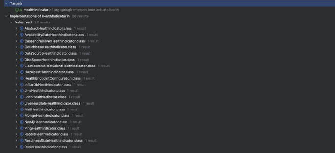

# Spring Monitoring

## Sebelum Belajar

- Kelas Java dari Programmer Zaman Now
- Spring Data JPA
- Spring Web

## #1 Pengenalan Monitoring

- Saat kita selesai membuat aplikasi, dan aplikasi sudah digunakan oleh pengguna kita
- Hal terakhir yang perlu kita lakukan adalah, Monitoring
- Monitoring adalah proses memeriksa bahwa aplikasi kita masih berjalan dengan baik
- Hal ini perlu kita lakukan, agar kita bisa mendeteksi sedini mungkin jika terjadi masalah di aplikasi yang kita buat

### Spring Actuator

- Spring Boot merupakan framework yang sudah lengkap dengan fitur untuk Monitoring
- Terdapat fitur bernama Spring Actuator, yang bisa kita gunakan untuk menambahkan kemampuan monitoring pada aplikasi yang kita buat
- Dengan menambahkan fitur Spring Actuator ini, kita bisa menambahkan kemampuan monitoring, tanpa harus membuat secara manual
- Di kelas ini, kita akan bahas lengkap fitur monitoring yang dimiliki oleh Spring Actuator

## #2 Membuat Project

- <https://start.spring.io/>
- Spring Web
- Spring Data JPA
- MySQL Driver
- Spring Actuator

## #3 Setup Project

- Buat database di MySQL dengan nama `belajar_spring_monitoring`
- Setup koneksi database di application properties

### Kode: Application Properties

```
spring.datasource.type=com.zaxxer.hikari.HikariDataSource
spring.datasource.url=jdbc:mysql://localhost:3306/belajar_spring_monitoring
spring.datasource.username=root
spring.datasource.password=
spring.datasource.driver-class-name=com.mysql.cj.jdbc.Driver
spring.datasource.hikari.maximum-pool-size=100
spring.datasource.hikari.minimum-idle=10
spring.datasource.hikari.connection-timeout=5000
```

## #4 Actuator Web Endpoint

- Saat kita menjalankan aplikasi web Spring Boot, secara otomatis Actuator bisa diakses melalui URL:
- `/actuator`
- Endpoint itu akan mengembalikan fitur yang terdapat di Actuator
- Secara default, untuk keamanan, hanya fitur Health saja yang ditampilkan, fitur lainnya bisa kita aktifkan secara manual jika kita mau

## #5 Bean

- Actuator memiliki fitur yang bisa kita gunakan untuk memonitor seluruh bean yang terdapat di aplikasi Spring Boot yang kita buat
- Kita bisa mengaktifkan terlebih dahulu fitur ini, lalu setelah itu kita bisa mengakses menggunakan URL :
- `/actuator/beans`

### Kode: Application Properties

```
management.endpoints.web.exposure.include=beans

management.endpoint.beans.enabled=true
```

## #6 Health

- Actuator memiliki fitur untuk mengecek kesehatan aplikasi kita
- Secara otomatis, misal ketika kita menambah fitur Spring Data JPA, secara otomatis - Actuator akan menambahkan pengecekan ke database ketika kita memanggil endpoint health tersebut
- Secara default, fitur health itu aktif, dan kita bisa mengakses menggunakan endpoint URL :
- `/actuator/health`

### Health Bawaan Spring Boot



### Kode: Application Properties

```
management.endpoints.web.exposure.include=beans,health

management.endpoint.health.enabled=true
management.endpoint.health.show-details=always

management.endpoint.beans.enabled=true
```

## #7 Membuat Custom Health

- Actuator mendeteksi kesehatan Health menggunakan bean dengan type `HealthIndicator`
- Jika kita ingin membuat custom Health, kita bisa membuat bean dengan type HealthIndicator

### Kode: My Health Indicator

```java
@Component
public class MyHealthIndicator extends AbstractHealthIndicator {

	@Override
	protected void doHealthCheck(Health.Builder builder) throws Exception {
		builder.status(Status.UP);
		builder.withDetail("app", "OK");
		builder.withDetail("error", "NO ERROR");
	}
}
```

## #8 Info

- Actuator memiliki fitur untuk menampilkan informasi
- Kita bisa menambah informasi di properties dengan prefix info, yang nanti akan ditampilkan oleh Actuator
- Kita bisa mengakses informasi tersebut menggunakan endpoint URL :
- `/actuator/info`

### Kode: Application Properties

```
info.app=Belajar Spring Monitoring
info.version=1.0.0
info.author=Eko Kurniawan Khannedy
info.website=https://www.programmerzamannow.com

management.endpoints.web.exposure.include=beans,health,info

management.endpoint.info.enabled=true
management.info.env.enabled=true
```

### Info Lainnya

- Selain `env`, Info juga bisa mengambil informasi tentang os dan juga versi Java yang kita gunakan
- Kita bisa mengaktifkan os dan java jika kita mau

### Kode: Application Properties

```
info.app=Belajar Spring Monitoring
info.version=1.0.0
info.author=Eko Kurniawan Khannedy
info.website=https://www.programmerzamannow.com

management.endpoints.web.exposure.include=beans,health,info

management.endpoint.info.enabled=true
management.info.env.enabled=true
management.info.os.enabled=true
management.info.java.enabled=true
```

## #9 Configuration Properties

- Saat kita membuat aplikasi Spring Boot, kita sering menggunakan Application Properties
- Semua konfigurasi di Application Properties, sebenarnya kebanyakan berasal dari class Configuration Properties
- Kita bisa memonitor apa saja class Configuration Properties yang terdapat di aplikasi kita menggunakan Actuator
- Kita bisa mengakses informasi nya di endpoint URL :
- `/actuator/configprops`

### Kode: Configuration Properties

```
management.endpoints.web.exposure.include=beans,health,info,configprops

management.endpoint.configprops.enabled=true
management.endpoint.configprops.show-values=always
```

## #10 Env

- Saat kita membuat aplikasi, kadang kita mengambil informasi dari environment variable, baik itu yang kita ubah sendiri, atau bawaan dari sistem operasi nya
- Kita bisa mendapatkan semua informasi menggunakan Actuator
- Kita bisa mengakses informasi env menggunakan endpoint URL :
- `/actuator/env`

### Kode: Application Properties

```
management.endpoints.web.exposure.include=env,beans,health,info,configprops

management.endpoint.env.enabled=true
management.endpoint.env.show-values=always
```

## #11 Logger

- Secara default, aplikasi Spring Boot akan terintegrasi dengan Logging Library
- Kita bisa melihat informasi Logger yang terdapat di aplikasi kita, sekaligus dengan level logging nya menggunakan endpoint URL :
- `/actuator/loggers`

### Kode: Application Properties

```
management.endpoints.web.exposure.include=loggers,env,beans,health,info,configprops

management.endpoint.loggers.enabled=true
```

## #12 Heap Dump

- Saat aplikasi Java kita jalankan, semua data di aplikasi akan disimpan di memory
- Kadang kita sering mengalami masalah yang bernama Memory Leak di aplikasi, oleh karena itu kadang kita butuh mendebut isi dari memory aplikasi kita
- Actuator memiliki fitur untuk melakukan dump (export isi memory) menggunakan endpoint URL :
- `/actuator/heapdump`

### Kode: Application Properties

```
management.endpoints.web.exposure.include=heapdump,loggers,env,beans,health,info,configprops

management.endpoint.heapdump.enabled=true
```

### Melihat Isi Heap Dump

- Untuk melihat isi file Heap Dump, kita bisa menggunakan aplikasi samisal :
- Visual VM : <https://visualvm.github.io/>
- Eclipse Memory Analyzer : <https://eclipse.dev/mat/>

## #13 Thread Dump

- Selain Heap Dump, Actuator juga memiliki fitur untuk menampilkan semua informasi Thread yang sedang berjalan di aplikasi
- Kita bisa melihat semua informasi Thread yang sedang berjalan menggunakan endpoint URL :
- `/actuator/threaddump`

### Kode: Application Properties

```
management.endpoints.web.exposure.include=threaddump,heapdump,loggers,env,beans,health,info,configprops

management.endpoint.threaddump.enabled=true
```

## #14 Scheduled Task

- Actuator juga bisa digunakan untuk melihat informasi dari Scheduled Task yang terdapat di aplikasi kita
- Dengan begitu kita bisa tahu kapan sebuah scheduled task berjalan
- Kita bisa melihat semua scheduled task yang terdapat di aplikasi menggunakan endpoint URL :
- `/actuator/scheduledtasks`

### Kode: My Scheduled Task

```java
@Slf4j
@Component
public class MyScheduledTask {

	@Scheduled(fixedRate = 10000)
	public void hello() {
		log.info("Hello World");
	}
}
```

### Kode: Application Properties

```
management.endpoints.web.exposure.include=scheduledtasks,threaddump,heapdump,loggers,env,beans,health,info,configprops

management.endpoint.scheduledtasks.enabled=true
```

## #15 Metric

- Metric adalah informasi ukuran atau takaran dari proses yang terdapat di aplikasi
- Saat membuat aplikasi, kadang kita perlu mendapatkan informasi metric
- Actuator, secara default sudah menyediakan metric yang bermanfaat yang bisa kita dapatkan menggunakan endpoint URL :
- `/actuator/metrics`

### Kode: Application Properties

```
management.endpoints.web.exposure.include=metrics,scheduledtasks,threaddump,heapdump,loggers,env,beans,health,info,configprops

management.endpoint.metrics.enabled=true
```

## #17 Mircometer

- Untuk fitur Metric yang terdapat di Spring Actuator, sebenarnya adalah fitur yang menggunakan library bernama Micrometer
- Micrometer adalah library untuk metric monitoring, dan bisa diintegrasikan dengan banyak monitoring tool seperti New Relic, Phometheus, dan lain-lain
- <https://micrometer.io/>

### Membuat Metric

- Untuk membuat metric lain selain bawaan dari Actuator, maka kita harus membuat menggunakan `Mictometer`
- Ada banyak sekali jenis metric yang terdapat di Micrometer, dan disini kita tidak akan bahas semuanya karena memang materi tersebut sudah bukan termasuk materi Actuator
- Untuk lebih jelas, kita bisa melihat semua jenis metric dan cara membuatnya pada halaman dokumentasi Micrometer
- <https://micrometer.io/docs/concepts>

### Kode: Membuat Metric Counter

```java
@Slf4j
@Component
public class MyScheduledTask {

	@Autowired
	private MeterRegistry meterRegistry;

	@Scheduled(fixedRate = 10000)
	public void hello() {
		meterRegistry.counter("my.scheduled.task").increment();
		log.info("Hello World");
	}
}
```

## #18 Peringatan

- Perlu diperhatikan bahwa fitur Actuator sangat sensitif karena berisi informasi yang mungkin rahasia, sehingga tidak boleh diakses secara public oleh semua orang
- Oleh karena itu, sangat disarankan untuk tidak mengekspos endpoint actuator ke public
- Kita bisa tambahkan Firewall atau Proxy Server seperti Nginx untuk menjaga agar endpoint Actuator tidak bisa diakses secara bebas oleh public

## #19 Penutup
