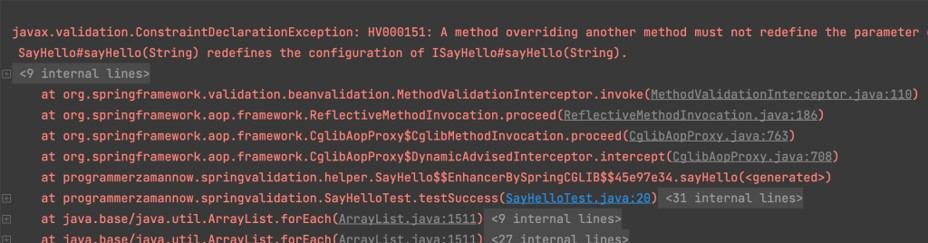
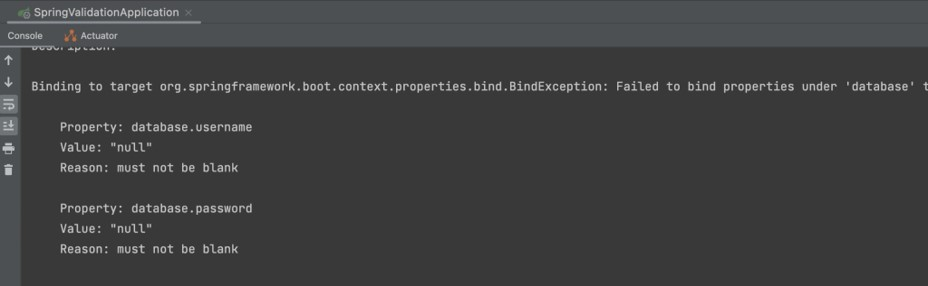

# Spring Validation

## Sebelum Belajar

- Menyelesaikan Kelas Java dari Programmer Zaman Now
- Spring Dasar
- Spring Config Properties
- Spring Logging

## Agenda

- Pengenalan Spring Validation
- Bean Validation

## #1 Pengenalan Spring Validation

- Spring sendiri memiliki fitur untuk Validation, hal ini menjadikan programmer Spring tidak perlu lagi membuat kode untuk Validation secara manual
- Salah satu keuntungan menggunakan Spring Validation adalah, format Validation menjadi standard untuk semua programmer
- Awalnya Spring membuat library Validation secara manual, namun di kelas ini kita tidak akan membahas fitur itu, karena sudah banyak ditinggalkan
- Sekarang, Spring sudah merekomendasikan untuk menggunakan Bean Validation untuk melakukan Validation
- Detail Bean Validation sudah kita bahas tuntas di kelas Java Validation

### Bean Validation

- Salah satu keuntungan menggunakan Spring adalah kita bisa menggunakan Bean Validation yang sudah kita pelajari sebelumnya
- Selain itu, object Validator sudah dibuat secara otomatis oleh Spring, sehingga kita tidak perlu membuatnya secara manual lagi
- Yang terpenting, kita bisa membuat Custom Validator, dan memanfaatkan Dependency Injection di Spring pada Custom Validator yang kita buat

## #2 Membuat Project

- <https://start.spring.io/>
- Library :
  - Validation
  - Lombok
  - Configuration Processor

## #3 Validator

- Seperti yang sudah kita tahu, bahwa untuk melakukan validasi, kita perlu membuat object Validator
- Di Spring, Validator otomatis dibuatkan, sehingga kita tidak perlu membuatnya secara manual lagi
- Spring akan secara otomatis membuat bean Validator

### Validator di Spring

- Pertanyaannya, bagaimana cara Spring membuat bean Validator?
- Spring sendiri membuat bean Validator menggunakan class `ValidationAutoConfiguration`, dimana terdapat method untuk membuat Validator menggunakan `FactoryBean` `LocalValidatorFactoryBean`
- Jika kita mau, kita juga bisa membuat bean Validator sendiri, namun sangat disarankan menggunakan Validator yang dibuat oleh Spring

### Kode: Validation Auto Configuration

```java
@Import(PrimaryDefaultValidatorPostProcessor.class)
public class ValidationAutoConfiguration {

	@Bean
	@Role(BeanDefinition.ROLE_INFRASTRUCTURE)
	@ConditionalOnMissingBean(Validator.class)
	public static LocalValidatorFactoryBean defaultValidator(ApplicationContext applicationContext) {
		LocalValidatorFactoryBean factoryBean = new LocalValidatorFactoryBean();
		MessageInterpolatorFactory interpolatorFactory = new MessageInterpolatorFactory(applicationContext);
		factoryBean.setMessageInterpolator(interpolatorFactory.getObject());
		return factoryBean;
	}
}
```

### Kode: Class Person

```java
@Data
@AllArgsConstructor
@NoArgsConstructor
public class Person {

	@NotBlank
	private String id;

	@NotBlank
	private String name;
}
```

### Kode: Validator Test

```java
@SpringBootTest
public class ValidatorTest {

	@Autowired
	private Validator validator;

	@Test
	void testValidator() {
		var person = new Person("", "");
		Set<ConstraintViolation<Person>> constraintViolations =  validator.validate(person);

		Assertions.assertFalse(constraintViolations.isEmpty());
		Assertions.assertEquals(2, constraintViolations.size());
	}
}
```

## #4 Custom Contraint

- Salah satu keuntungan ketika menggunakan Validator yang dibuat secara otomatis oleh Spring, yaitu kita bisa membuat Custom Constraint, yang secara otomatis akan dijadikan bean oleh Spring
- Dengan begitu, kita juga bisa menambahkan dependency injection terhadap bean Custom Constraint tersebut
- Ini memudahkan ketika misal kita ingin membuat validasi, yang memerlukan bean Object yang lain

### Kode: String Helper

```java
@Component
public class StringHelper {

	public class isPalindrome(String value) {
		String reverse = new StringBuilder(value).reverse().toString();
		return value.equals(reverse);
	}
}
```

### Kode: Palindrome Annotation

```java
@Documented
@Constraint(validateBy = {PalindromeValidator.class})
@Target({METHOD, FIELD, ANNOTATION_TYPE, CONSTRUCTOR, PARAMETER, TYPE_USE})
@Retention(RUNTIME)
public @interface Palindrome {

	String message() default "{Palindrome.message}";

	Class<?>[] groups() default {};

	Class<? extends Payload>[] payload() default {};
}
```

### Kode: Palindrome Validator

```java
public class PalindromeValidator implements ConstraintValidator<Palindrome, String> {

	@Autowired
	private StringHelper stringHelper;

	@Override
	public boolean isValid(String value, ConstraintValidatorContext context) {
		return stringHelper.isPalindrome(value);
	}
}
```

### Kode: Data

```java
@Data
@AllArgsConstructor
public static class Foo {

	@Palindrome
	private String bar;
}
```

### Kode: Palindrome Test

```java
@SpringBootTest
public class PalindromeTest {

	@Autowired
	private Validator validator;

	@Test
	void testPalindromFail() {
		Set<ConstraintViolation<Foo>> constraintViolations = validator.validate(new Foo("eko"));
		Assertions.assertFalse(constraintViolations.isEmpty());
		Assertions.assertEquals(1, constraintViolations.size());
	}

	@Test
	void testPalindromSuccess() {
		Set<ConstraintViolation<Foo>> constraintViolations = validator.validate(new Foo("kodok"));
		Assertions.assertTrue(constraintViolations.isEmpty());
	}
}
```

## #5 Message Source

- Saat kita membuat error message di Bean Validation, di kelas Java Validation kita sudah bahas tentang membuat properties file untuk menyimpan message agar bisa mendukung `Internationalization`
- Menggunakan Spring, secara otomatis Bean Validation akan mencari message ke Message Source yang sudah otomatis dibuat
- Dan secara default, Message Source akan mencari pesan error di file `messages.properties`

### Kode: Messages Properties

```
Palindrome.message=Data bukan palindrome
```

### Kode: Message Source Test

```java
@Test
void testPalindromMessage() {
	Set<ConstraintViolation<Foo>> constraintViolations = validator.validate(new Foo("eko"));

	String message = constraintViolations.stream().findFirst().get().getMessage();

	Assertions.assertEquals("Data bukan palindrome", message);
}
```

## #6 Method Validation

- Di kelas Java Validation, kita sudah banyak membahas tentang validasi di level Method
- Namun sayangnya, menggunakan Bean Validation untuk melakukan validation di level method sangat ribet
- Untungnya hal ini dibantu dengan fitur Bean Post Processor nya Spring
- Spring menggunakan class `MethodValidationPostProcessor` akan secara otomatis mencari bean yang memiliki annotation @Validated di class nya, dan secara otomatis akan melakukan validasi di setiap method yang terdapat di bean tersebut jika terdapat annotation Bean Validation
- Kita tidak perlu meregistrasikan MethodValidationPostProcessor secara manual, itu sudah otomatis dibuat oleh class ValidationAutoConfiguration
- Jika terjadi validasi error, secara otomatis akan throw `ConstraintViolationException`

### Kode: Say Hello Component

```java
@Validated
@Component
public class SayHello {

	public String sayHello(@NotBlank String name) {
		return "Hello " + name;
	}
}
```

### Kode: Say Hello Test

```java
@SpringBootTest
public class SayHelloTest {

	@Autowired
	private SayHello sayHello;

	@Test
	void testSuccess() {
		String message = sayHello.sayHello("Eko");
		Assertions.assertEquals("Hello Eko", message);
	}

	@Test
	void testError() {
		Assertions.assertThrows(ConstraintViolationException.class, () -> {
			sayHello.sayHello("");
		});
	}
}
```

## #7 Method Overriding

- Salah satu praktek yang banyak dilakukan oleh programmer Spring adalah membuat kontrak berupa interface, dan membuat bean berupa class implementasi dari interface tersebut
- Namun hati-hati jika menggunakan Interface sebagai kontrak, karena misal ketika kita override method nya di class, lalu di dalam method tersebut kita tambahkan annotation untuk bean validation, maka secara otomatis akan terjadi error
- Hal ini dikarenakan, bean validation mendeteksi bahwa terjadi perubahan di method overriding nya

### Kode: Interface Say Hello

```java
public interface ISayHello {

	String sayHello(String name);
}
```

### Kode: Class Say Hello

```java
@Validated
@Component
public class SayHello implements ISayHello {

	public String sayHello(@NotBlank String name) {
		return "Hello " + name;
	}
}
```

### Error: Test Say Hello



### Solusinya?

- Solusinya yang paling baik adalah, memindahkan semua annotation ke Interface nya
- Dengan demikian bean validation tidak akan mendeteksi adanya perubahan pada Method overriding nya

### Kode: Interface Say Hello

```java
@Validated
public interface ISayHello {

	String sayHello(@NotBlank String name);
}
```

## #8 Configuration Properties

- Sebelumnya kita sudah belajar tentang Configuration Properties di Spring
- Spring mendukung validasi bean Configuration Properties secara otomatis dengan Bean Validation
- Hal ini bisa memastikan bahwa data di Configuration Properties sudah valid, jika tidak valid, maka secara otomatis pembuatan bean akan gagal, dan aplikasi akan berhenti

### Kode: Configuration Properties

```java
@Data
@NoArgsConstructor
@ConfigurationProperties("database")
@Validator
public class DatabaseProperties {

	@NotBlank
	private String username;

	@NotBlank
	private String password;
}
```

### Kode: Sprint Application

```java
@EnableConfigurationProperties({
	DatabaseProperties.class
})
@SprintBootApplication
public class SpringValidationApplication {

	public static void main(String[] args) {
		SpringApplication.run(SpringValidationApplication.class, args);
	}
}
```

### Error: Configuration Properties Validation



## #9 Materi Selanjutnya

- Spring Aspect Oriented Programming
- Spring Async
- Spring Data JPA
- Spring Web MVC
- Dan lain-lain
