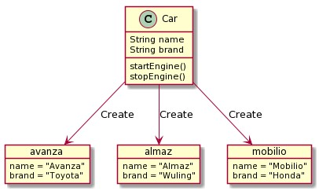

# TypeScript Object Oriented Programming

## Sebelum Belajar

- Kelas JavaScript dari Programmer Zaman Now
- Kelas NodeJD dari Programmer Zaman Now
- TypeScript Dasar

## #1 Apa itu Object Oriented Programming>

- Object Oriented Programming adalah sudut pandang bahasa pemrograman yang berkonsep "objek"
- Ada banyak sudut pandang bahasa pemrograman, namun OOP addalah yang sangat populer saat ini
- Ada beberapa istilah yang perlu dimengerti dalam OOP, yaitu: Object dan Class

### Apa itu Object?

- Object adalah data yang berisi field / properties / attributes dan method / function / behavior

### Apa itu Class?

- Class adalah blueprint, prototype atau cetakan untuk membuat Object
- Class berisikan deklarasi semua properties dan functions yang dimiliki oleh Object
- Setiap Object selalu dibuat dari Class
- Dan sebuah Class bisa membuat Object tanpa batas

### Class dan Object: Person


### Class dan Object: Car



### OOP di TypeScript

- Implementasi OOP di TypeScript, sebenarnya akan diterjemahkan menjadi kode JavaScript
- Dan JavaScript sendiri sebenarnya sejak awal dibuat sebagai bahasa prosedural, bukan bahasa pemrograman berorientasi objek
- Oleh karena, implmentasi OOP di JavaScript memang tidak sedetail bahasa pemrogramman lain yang memang dari awal merupakan bahasa pemrograman OOP seperti Java atau C++
- Pada meteri ini, sebenarnya untuk OOP di TypeScript hampir sama dengan di OOP di JavaScript, oleh karena itu di awal saya wajibkan untuk sudah mengikuti kelas JavaSript, karena disana sudah jelas dibahas tentang OOP di JavaScript

## #2 Membuat Project

- Buat folder belajar-typescript-oop
- `npm init`
- Buka `package.json`, dan tambahkan `"type": "module"`

```json
{
	"name": "belajar-typescript-oop",
	"version": "1.0.0",
	"description": "Belajar TypeScript OOP",
	"main": "index.js",
	"scripts": {
		"test": "jest"
	},
	"jest": {
		"transform": {
			"^.+\\.[t|j]sx?$": "babel-jest"
		}
	},
	"author": "Eko Kurniawan Khannedy",
	"license": "ISC",
	"type": "module",
	"devDependencies": {
		"@babel/preset-env": "^7.22.9",
		"@babel/preset-typescript": "^7.22.5",
		"@jest/globals": "^29.6.2",
		"@types/jest": "^29.5.3",
		"babel-jest": "^29.6.2",
		"jest": "^29.6.2",
		"ts-jest": "^29.1.1",
		"typescript": "^5.1.6"
	}
}
```

### Menambahkan Library Jest untuk Unit Test

- `npm install --save-dev jest @types/jest`
- <https://www.npmjs.com/package/jest>

### Menambahkan Library Babel

- `npm install --save-dev babel-jest @babel/preset-env`
- <https://babeljs.io/setup#installation>

```json
// babel.config.json
{
	"presets": ["@babel/preset-env"]
}
```

### Menambahkan Library TypeScript

- `npm install --save-dev typescript`
- <https://www.npmjs.com/package/typescript>

### Setup TypeScript Project

- `npx tsc --init`
- Semua konfigurasi akan dibuat di file `tsconfig.json`
- Ubah `"module"` dari `"commonjs"` menjadi `"ES6"`

```json
// tsconfig.json
{
	"compilerOptions": {
		"target": "es2016",
		"module": "ES6",
		"esModuleInterop": true,
		"forceConsistentCasingInFileNames": true,
		"strict": true,
		"skipLibCheck": true
	}
}
```

### Setup TypeScript untuk Jest

- `npm install --save-dev @bebel/preset-typescript`
- `npm install --save-dev @jest/globals`
- <https://jestjs.io/docs/getting-started#using-typescript>

```json
// babel.config.json
{
	"presets": ["@babel/preset-env", "@babel/preset-typescript"]
}
```

## #3 Class

- Untuk membuat class di TypeScript, kita bisa menggunakan kata kunci class, sama seperti di JavaScript
- Cara membuat Object dari Class pun cukup menggunakan kata kunci new, sama juga seperti di JavaScript

### Kode: Class

```ts
class Customer {}

class Order {}

const customer: Customer = new Customer();
const order: Order = new Order();
```

## #4 Constructor

- Constructor adalah method atau function yang dipanggil ketika pertama kali object dibuat dari class
- Constructor sama seperti Function biasanya, bisa memiliki parameter, yang membedakan adalah pada constructor, kita tidak perlu mengembalikan value

### Kode: Constructor

```ts
class Customer {
	constructor() {
		console.info("Create new customer");
	}
}

new Customer();
new Customer();
```

## #5 Properties

- Properties atau Fields adalah atribute yang dimiliki oleh Class
- Pada JavaScript, kita bisa langsung saja memuat atribut tanpa harus mendeklarasikan atribut nya
- Di TypeScript, kita perlu mendeklarsikan properties nya terlebih dahulu, beserta dengan tipe datanya
- Sama seperti ketika membuat attribute di Tupe dan Interface, kita juga bisa menjadikan properties sebagai optional, mandatory atau readonly
- Properties yang mandatory, wajib ditambahkan nilainya di Constructor

### Kode: Properties

```ts
class Customer {
	readonly id: number;
	name: string;
	age?: number;

	constructor(id: number, name: string) {
		this.id = id;
		this.name = name;
	}
}

const customer = new Customer(1, "John");
customer.age = 20;

console.info(customer);
```

### Properties Default Value

- Properties juga bisa memiliki default value, kita bisa tambahkan menggunakan operator = (sama dengan) pada properties yang ingin kita tambahkan default value nya

### Kode: Properties Default Value

```ts
class Customer {
	readonly id: number;
	name: string = "";
	age?: number;

	constructor(id: number) {
		this.id = id;
	}
}
```

## #6 Method

- Selain properties, di Class juga busa memiliki function, atau lebih sering disebut sebagai Method
- Cara pembuatannya sebenarnya sama seperti di JavaScript, hanya saja pada TypeScript kita harus tentukan tipe data parameter dan return value nya

### Kode: Method

```ts
class Customer {
	readonly id: number;
	name: string;
	age?: number;

	constructor(id: number, name: string) {
		this.id = id;
		this.name = name;
	}

	sayHello(name: string): void {
		console.info(`Hello ${name}, my name if ${this.name}`);
	}
}
```

## #7 Getter dan Setter

- Sampai sekarang, ketika kita ingin mengubah data properties, kita bisa langsung gunakan operator = (sama dengan), dan ketika ingin mengambil data cukup gunakan . (titik)
- JavaScript memiliki fitur bernama Getter dan Setter, begitu juga di TypeScript, dimana kita bisa membuat method untuk mengubah properties dan juga method untuk mengambil properties
- Karena bentuknya adalah method, maka kita bisa menambahkan validasi apapun pada method tersebut sebelum properties aslinya diubah

### Kode: Getter dan Setter

```ts
class Category {
	_name?: string;

	get name(): string {
		if (this._name) {
			return this._name;
		} else {
			return "empty";
		}
	}

	set name(value: string) {
		if (value != "") {
			this._name = value;
		}
	}
}

const category = new Category();
console.info(category.name);

category.name = "Food";
console.info(category.name);

category.name = "";
console.info(category.name);
```

## #8 Inheritance

- Sama seperti di JavaScript, di TypeScript juga mendukung pewarisan antar Class menggunakan kata kunci extends
- Secara otomatis semua properties dan method yang ada di Parent Class akan diwariskan ke Child Class
- Pewarisan di TypeScript sama seperti di JavaScript, hanya bisa memiliki satu Parent Class
- Namun satu Parent Class, bisa memiliki banyak sekali Child Class

### Kode: Inheritance

```ts
class Employee {
	name: string;

	constructor(name: string) {
		this.name = name;
	}
}

class Manager extends Employee {}

class Director extends Manager {}
```

## #9 Interface Inheritance

- Di bahasa pemrograman seperti Java, kadang Interface digunakan sebagai kontrak
- Di TypeScript, hal itu juga bisa dilakukan, kita bisa membuat class yang mengikuti kontrak sebuah Interface, caranya dengan menggunaakan kata kunci `implements`
- Karena sebenarnya ini bukanlah pewarisan, oleh karena itu untuk implementasi, kita bisa melakukan implementasi ke lebih dari satu interface, dimana pada extends hal ini tidak bisa dilakukan

### Kode: Interface

```ts
interface HasName {
	name: string;
}

interface CanSayHello {
	sayHello(name: string): void;
}
```

### Kode: Implementasi Interface

```ts
class Person implements HasName, CanSayHello {
	name: string;

	constructor(name: string) {
		this.name = name;
	}

	sayHello(name: string): void {
		console.info(`Hello ${name}, my name is ${this.name}`);
	}
}
```

## #10 Super Constructor

- Pada kasus pewarisan antar class, kadang di Child Class kita ingin membuat Constructor juga, baik itu sama seperti di Parent Child, ataupun berbeda
- Pada kasus kita membuat Constructor di Child Class, maka secara otomatis kita harus memanggil Constructor di Parent Class
- Hal ini sebenarnya sama seperti di JavaScript
- Kita bisa menggunakan kata kunci super untuk memanggil Constructor di Parent Class

### Kode: Super Constructor

```ts
class Person {
	name: string;

	constructor(name: string) {
		this.name = name;
	}
}

class Employee extends Person {
	department: string;

	constructor(name: string, department: string) {
		super(name);
		this.department = department;
	}
}
```

## #11 Merhod Overriding

- Saat kita membuat Child Class, kita bisa mendeklarasikan ulang Method yang terdapat di Parent Class
- Jika semua deklarasi Method sama, maka itu adalah Method Overriding
- Pada kasus tertentu, kadang kita sering melakukan hal ini

### Kode: Method Overriding

```ts
class Employee {
	name: string;

	constructor(name: string) {
		this.name = name;
	}

	sayHello(name: string): void {
		console.info(`Hello ${name}, my name is ${this.name}`);
	}
}

class Manager extends Employee {
	sayHello(name: string): void {
		console.info(`Hello ${name}, my name is ${this.name}, I am your manager`);
	}
}
```

## #12 Super Method

- Sama seperti Constructor, saat kita membuat Method Overriding, kita juga bisa memanggil Method yang sama yang terdapat di Parent Class dengan menggunakan kata kunci super, lalu diikuti dengan Method yang ingin kita panggil

### Kode: Super Method

```ts
class Manager extends Employee {
	sayHello(name: string): void {
		super.sayHello(name);
		console.info(`And, I am your manager`);
	}
}
```

## #13 Visibility

- Di JavaScript dan TypeScript, secara default setiap membuat properties atau method, maka sifatnya adalah bisa diakses di dalam class, atau diluar class (public)
- Di JavaScript, kita mengenal private properties atau method, dimana menggunakan prefix `#`, yang secara otomatis hanya bisa diakses di dalam class
- Di TypeScipt, visibility ini dipermudah dengan menggunakan tiga kata kunci, `public`, `private` dan `protected`

### Visibility di TypeScript

| Visibility (Properties & Method) | Keterangan                                                                                                        |
| -------------------------------- | ----------------------------------------------------------------------------------------------------------------- |
| public                           | Bisa diakses dimanapun, secara default jika tidak menyebutkan visibility, maka akan menggunakan visibility public |
| private                          | Hanya bisa diakses oleh class nya sendiri                                                                         |
| protected                        | Sama seperti private, tapi bisa juga diakses oleh class turunannya                                                |

### Kode: Counter

```ts
class Counter {
	private counter: number = 0;

	public increment(): void {
		this.counter++;
	}

	public getCounter(): number {
		return this.counter;
	}
}
```

### Kode: Double Counter

```ts
class Counter {
	protected counter: number = 0;

	public increment(): void {
		this.counter++;
	}

	public getCounter(): number {
		return this.counter;
	}
}

class DoubleCouter extends Counter {
	public increment(): void {
		this.counter += 2;
	}
}
```

## #14 Parameter Properties

- Kadang, seringnya kita selalu membuat parameter di Constructor yang hanya digunakan sebagai nilai untuk properties
- Pada kasus seperti ini, kita bisa menggunakan Parameter Properties, yang secara otomatis parameter di Constructor akan dijadikan sebagai Properties di Class nya
- Untuk membuat Parameter Properties, kita bisa langsung menambahkan visibility pada parameter di Constructor

### Kode: Parameter Properties

```ts
class Person {
	constructor(public name: string = "")
}

const person = new Person()
person.name = "Eko"
console.info(person)
```

## #15 Operator instanceof

- Kadang ada kasus kita ingin mengecek apakah sebuah object merupakan instance dari class tertentu atau bukan
- Kita tidak bisa menggunakan operator `typeof`, karena object dari class, jika kita gunakan operator `typeof` hasilnya adalah `"object"`
- Operator `instanceof` akan menghasilkan `boolean`, `true` jika benar object tersebut adalah instance object nya, atau `false` jika bukan

### Kode: Masalah Dengan typeof

```ts
class Employee {}

class Manager {}

const budi = new Employee();
const eko = new Manager();

console.info(typeof budi);
console.info(typeof eko);
```

### Kode: Operator instanceof

```ts
class Employee {}

class Manager {}

const budi = new Employee();
const eko = new Manager();

expect(budi instanceof Employee).toBe(true);
expect(budi instanceof Manager).toBe(false);

expect(eko instanceof Employee).toBe(false);
expect(eko instanceof Manager).toBe(true);
```

## #16 Polymorphism

- Polymorphism berasal dari bahasa Yunani yang berarti banyak bentuk
- Dalam OOP, Polymorphism adalah kemampuan sebuah object berubah bentuk menjadi bentuk lain
- Polymorphism erat hubungannya dengan Inheritance

### Kode: Class Inheritance

```ts
class Employee {
	constructor(public name: string) {}
}

class Manager extends Employee {}

class VicePresident extends Manager {}
```

### Kode: Polymorphism

```ts
let employee: Employee = new Employee("Budi");
console.info(employee);

employee = new Manager("Eko");
console.info(employee);

employee = new VicePresident("Joko");
console.info(employee);
```

### Method Polymorphism

- Saat kita membuat function / method dengan parameter, kita juga bisa mengirim data polymorphism pada parameter tersebut
- Misal kita membuat sebuah function dengan parameter class Employee, kita bisa mengirim object dalam bentuk Employee, Manager, ataupun VicePresident
- Hal ini karena Manager dan VicePresident merupakan turunan dari Employee, sehingga kita bisa mengirim data seluruh turunan dari Employee

### Kode: Method Polymorphism

```ts
function sayHello(employee: Employee): void {
	console.info(`Hello ${employee.name}`);
}

sayHello(new Employee("Budi"));
sayHello(new Manager("Eko"));
sayHello(new VicePresident("Joko"));
```

## #17 Type Cast

- Di TypeScript dasar, kita pernah belajar tentang type assertions, dimana kita bisa mengubah tipe data dari satu tipe data ke tipe data lainnya yang lebih specific atau detail
- Ini juga bisa kita lakukan pada kasus Method Polymorphism
- Kita bisa kombinasikan operator instanceof dan type assertions

### Kode: Type Cast

```ts
function sayHello(employee: Employee): void {
	if (employee instanceof VicePresident) {
		const vp = employee as VicePresident;
		console.info(`Hello VP ${vp.name}`);
	} else if (employee instanceof Manager) {
		const manager = employee as Manager;
		console.info(`Hello Manager ${manager.name}`);
	} else {
		console.info(`Hello Employee ${employee.name}`);
	}
}
```

### Perlu Diingat

- Saat melakukan Type Cast, pastikan posisi Child paling bawah dilakukan pengecekan di awal
- Hal ini agar tidak terjadi kesalahan konversi
- Contoh, jika kita ubah posisi pengecekan instanceof Manager dan VicePresident, maka ketika kita mengirim VicePresident, dia akan berhenti di Manager, hal ini karena hasil instanceof bernilai true, karena VicePresident adalah turunan dari Manager

### Kode: Type Cast Salah

```ts
function sayHello(employee: Employee): void {
	if (employee instanceof Manager) {
		const manager = employee as Manager;
		console.info(`Hello Manager ${manager.name}`);
	} else if (employee instanceof VicePresident) {
		const vp = employee as VicePresident;
		console.info(`Hello VP ${vp.name}`);
	} else {
		console.info(`Hello Employee ${employee.name}`);
	}
}

sayHello(new Employee("Budi"));
sayHello(new Manager("Eko"));
sayHello(new VicePresident("Joko"));
```

## #18 Abstract Class

- Abstract Class merupakan deklarasi Class yang belum selesai
- Abstract Class membolehkan memiliki properties atau method yang abstract atau belum di buat implemntasinya
- Abstract Class juga tidak bisa dibuat menjadi object menggunakan kata kunci new
- Kegunaan Abstract Class hanya digunakan sebagai Parent Class yang nanti diturunkan ke Child Class nya

### Kode: Abstract Class

```ts
abstract class Customer {
	readonly id: number;
	abstract name: string;

	constructor(id: number) {
		this.id = id;
	}

	abstract sayHello(name: string): void;
}
```

### Kode: Child Class dari Abstract Parent

```ts
class RegularCustomer extends Customer {
	name: string;

	constructor(id: number, name: string) {
		super(id);
		this.name = name;
	}

	sayHello(name: string): void {
		console.info(`hello ${name}, my name is ${this.name}`);
	}
}
```

## #19 Static

- Static merupakan kata kunci yang bisa digunakan pada properties atau method di class, yang menyebabkan properties atau method tersebut bukan lagi sebagai bagain dari object yang dibuat dari class
- Static properties atau method, bisa menyebabkan seakan-akan kita membuat global variable atau function, yang bisa diakses secara langsung, tanpa membuat object dari class nya
- Kita juga bisa menambahkan visibility pada static properties atau method
- Biasanya static ini sering digunakan pada jenis class utility / helper

### Kode: Static Properties

```ts
class Configuration {
	static NAME: string = "Belajar TypeScript OOP";
	static VERSION: strinnumber = 1.0;
	static AUTHOR: string = "Eko Kurniawan Khennedy";
}

console.info(Configuration.NAME);
console.info(Configuration.VERSION);
console.info(Configuration.AUTHOR);
```

### Kode: Static Method

```ts
class MathUtil {
	static sum(...values: number[]): number {
		let total = 0;
		for (let value of values) {
			total += value;
		}
		return total;
	}
}

console.info(MathUtil.sum(1, 2, 3, 4, 5));
```

### Perlu Diingat

- Static member hanya bisa mengakses static member lainnya, tidak bisa mengakses non static member, kecuali dari object
- Sedangkan untuk non Static member, bisa mengakses static member secara langsung

## #20 Class Relationship

- Karena implemntasi dari object di TypeScript adalah JavaScript object
- Jadi sebenarnya jika terdapat dua object walaupun class, tetapi secara properties dan function sama, smasa bisa dianggap secara struktur JavaScript object adalah sama
- Pada kasus seperti itu, kita bisa membuat object untuk tipe data A, dengan membuat object dari tipe data B, asal secara properties dan method sama

### Kode: Class Relationship

```ts
class Person {
	constructor(public name: string) {}
}

class Customer {
	constructor(public name: string) {}
}

const person: Person = new Customer("Eko");
```

## #21 Error Handling

- Sama seperti di JavaScript, di TypeScript pun mendukung error handling menggunakan `try catch`
- Cara penggunaan error handling di TypeScript sama saja seperti di JavaScript
- Termasuk jika ingin membuat class Error secara manual, ini juga bisa kita lakukan dengan membuat class turunan dari Error, sama seperti di JavaScript

### Kode: Validation Error

```ts
class ValidationError extends Error {
	constructor(public message: string) {
		super(message);
	}
}

function doubleIt(value: number): number {
	if (value < 0) {
		throw new ValidationError("Value cannot be less than 0");
	}
	return value * 2;
}
```

### Kode: Try Catch

```ts
try {
	const result = doubleIt(-1);
	console.info(result2);
} catch (e) {
	if (e instanceof ValidationError) {
		console.info(e.message);
	}
}
```

## #22 Namespace

- Selain menggunakan JavaScript Modules, di TypeScript ada cara lain untuk mengorganisir kode program kita, yaitu menggunakan Namedpace
- Namespace biasanya digunakan untuk mengorganisir kode ketika dalam satu module terdapat banyak sekali kode, sehingga bisa kita kelola dalam Namespace
- Jika Module kita anggap sebuah folder, maka Namespace adalah sub folder di dalam Module
- Untuk membuat Namespace, kita bisa gunakan kata kunci namespace, dan kita bisa tambahkan calss function dan lain-lain di dalam Namespace tersebut

### Kode: Namespace

```ts
export namespace MathUtil {
	export const PI: number = 3.14;

	export function sum(...values: number[]): number {
		let total = 0;
		for (let value of values) {
			total += value;
		}
		return total;
	}
}
```

### Kode: Menggunakan Namespace

```ts
console.info(MathUtil.PI);
console.info(MathUtil.sum(1, 2, 3, 4, 5));
```

## #23 Materi Selanjutnya

- TypeScript Generic
- TypeScript Decorator
- Studi Kasus NodeJS menggunakan TypeScript
