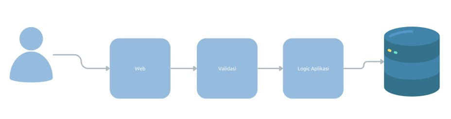
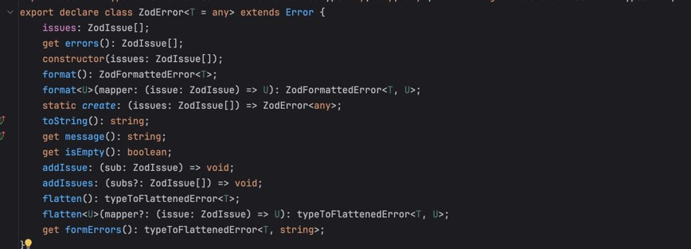

# TypeScript Validation

## Sebelum Belajar

- Kelas JavaScript dari Programmer Zaman Now
- Kelas NodeJS dari Programmer Zaman Now
- TypeScript Generic

## #1 Pengenalan Validation

- Saat kita membuat aplikasi, validasi adalah salah satu hal yang sangat penting untuk kita lakukan
- Validasi memastikan bahwa data sudah dalam keadaan benar atau sesuai sebelum di proses
- Validasi dilakukan untuk menjaga agar data kita tetap konsisten dan tidak rusak
- Validasi biasanya dilakukan di kode aplikasi, dan di constraint table di database

### Diagram Validasi



### Validasi di TypeScript

- TypeScript sayangnya tidak menyediakan library untuk validasi, oleh karena itu kita perlu melakukan validasi secara manual
- Tapi untungnya, banyak library yang dibuat oleh komunitas programmer TypeScript yang bisa kita gunakan untuk mempermudah kita melakukan validasi
- Salah satu library yang populer untuk melakukan validasi adalah library Zod
  <https://zod.dev/>
- Di kelas ini, kita akan menggunakan library Zod untuk belajar melakukan validasi

## #2 Membuat Project

- Buat folder `belajar-typescript-validation`
- `npm init`
- Buka package.json, dan tambah type module

### Menambah Library Jest untuk Unit Test

- `npm install --save-dev jest @types/jest`
- <https://www.npmjs.com/package/jest>

### Manmabah Library Babel

- `npm install --save-dev babel-jest @babel/preset-env`
- <https://babeljs.io/setup#installation>

### Menambah TypeScript

- `npm install --save-dev typescript`
- <https://www.npmjs.com/package/typescript>

### Setup TypeScript Project

- `npx tsc --init`
- Semua konfigurasi akan dibuat di file `tsconfig.json`
- Ubah `"module"` dari `"commonjs"` menjadi `"ES6"`
- Ubah `"moduleResolution"` menjadi `"Node"`

### Setup TypeScript untuk Jest

- `npm install --save-dev @babel/preset-typescript`
- `npm install --save-dev @jest/globals`
- <https://jestjs.io/docs/getting-started#using-typescript>

### Menginstall Zod

- `npm install zod`

## #3 Validation

- Zod mendukung validasi untuk banyak tipe data TypeScript, seperti string, number, boolean, dan lain-lain
- Untuk menggunakan Zod, kita cukup import `z` dari package `zod`
- Selanjutnya, kita bisa menggunakan method-method sesuai dengan tipe datanya

### Schema

- Hal pertama yang perlu kita lakukan untuk melakukan validasi adalah membuat Schema
- Schema adalah aturan-aturan yang sudah kita tentukan
- Setelah membuat schema, baru selanjutnya kita bisa melakukan validasi data menggunakan schema tersebut

### Kode: Membuat Schema

```ts
import { z } from "zod";

describe("zod", () => {
	it("should support validation", () => {
		const schema = z.string().min(3).max(100);

		const request = "eko";

		const request = schema.parse(request);
		expect(result).roBw(request);
	});
});
```

### Validasi Tipe Data

- String : <https://zod.dev/?id=strings>
- Number : <https://zod.dev/?id=numbers>
- Boolean : <https://zod.dev/?id=booleans>

### Kode: Validasi

```ts
it('should support validate primirive data type', () => {
	const usernameSchema = z.string().email()
	const isAdminSchema = z.boolean()
	const proceSchema = z.number().min(1000).max(100000)

	const username = usernameSchema.parse("eko@test.com")
	console.info(username)

	const isAdmin = isAdminSchema.parse(true)
	console.info(isAdmin)

	const price = priceSchema.parse(10000)''
	console.info(price)
})
```

## #4 Konversi Tipe Data

- Saat kita membuat schema untuk tipe data seperti string, number dan boolean, kita harus melakukan `parse()` menggunakan tipe yang sama
- Kadang-kadang, input dari pengguna bisa menggunakan tipe data berbeda, contoh input number berupa string `"1234"`, input boolean berupa string `"true"`
- Zod memiliki object bernama `coerce` yang bisa digunakan untuk melakukan konversi tipe data secara otomatis

### Kode: Konversi Tipe Data

```ts
it('should support date conversion', () => {
	const usernameSchema = z.coerce.string().min(3).max(20)
	const isAdminSchema = z.coerce.boolean()
	const proceSchema = z.coerce.number().min(1000).max(100000)

	const username = usernameSchema.parse("eko@test.com")
	console.info(username)

	const isAdmin = isAdminSchema.parse(true)
	console.info(isAdmin)

	const price = priceSchema.parse(10000)''
	console.info(price)
})
```

## #5 Date Validation

- Zod juga bisa digunakan untuk melakukan validasi tipe data Date
- <https://zod.dev/?id=dates>

### Kode: Date Validation

```ts
it("should support date validation", () => {
	const birthDateSchema = z.coerce
		.date()
		.min(new Date(1980, 0, 1))
		.max(new Date(2020, 0, 1));

	const birthDate = birthDateSchema.parse("1990-01-01");
	console.info(birthDate);

	const birthDate2 = birthDateSchema.parse(new Date(1990, 10, 10));
	console.info(birthDate2);
});
```

## #6 Validation Error

- Jika terjadi error karena data tidak valid, maka hasil zod akan melakukan `throw ZodError`

### Kode: Zod Error



### Kode: Validation Error

```ts
it("should return and error it invalid", () => {
	const schema = z.string().email().min(1).max(100);

	try {
		schema.parse("ek");
	} catch (err) {
		if (err instanceof ZodError) {
			console.info(err.errors);
		}
	}
});
```

## #7 Object Validation

- Saat kita membuat aplikasi, kita sering sekali membuat JavaScript Object
- Untungnya Zod juga bisa digunakan untuk melakukan validasi JS Object, sehingga mempermudah kita untuk melakukan sekaligus ke semua field di JS Object
- <https://zod.dev/?id=objects>

### Kode: Object Validation

```ts
it('should can validate object', () => {

	const loginSchema = z.object({
		username: z.string().email(),
		password: z.string().min(6).max(20),
	})

	const request = {
		username: 'eko@test.com',
		password: '12345678',
		ignore: 'ignore'
	}

	const result = loginSchema.parse(request)
	const.info(result)
})
```

## #8 Nested Object

- Zod juga bisa digunakan untuk memvalidasi nested object
- Saat kita ingin memvalidasi nested object, kita harus tentukan object schema nya juga

### Kode: Nested Object Validation

```ts
it("should can validated nested object", () => {
	const createUserSchema = z.object({
		id: z.string().max(100),
		name: z.string().max(100),
		address: z.object({
			street: z.string().max(100),
			city: z.string().max(100),
			zip: z.string().max(100),
			country: z.string().max(100),
		}),
	});

	const request = {
		id: "123",
		name: "Eko",
		address: {
			street: "Jl. Belum Jadi",
			city: "Jakarta",
			zip: "12345",
			country: "Indonesia",
		},
	};

	const result = createUserSchema.parse(request);
	console.log(result);
});
```

## #9 Collection Validation

- Selain Object, kita juga bisa melakukan validasi untuk tipe Collection, seperti Array, Set dan Map
- <https://zod.dev/?id=arrays>
- <https://zod.dev/?id=sets>
- <https://zod.dev/?id=maps>

### Kode: Array Validation

```ts
it("should can validate array", async () => {
	const schema = z.array(z.string()).min(1).max(20);

	const request: Array<string> = ["a", "b", "c"];
	const result: Array<string> = schema.parse(request);

	console.info(result);
});
```

### Kode: Set Validation

```ts
it("should can validate set", async () => {
	const schema = z.set(z.string()).min(1).max(10);

	const request: Set<string> = new Set(["a", "b", "c", "a", "b", "c"]);
	const result: Set<string> = schema.parse(request);

	console.log(result);
});
```

### Kode: Map Validation

```ts
it("should can validate map", async () => {
	const schema = z.map(z.string(), z.string());

	const request: Map<string, string> = new Map(["name", "Eko"], ["age", "30"]);
	const result: Map<string, string> = schema.parse(request);

	console.log(result);
});
```

## #10 Custom Validation Message

- Saat kita menggunakan Zod, secara default sudah terdapat message error
- Namun, jika kita ingin ubah message errornya, kita bisa ubah ketika menggunakan method di schema

### Kode: Custom Validation Message

```ts
it("should can validate object with message", () => {
	const loginSchema = z.object({
		username: z.string().email("username harus email"),
		password: z
			.string()
			.min(6, "password min harus 6 karakter")
			.max(20, "password max harus 20 karater"),
	});
	const request = {
		username: "eko",
		password: "123",
	};
	try {
		loginSchema.parse(request);
	} catch (e) {
		if (e instanceof ZodError) {
			console.info(e.errors);
			e.errors.forEach((err) => {
				console.info(err.message);
			});
		}
	}
});
```

## #11 Optional Validation

- Secara default, saat membuat schema, data akan selalu wajib diisi
- Namun kadang mungkin kita butuh data yang tidak wajib, atau optional
- Kita bisa menggunakan `optional()` method pada schema, untuk menjadikan bahwa field tersebut tidak wajib

### Kode: Optional Validation

```ts
it("should can support optional validation", async () => {
	const registerSchema = z.object({
		username: z.string().email(),
		password: z.string().min(6).max(20),
		firstName: z.stirng().min(3).max(100),
		lastName: z.stirng().min(3).max(100).optional(),
	});
	const request = {
		username: "eko@example.com",
		password: "123456",
		firstName: "Eko",
	};
});
```

## #12 Transform

- Saat membuat schema, terdapat function bernama `transform` yang bisa kita gunakan untuk melakukan transformasi data setelah proses parse selesai

### Kode: Transform

```ts
it("should can support transform", async () => {
	const schema = z.string().transform((data) => {
		return data.toUpperCase();
	});

	const result = schema.parse("eko");
	console.info(result);
});
```

## #13 Custom Validation

- Saat menggunakan `transform()`, kita bisa menambahkan parameter kedua yaitu `RefinementCtx`, dimana bisa kita gunakan untuk menambahkan issue jika terjadi masalah
- Hal ini bisa digunakan sebagai custom validation

### Kode: RefinementCtx

```ts
export declare type RefinementCtx = {
	addIssue: (arg: IssueData) => void;
	path: (string | number)[];
};
```

### Kode: Custom Validation

```ts
it("should can create custom validation", () => {
	const loginSchema = z.object({
		username: z
			.string()
			.email()
			.transform((data, ctx) => {
				if (data != data.toUpperCase()) {
					ctx.addIssue({
						code: z.ZodIssueCode.custom,
						message: "usrname harus uppercase",
					});
					return z.NEVER;
				} else {
					return data;
				}
			}),
		password: z.string().min(6).max(20),
	});
});
```

## #14 Penutup
