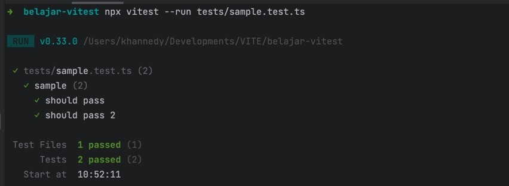
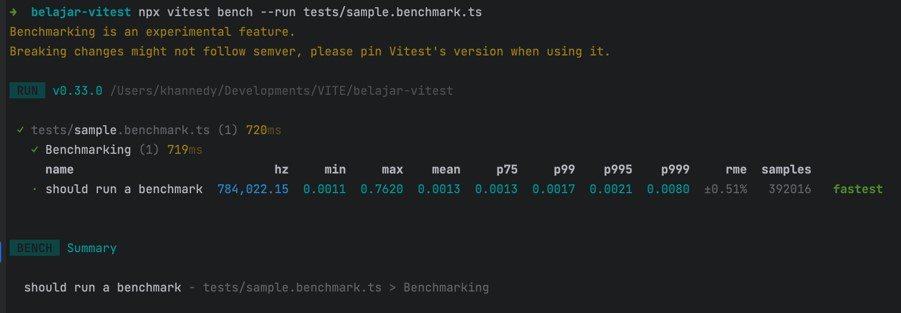
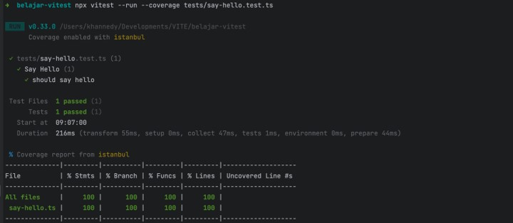
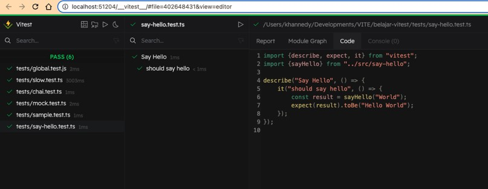

# Vitest Vite Unit Testing

## #1 Sebelum Belajar

- Kelas JavaScript dari Programmer Zaman Now
- Kelas NodeJS dari Programmer Zaman Now
- Kelas TypeScript dari Programmer Zaman Now
- Kelas Vite

## #2 Pengenalan Vitest

- Vitest adalah unit test framework yang sangat cepat yang dipersembahkan oleh Vite
- Vitest mirip dengan unit test framework lainnya seperti Jest, Mocha dan lain-lain
- Vitest secara default mendkung JavaScript Module
- Vitest juga terintegrasi dengan baik dengan TypeScript
- <https://vitest.dev/>

### Kenapa Vitest

- Vitest sangat cepat, mendukung parallel testing, sehingga bisa menjalankan unit test dengan sangat cepat
- Compatible dengan Jest, sehingga kita tidak perlu belajar lagi jika sudah terbiasa menggunakan Jest
- Vitest sangat ringan, dan sangat berhati-hati ketika menambahkan dependency, agar tetap cepat
- Terintegrasi baik dengan Vite

## #3 Membuat Project

- `npm create vite@latest`

### Menambahkan Vitest

- `npm install vitest --save-dev`

## #4 Menjalankan Unit Test

- Secara default, kita tidak butuh menambahkan konfigurasi apapun ketika menggunakan Vitest
- Setelah menginstall Vitest, kita bisa langsung menggunakan Vitest untuk manjalankan file unit test
- Sama seperti Jest, Vitest secara default akan manjalankan unit test untuk file dengan akhiran test.js/ts atau spec.js/ts
- Untuk menjalankan unit test menggunakan Vitest, kita bisa menggunakan perintah: `npx vitest --run nama/file.test.js`

### Kode : Sample Unit Test

```typescript
import { describe, expect, it } from "vitest";

describe("sample", () => {
	it("sould pass", () => {
		expect(1).toBe(1);
	});

	it("should pass 2", () => {
		expect(2).toBe(2);
	});
});
```

### Menjalankan Unit Test

```bash
npx vitest --run tests/sample.test.ts
```



### Watch Mode

- Vitest memiliki fitur Watch Mode, yaitu bisa mendeteksi perubahan yang terjadi pada file Unit Test, dan secara otomatis akan menjalankan unit test ulang
- Kita bisa menggunakan perintah berikut untuk menjalankan Vitest dalam Watch Mode: `npx vitest`

## #5 Configuration

- Walaupun Vitest tidak butuh konfigurasi file untuk digunakan secara default
- Namun kadang kita ingin menambahkan konfigurasi yang berbeda dari deafult nya
- Kit bisa tambahkan file `vitest.config.js`
- Semua konfigurasi yang bisa kita lakukan, bisa kita lihat di halaman ini : <https://vitest.dev/config/>

### Kode : Configuration

```typescript
import { defineConfig } from "vitest/config";

export default defineConfig({
	test: {
		dir: "tests",
	},
});
```

## #6 Jest Compatible

- API yang dibuat Vitest kompatible dengan API Jest, dengan begitu untuk menggunakan Vitest, sama seperti kita menggunakan Jest
- Namun pada kode sebelumnya, kita melakukan import describe, it, dan expect dari package Vitest, sedangkan di Jest, secara default function-function tersebut sudah terdaftar di global scope
- Kita juga bisa melakukan hal yang sama dengan mengubah konfigurasi dari Vitest

### Kode : Configuration

```typescript
import { defineConfig } from "vitest/config";

export default defineConfig({
	test: {
		dir: "tests",
		globals: true,
	},
});
```

### Kode : Unit Test

```typescript
describe("sample", () => {
	it("should be pass", () => {
		expect(1).toBe(1);
	});

	it("should be pass 2", () => {
		expect(2).toBe(2);
	});

	it("should be pass 3", () => {
		expect(3).toBe(3);
	});

	it("should be pass 4", () => {
		expect(4).toBe(4);
	});
});
```

### Fitur Jest Lainnya

- Hampir semua fitur Jest didukung oleh Vitest, dan cara penggunaannya sama, seperti
- Timeout pada Test Function
- Concurrent Test
- Skip Test
- Dan lain-lain

## #7 Multi-Threading

- Secara default, Vitest menjalankan unit test menggunakan multi thead, dimana unit test akan dijalankan pada Worker Thread, berbeda dari Thread utama.
- Walaupun dijalankan di Worker Thread yang berbeda, namun tetap secara default Vitest akan menjalankan unit test satu per satu, karena kebanyakan programmer membuat unit test yang sequential
- Namun, pada kasus jika kita tidak butuh berjalan secara sequential, kita bisa gunakan fitur Concurrent Test seperti di Jest

### Kode : Slow Test

```typescript
describe("slow test", () => {
	it.concurrent("should pass", async () => {
		await new Promise((resolve) => setTimeout(resolve, 3000));
		expect(1).toBe(1);
	});

	it.concurrent("should pass 2", async () => {
		await new Promise((resolve) => setTimeout(resolve, 2000));
		expect(2).toBe(2);
	});

	it.concurrent("should pass 3", async () => {
		await new Promise((resolve) => setTimeout(resolve, 1000));
		expect(3).toBe(3);
	});
});
```

## #8 Chai

### Jest Expect

- Saat kita menggunakan Expect di Vitest, cara penggunaannya mirip dengan di Jest Expect
- Namun, selain kompatibel dengan Jest Expect, Vitest juga menggunakan library `Chai` untuk fitur Expect

### Chai

- Chai adalah test assertions yang populer, karena penggunaannya sangat mudah dan mudah untuk dibaca juga
- <https://www.chaijs.com/>
- Chai memiliki fitur expect dan juga assert, dan kita bisa import dari package vitest, dan secara otomatis kitabisa menggunakan fitur expect dan assert Chai
- <https://www.chaijs.com/api/bdd>/
- <https://www.chaijs.com/api/assert/>

### Kode : Chai

```typescript
import { assert, describe, expect, it } from "vitest";

function sayHello(name: string): string {
	return `Hello ${name}!`;
}
describe("sayHello", () => {
	it("should return with name", function () {
		expect(sayHello("John")).to.be.a("string", "Hello John!");
		assert.equal(sayHello("John"), "Hello John!");
	});
});
```

## #9 Mocking

- Di materi Jest, kita sudah bahas tentang Mocking, yaitu membuat object tiruan/palsu, sehingga memudahkan ketika kita mau melakukan test interaksi dengan object lain
- Vitest juga mendukung Mocking
- Vitest Mocking penggunaannya kompatibel dengan penggunaan Jest Mocking, sehingga kita bisa melakukan Mock Function, Mock Module dan Mock Class, seperti yang sudah dibahas di kelas NodeJS Unit Test

### Kode : Mocking

```typescript
import { describe, expect, it, vi } from "vitest";

describe("mock", () => {
	function sayHello(name: string, callback: (message: string) => void) {
		callback("Hello " + name);
	}

	describe("should mock", () => {
		const callback = vi.fn();
		sayHello("World", callback);

		expect(callback).toHaveBeenCalledWith("Hello World");
	});
});
```

## #10 Benchmarking

- Salah satu fitur yang menarik di Vitest adalah, Benchmarking
- Benchmarking adalah melakukan performance test terhadap kode yang kita buat
- Benchmarking bisa digunakan untuk menjalankan kode kita berulang kali, sehingga kita bisa meliihat performa kecepatan dari kode yang sudah kita buat
- Untuk membuat benchmark, kita harus meggunakan format file dengan akhiran .bench.ts/js atau bechmark.js/ts
- Dan untuk menjalankan Benchmarking, kita harus menggunakan perintah : `npx vitest bench --run namafile`
- PERLU DIINGAT, fitur Benchmarking masih experimental, jadi bisa dimungkinkan kedepannya akan berubah

### Kode : Benchmarking

```typescript
import { bench, describe, expect } from "vitest";

describe("Benchmarking", () => {
	function sayHello(name: string) {
		return `Hello ${name}`;
	}

	bench("should run a benchmark", () => {
		const result = sayHello("World");
		expect(result).toBe("Hello World");
	});
});
```

### Menjalankan Benchmarking

```bash
npx vitest bench --rucn tests/sample.benchmark.ts
```



## #11 Coverage

- Sama seperti di Jest, Vitest juga memiliki fitur Coverage untuk mendeteksi Coverage Unit Test yang sudah kita buat
- Dengan begitu kita bisa lihat kode mana yang belum ter-cover oleh Untuk Test yang sudah kita buat
- Vitest support library V8 atau Istambul sebagai library untuk melakukan Code Coverage
- <https://v8.dev/blog/javascript-code-coverage>
- <https://istanbul.js.org/>
- Kita bisa memilih library apa yang mau kita gunakan pada file konfigurasi, namun secara default yang dipilih adalah V8
- Untuk melakukan Code Coverage tambahkan `--coverage` ketika menjalankan vitest, misal: `npx vitest --run --coverage namafile`

### Kode : Configuration

```javascript
import { defineConfig } from "vitest/config";

export default defineConfig({
	test: {
		dir: "tests",
		globals: true,
		coverage: {
			provider: "istanbul",
		},
	},
});
```

### Kode : Say Hello

```typescript
export function sayHello(name: string): string {
	return `Hello ${name}`;
}
```

### Kode : Say Hello Test

```typescript
import { describe, expect, it } from "vitest";
import { sayHello } from "../src/say-hello";

describe("Say Hello", () => {
	it("should say hello", () => {
		const result = sayHello("World");
		expect(result).toBe("Hello World");
	});
});
```

### Menjalankan Code Coverage

```bash
npx vitest --run --coverage tests/say-hello.test.ts
```



## #12 Vitest UI

- Salah satu fitur menarik di Vitest adalah Vitest UI
- Vitest UI adalah Web Dashboard untuk memonitor Unit Test yang kita buat, mana yang sukses, mana yang gagal
- Kita juga bisa menjalankan Unit Test melalui web ang sudah diesediakan oleh Vitest UI
- Kita bisa menjalankan Vitest UI ketika menjalankan Vitest dengan tambahkan parameter `-ui`, misal : `npx vitest --ui`

### Tampilan Vitest UI



## #13 Materi Selanjutnya

- Frontend Framework
- VueJS
- ReactJS
- Svelte
- Dan lain-lain
